---
title: North Pacific Logbook
author: Rekka Bellum & Devine Lu Linvega
lang: en-CA
publisher: Hundredrabbits
date: 2020-12-01
rights: © 2020 HundredRabbits, CC BY-NC
cover-image: cover.pdf
...

\newpage

## About us

We found our boat, a Yamaha 33, on Vancouver Island. Back then, we associated the brand of Yamaha to keyboards and motorcycles, not sailboats. After a bit of research, we learned that between 1976 and 1985 Yamaha did build and export sailboats to the Pacific Northwest. These boats had the reputation of being sturdy as they were often used in sailing schools. The third boat that we visited while shopping was one of them, and it so happened to be the right price and size.

Prior to purchasing Pino, we read many sailing books. One of them in particular, "The feeding and caring of the offshore crew" by Lin Pardey, left a lasting impression. In this book, Lin and Larry Pardey travel to Japan on their 24-foot sailboat Seraffyn. We had never heard of anyone sailing to Japan but afterward we became obssessed with the idea. Pino was built in 1982, and we thought, what better way to celebrate Pino's 36th birthday, than to take it back home to Japan! By our calculations, we could make it by 2018. But first, we had to learn how to sail.

In February 2016, we moved aboard Pino. And like fledlings leaping out of the nest, clumsy, but determined, we pushed from the dock and spread Pino's dacron wings. Learning to sail was a process, it often involved a little trial and error. Like every new skill, it required both patience and practice. Similar to how a toddler's first steps are interrupted with stumbles and falls. In the beggining, we lacked the finesse that we observed in others, but with time we knew we'd get it. On the topic of finesse, or the lack thereof, the first time we hoisted our gennaker, we raised it the wrong way 3 times(it's a triangle). We didn't know which part of the sail was the tack, clew or head. To be fair, when a large sail is stuffed into a bag, it is hard to tell where it begins and where it ends. We had humble beginnings in sailing, we learned by watching others, and by reading books, but mostly by doing.

Following the advice of the experienced sailors we met, we ventured further and further from our dock. We soon began to yearn for a larger body to wade in. Like a compass needle that can't help but point north, we had our hearts set on Japan. Our goal was to sail to Japan, by way of the South Pacific, and to circle back to Canada, effectively circumnavigating the Pacific Ocean.

In 2019 we reached our goal. We made landfall in Chichijima, Ogasawara, before sailing to mainland Japan. We spent 1 year there. Our stay coincided with the start of the coronavirus pandemic. We said goodbye to our plans to visit the Inland Sea, and decided to wait out the worse of the pandemic in Minamiise, a small rural town. At the end of May, the state of emergency lifted in many prefectures, we left Minamiise to go to Shimoda, our last port in Japan. Then, on June 9th 2020, we began our long and hard sail back to Canada. 

During our North Pacific crossing I kept a detailed journal of the day's events. I wrote most entries while off-watch, whenever I had free time. We had a lot of bad weather on this trip. I started drawing funny cartoons in the margins as a way to feel better. At the start, I had plans to keep a simple logbook, to talk about our meals, the weather and sea state, but I found comfort in writing, and the texts got longer and longer. When we arrived in Victoria, I had filled 3 notebooks.

On arrival, Canadian Customs asked us to quarantine for 2 weeks. I used this time to transcribe the handwritten pages so we could publish them online. Every morning, I'd transcribe 4-5 days of text, and handed them off to Devine for proofreading. After our 14-day isolation period, the entirety of the logbook was published online. Devine wrote the closing words, to try and explain why we did what we did, a question we have long struggled to answer.

Weeks later, we decided to expand on the logbook. I added recipes, as well as a list of cooking tips and pantry essentials. I also expanded on specific logs, adding stories of previous trips.

The writing in this book is not meant to be discouraging, or intentionally harrowing, it is an honest account of a very difficult, but necessary journey. When we made the choice to leave port in 2016, we knew we'd have to sail back home through the North Pacific Ocean, it was the only way to bring Pino back home.

\newpage

# Prior to leaving Japan

On the morning of May 28th, we arrived near the Izu peninsula. We left Shima Yacht Harbour yesterday for an overnight 126 nm passage to Shimoda. We'd planned to pass south of the Mikomotoshima Lighthouse, an island 5.9 nm away from the port entrance. The forecast showed little to no wind for the area, but we got 30+ knots on the nose, funneling out of Sagami Bay. We tightened the sheets and pushed on. In this kind of weather, the short trip there was wet and cold, it felt unending. We saw a large freighter moving between the land and a set of offshore rocks to the north. "We should have passed there," I said. Had we done this, we would have avoided beating into this wind. 

We arrived at the breakwater, and inched inside the beautiful, sheltered port of Shimoda. We found a spot on a pontoon. Our spot in Shimoda offered an amazing view of the port, with many fishing boats lining its sides. Two iconic mountains stood as a backdrop to this small city. A bust of Commodore Matthew C. Perry sat a few meters away. Perry and his collection of modern warships sailed into Shimoda port in 1854, demanding that the Japanese end its 200-year-old policy of isolation and begin trade with the United States. In town, we found many momuments commemorating the event, like a full-sized replica of his black warship, or Kuro fune. We also found strange Perry-themed oddities, like dolls and cookies bearing his likeness. 

Our friends from Robusta landed on our pontoon just a few hours later, we knew they were coming but did not know when. The last time we had seen them was in Whangarei, New Zealand in 2018. We explored the area together, all the while, preparing for our dreaded leap across the Pacific.

We would watch the weather everyday. If we hoped to make any progress sailing away from Japan, we needed a few days of consistent wind from a favourable direction. The port of Shimoda was a strategic point of departure, as it was as far north, and east, as we could go. Many ports north were still closed because of the coronavirus pandemic, and due to their proximity to Tokyo.

The town had many shops, making it ideal for provisioning. We'd already started stocking up while in Minamiise, but it was hard to carry more than a backpack-full of items at a time. The shop was a 30-minute, hilly bike ride away. In Shimoda, stores were conveniently close, we could walk the food to the boat. 

While in the city, we realized our Iridium GO satellite phone would need a new SIM card. We had no address in the city, but Anja and Thomas from Robusta had met a friendly local, a woodworker named Shuhei. Shuhei let us use his address. The card would ship from the US, but we didn't know how long it would take. We knew there were reduced flights because of the pandemic. A week away, we saw a possible weather window, but had doubts whether or not we could take it. Venturing into the Pacific without weather, or any form of communication would be dangerous, and so we waited. 

Days passed, and the weather window proved to be ideal for departing from Japan. Robusta told us they planned to take it. Devine & I were feeling down, refreshing the FedeX website every morning to see where our card was in the world. On the 8th of June, Anja and Thomas traveled to the Immigration office in Shizuoka to check out of Japan, with plans to leave the next day. 2-3 hours after our friends left, Shuhei came by with a package, it was our SIM card! We looked at each other then. "Can we make it?" It was 1100, if we left now, we could arrive at the Immigration office by 1400. "Let's do it." We grabbed our passports and boat papers, and boarded the train to Shizuoka. 

We arrived on time to the Immigration office, and checked out. We had plans to visit the customs office in Shimoda to finish the process, but the officials informed us that the Shimoda branch was closed today, it was only open on Wednesdays. If we wanted to check out, we would have to go to Numazu. I looked at the time, even if we left now, we wouldn't make it before closing. The workers at the Immigration Office could tell we were pressed for time, and decided to give them a call to see if they could help check us out with customs. We were lucky, they allowed us to complete the process by email. We rushed back onto the train, eager to return to Shimoda to prepare for our departure tomorrow morning. 

On our last connection, the train broke down — a rare occurence in Japan. We arrived back in Shimoda at 1900, only to find that Anja and Thomas were not back yet. They had gone to Numazu to visit Customs, a detour we managed to avoid, and then, they too were delayed because of the train.

Our last day in Shimoda was stressful, but the train ride was a good way to end our visit there. The local train from Shimoda runs along the eastern coastline of the Izu Peninsula, the scenery is stunning. We spent the evening sorting out problems with our Iridium Go plan, but  made time for one last beer on the dock with Robusta. We sat with Shuhei, Anja and Thomas in the dark, beer in hand, nervous, but also relieved that we could leave with them tomorrow.

Note: On this trip, we used GRIB files to read the weather. They are computer-derived weather forecasts packed into a digital file. We download them using our SAT phone's data, and visualize them via a laptop or phone with Predict Wind (we don't have a subscription). GRIB files can be quite large, it is therefore necessary to specify an area (using a set of coordinates) and to choose a lower, or higher resolution. Lower resolution GRIB files have less detail, and take fewer data minutes (data minutes on a SAT phone aren't cheap). They are useful when downloading weather for larger areas, to get an idea of what's going on further away. 

\newpage

# Week 1 

#### June 9th

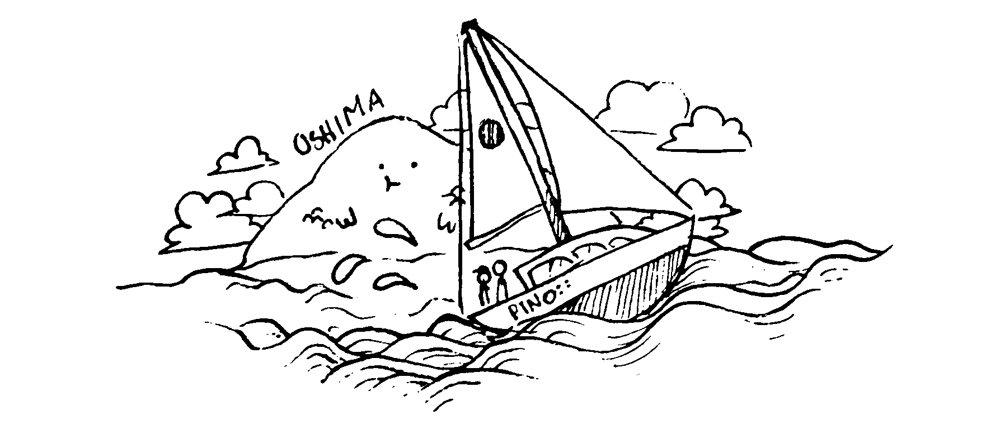

	Distance covered: 0 nm
	Distance to Victoria: 4045 nm

##### 0600
We woke up early today, as we had little time to prepare before leaving Japan. Why so last minute? Because we only decided to leave yesterday morning. The reason we decided so late, was because we were waiting for a SIM card for our Iridium GO satellite phone, and we received it yesterday morning. As soon as we got it, we grabbed our passports and boat papers and hurried to the Immigration Office in Shizuoka to check out (a 4-5 hour train ride away). We were eager to leave on the 9th, as there was a good weather window, with moderate winds coming from a favourable direction. Because we weren't planning to leave until late yesterday morning, there were many tasks we had no yet done, or had not had time to do.

We're usually more organized than this, with only a few menial tasks to do, but not this time. Last minute departures is not our style, but we also wanted to take this window. We had to find a post box to send the pocket wifi we rented and to fill our water tanks — this may not seem like much, but it was, as it piled up on top of other things we'd forgotten, like finding and installing the pot holders to the stovetop, installing the jack lines, taking out the tethers, putting key items back in the ditch bag plus a number of other last minute things that had escaped us at the time.

##### 0700
We meet Shuhei, Thomas and Anja on the sailing vessel Robusta for coffee, turning down a cup as coffee, as it never sits right on the first day at sea. We use this opportunity to chat, meanwhile butterflies gather in my gut. I am nervous. I always am before a big trip and this time is no different, although this is our biggest passage yet, and will also likely be the most challenging. My gut has every right to twist itself into knots. We ask Shuhei to drop off our pocket wifi in a post box, he agrees ­— ah, what a kind person. He came by this with his truck to help Robusta with some last minute tasks, like getting produce, gas etc. We had done most of that ahead of time.

##### 0800
We push off our spot and head over to the Shimoda Boat Services pontoon to fill our water tanks. We tied up to it and began to ferry bins back and forth to empty them in our tank. We filled as many recipients as we could carry, as we don't know how long the trip will take. Once the tanks and jerry cans were full, we left the pontoon and headed outside of the breakwater. The Shimoda coastguard ship was lifting anchor at the time, it went past us, disappearing quickly as it was going much faster. Outside of the breakwater, we saw the lighthouse on our starboard side, the one we had difficulty rounding when we arrived here a week and a half ago due to 30-knot winds off our bow. Today, the seas were tame and the skies clear and blue.

We saw the Kurofune, a replica of Commodore Perry's black ship, taking tourists about the harbor. It was the first time we'd seen it on the water, as there weren't many tourists before due to concerns with the coronavirus. Now that the state of emergency's been lifted, people started traveling more around the country.

##### 1200
The current is pushing us along, fast. We passed Oshima island at a ridiculous speed of 9.5 knots! The kuroshio, or black current, is very strong in this area, and even stronger between the islands as the water is forced through a narrow opening. We had no problem with ships, even with many heading to Tokyo. Our speed made it easy to work our way out of the main shipping channel. We are flying! Pino is happy to be moving again, and as are we.

##### 1430
We saw porpoises in the water! It's been too long! They came for a bow-riding session. We missed them. Winds are coming out of the southwest, at a good speed of 12-15 knots. We're going at 8 knots. For lunch, we had inari pouches (rice stuffed tofu pockets), a meal we'd purchased at MaxValue the night before. It's nice not having to cook on the first day. Neither of us are sea sick, but going below is still difficult and can easily trigger it. We stay outside instead, enjoying the good wind, weather and sun.

Devine is reading "The mushrooom at the end of the world", while I steer us east. We tried calling Robusta on the VHF, but got no answer, either they're too far or their radio isn't on.

##### 1700
Wind rises to 20 knots, we put on our foul weather gear as we don't want to wet our clothes. We won't be doing laundry in this trip, so keeping clothes dry is crucial.

\newpage

#### June 10th

	Distance covered: 165 nm
	Distance to Victoria: 4045 nm

##### 0800
We download the weather, it is the same as yesterday, but it looks like the wind will increase this evening. Both of us are feeling sick and grumpy. We're experiencing the early symptoms of sea sickness, which usually means a headache, reduced appetite, morose view on things etc. This happens on every trip. Neither of us have ever vomited, thankfully.

Yesterday we sent Robusta an email and got a reply, they are ok and are southwest of us.

##### 1200
We napped hard, then awoke and decided that we should try and cook something. Neither of us feel like eating rice balls, we regret getting so many as we aren't sure we can eat them. We have no appetite, but try to eat anyway.

We ate raw snap peas as a snack, the texture was weird in our mouths. Devine made spicy ramen, which were very, very spicy. I couldn't finish my bowl. We had a grapefruit for desert, and made a mess on deck trying to pry it apart. The deck had red on it for a while afterwards.

##### 1700
We check the weather again. We don't normally check it twice a day as it eats up data, but the weather was changing so fast...! We wanted to know what was going on. We're glad we looked, as the wind was set to increase by a lot. If we hadn't checked, we might not have set the second reef point in our main. The last thing we want in this ocean is to have too much canvas up.

##### 1800
We eat chips as a snack, as we are not hungry for a full dinner. Everything tastes weird? It's like our taste buds are going crazy. The only thing that goes down easy is salty foods.

\newpage

#### June 11th

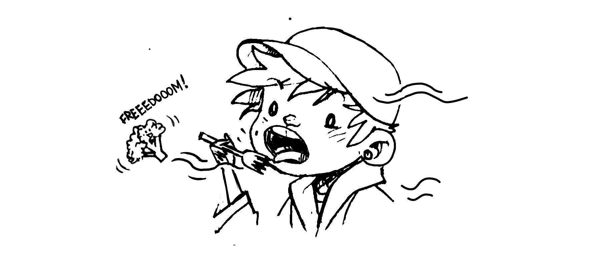

    Distance covered: 138 nm
    Distance to Victoria: 3926 nm

##### 0200
Saw a tanker ahead, but it wasn't moving? We passed its stern, wondering why it was idling out here.

##### 0900
We've reduced the jib, as the wind is a strong and steady 27 knots. We are sailing east, although the current has pushed us higher than we wanted. We are at 36°N, and it is worrisome as we knew it was safer to stay under 35°N. The wind above that line tends to be stronger. Robusta was at 33°N, upon exiting Shimoda they took a more southerly route, I wish we'd done the same. We underestimated the strength of this current. We have peanut butter toast with slices of banana on top for breakfast.

Devine sent a happy birthday message to his sister.

##### 1100
The waves are getting bigger. We are worried about our fresh produce as we can't eat any of it. This has never happened to us before. The sun is warm and is hastening the rotting of some of the more sensitive vegetables, like broccoli. We had to throw away half a head overboard today. I hope we'll find our appetites again, I'd rather the food end up in our stomachs than in the ocean.

##### 1200
Devine made a salad for lunch to try and use up some of our uglier produce. The wind is blowing food off of my fork as I eat, maybe not the best meal to have on a windy day. The wind is blowing 25-30 knots, generating big waves, but at least it is sunny.

##### 1300
We watched seabirds pirouetting in the distance, they've no problem in this wind. Their movements are sharp and fast. We don't know what kind of bird they are, they're brown with a white stomach.

We've noticed the automatic bilge pump keeps going off, we think there's a leak below the waterline, if so, that is worrisome. We tried to find where it was, but found nothing. None of the thru-hulls are leaking. I also checked the hose connections, nada! I suspect it may be the rudder post that is leaking, but for now it is impossible to look as I'd have to get into the cockpit locker, which is full of water bins and other heavy gear. For now, we try and check the bilge often, pumping the water out by hand every 2h or so. We have two manual bilge pumps, one in the cockpit and another in the cabin under the sink. The automatic bilge pump doesn't empty the bilge entirely, as it sits on a little stand above the lowest point, but the manual pump tube touches the bottom and does a better job of sucking up the majority of the water. If anything, the automatic pump serves as an alarm.

##### 1700
Made spaghetti with eggplant and green peppers for dinner. It is still hard to finish food, so we started making smaller portions to avoid waste. Both of us are still plagued with weird tastebuds. Sweet is too sweet, veggies are bland...

\newpage

##### June 12th

    Distance covered: 162 nm
    Distance to Victoria: 3786 nm

##### 0800
Rain. All day. It won't stop. We've asked it to, but it won't listen.

##### 1900
The conditions out here are horrible. We are running with the waves and wind, we wished we'd put in the 3rd reef earlier. It is too late to do it now, as it is dark and stormy. Neither of us eat dinner. We're in sparta mode. 

\newpage

##### June 13th

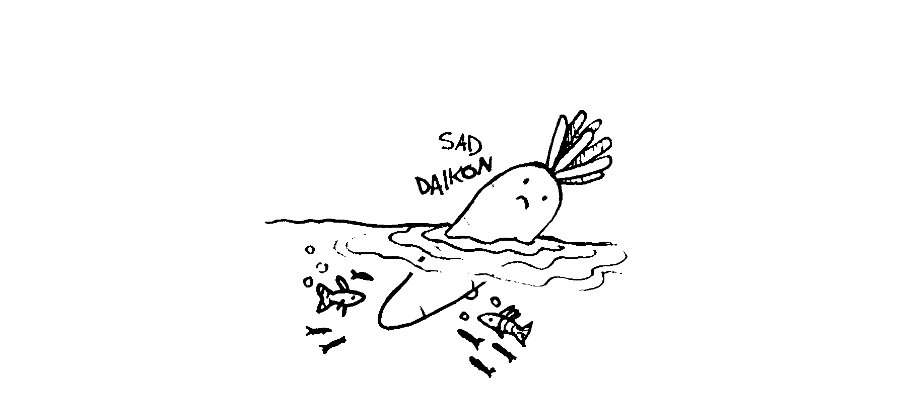

    Distance covered: 192 nm
    Distance to Victoria: 3611 nm

##### 0800
It is still raining a lot, with winds gusting in the high 30's. This weather is demoralizing, but at least we are making good easting and getting further and further away from Japan. I never thought I'd be happy about getting away from Japan, it's my favorite place in the world! The ocean around the country is mean, and another entity entirely, lingering here is too dangerous. Oh how much I wish the rain would stop, everything would be more pleasant if the rain stopped.

##### 1200
Devine made pasta with a mustard sauce for lunch, I ate half, and left the bowl on the stove. It was delicious, but I couldn't finish. I'll keep it as a snack for later. We had our usual peanut butter and banana toast this morning, we still have no problem eating this. Will our appetite ever return I wonder? We had to to throw away half a daikon today. Sad.

##### 1700
Devine was steering outside, running downwind in heavy weather, and gybed accidentally. As that happened, the block for the boom preventer broke off the toe rail, and the line caught one of the stanchions and bent it at a 45 degree angle. At the time, we thought it'd been ripped off the deck! Glad that wasn't the case. We'll be able to straighten it back out, but the weather right now doesn't permit casual walks on deck. No damage to boom or main.

##### 2100
Another rough and rainy night. This horrible system seems to cover the whole area! What a nightmare world this is.

\newpage

#### June 14th

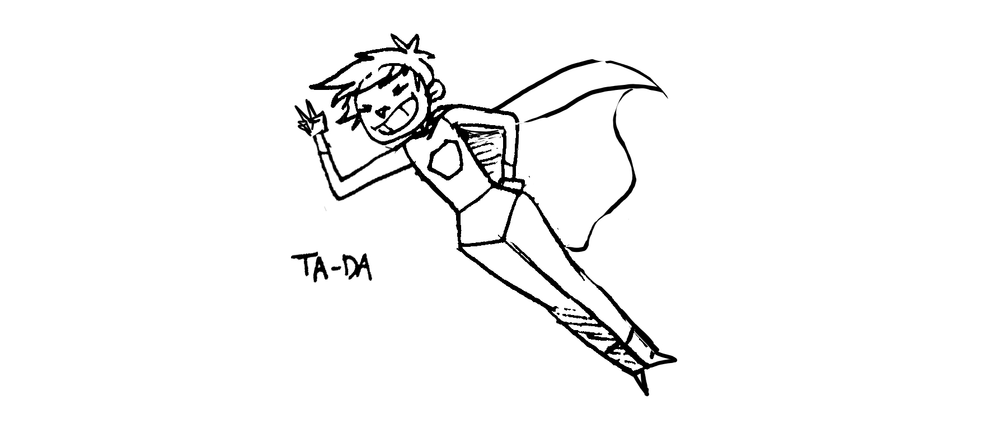

    Distance covered: 124 nm
    istance to Victoria: 3523 nm

##### 0800
We both did shorter night shifts because of the weather. Everything inside is wet, the floors are slippery with water, and our foul-weather gear just isn't drying between shifts. We hang them over the sink so they drip into it, which makes doing the dishes a very complex and unpleasant affair. All synthetic clothing won't dry, and does a poor job of keeping us warm. We switch to wool as it stays warm even when damp.

We eat two small meals per day, but aren't low on energy. The terrible weather has a way of keeping us focused, when there is danger we become superhuman. We need less sleep, less food...less everything. Don't know how long we can sustain this though.

##### 1200
The wind has calmed, but the rain has not. Wish they'd left together to give us some time to dry off. The weather doesn't care about our damp clothing and water-logged bones.

##### 1500
Devine makes gnocchi. I managed to finish off my entire bowl — this is a good sign! The wind is supposed to change tonight, and we hope that the waves die down with them.

\newpage

#### June 15th

    Distance covered: 52 nm
    Distance to Victoria: 3472 nm

##### 0800
The wind changed a few times, then died and left us with nothing? Fantastic! Thank you weather! We hand-steered toward a blue patch on the horizon, toward the sun. Blue patches in the sky, laying between clouds, always gives us hope. We wanted the sun to dry up Pino's insides, and our outer shells.

##### 0900
THE SUN! THE SUN! We put clothes out to dry in the cockpit — well, ALL of the clothes! As the wind and waves were down, we spent time dealing with minor breakages aboard, like fixing leaks.

The anchor fell off the bow this morning, after too much time spent bashing in the waves. This is bad. We could hear banging outside at the bow, not because it was hitting the hull, but it was the sound of it skipping on the water and reverberating up the chain. I went ahead to pull it back up, the bow diving deep. I was clipped to the jackline, and held onto the pulpit to keep still. I was drenched with salt water. I managed to get the acnhor up, and secured it as well as I could. If the winds calm down enough, we'll take it off the bow entirely. This is a lesson for future trips in rough waters: remove the anchor, always. 

While in New Zealand, we upgraded from a wheel to a tiller, gave our old post and wheel to a second-hand shop in exchange for a larger anchor. Our other anchor never leapt out of its bindings before, but this heavier model just doesn't want to stay put. 

##### 1500
Pino is drifting toward the southeast in very light winds. We still have items out to dry. Our morale is good, and so we make coffee for the first time since we left Japan! We also make a proper lunch of rice and miscellaneous vegetables, a meal both of us were able to finish.

##### 1530
Devine is asleep. The sun is still with us, and as I sit outside I notice something shiny in the water. It's a sea turtle! I start screaming: "SEA TURTLE! SEA TURTLE!" It drifts past us, its head out of the water. I can also see its shell. Far off in the distance, I see the spray of a whale. Calm days are wonderful, we see and hear so much more.

On days of calm, bright sun, the world always feels so large. On grey, cloudy days, it shrinks, and stops at Pino's sides, back and front.

##### 1600
We added our main's 3rd reef in preparation for the coming bad weather, it is easier to set it up in calm conditions. A main with a 3rd reef also flaps a lot less in light winds. We're lucky that none of our slides have broken off so far. In the last two trips we had many problems with this. While in Japan, I replaced our flimsy nylon slides with some of that same material, but with stainless steel inlaid. They are stronger, better quality overall. I know it is better for the slides to break rather than the main, but in our case, the main is very strong and won't split easily. Also, replacing slides at sea is really, really tough and dangerous when they run inside the mast. I'd rather they not break. We both wish we had an outside track on the mast, the main would go up and down easily, and replacing slides would be easy. Ah, we can dream!

##### 1700
Steering toward the northeast. The weather is still beautiful, but there is little wind. We make pasta with fresh tomatoes for dinner.

##### 2000
Clear night, we can see the stars. I am bored tonight, my usual tricks to pass the time just aren't working, and so I do shadow puppetry using the light from the compass. We replaced the original light with an LED, but it shines so bright that it lights up the entire cockpit, acting as a stern light. We're going to have to replace this, as it is difficult to see the light of ships with it. I have to obscure it with my hand to see afar, not a big deal, but also not ideal.

The 'usual tricks' I have to pass the time include brainstorming, as I have many ongoing projects, I use night shifts to plan it all out in my head and take notes if the weather is good. Another, is recalling as best I can my favorite films, then wording them out. I've watched The Lion King too many times in my youth and can narrate it well enough, this can keep me busy for some time. "Oh, and just between us, you might want to work on that little roar of yours. Hmm?" I do the same for my favorite music, singing aloud when I feel tired to keep awake, and when I run out of ideas I try and do the same thing but translate the song into french, which usually makes me laugh and does a good job of keeping me alert. Listening to podcasts, music, or the audio ripped from films is something we used to do, but on this trip, we don't take devices outside as it is too cold, or too damp and will damage them.

\newpage

# Week 2

#### June 16th

    Distance covered: 144 nm
    Distance to Victoria: 3340 nm

##### 0600
Devine woke up and went to stand in the companionway to tell me about this weird, elaborate dream he'd had. I look at him, standing there, half-awake as he re-counts it. He speaks slowly, talking about the architecture and mood of the place in his dream. His eyes are small, barely open, and I begin to wonder if he is truly awake...

##### 0800
The wind is back, we sail close-hauled in light rain.

##### 1000
The wind is turning gradually to the southwest, it is easy to self-steer with this point of sail. We lock the tiller with a bungee, trim the sails and let Pino do as it pleases. The sea is choppy though, our bow is jumping a little.

##### 1100
I go below to prepare lunch. As I am cutting carrots, a big wave lifts us up and I fall from the starboard to the port side, my back striking the edge of the navigation table. My vision blanked out entirely. The pain was like a knife in my back and ribs. Devine asks me if I'm okay, after he hears me falling and yelling. "I'm fine." I say, but I always say that... even when I'm hurt. I try and get back to cutting things, but I feel faint, and have to go lie down before I fall again and really hurt myself. Devine asks me if I'm okay again, this time I say I'm not. Lying down did not help me, as the movement of the boat made it difficult to lay still. I wince with every passing wave. My ribs on my left-side are bruised, and I begin to worry... wondering if it would be hard to steer the boat. I couldn't let Devine do all the work, I just couldn't. For now though, I lie here, focusing on getting better.

##### 1200
I feel better when sitting. I can't lie down. I go outside to try and drive, because I am hard-headed. I can't stand the thought of Devine having to drive for too long. I find that it isn't too painful to steer, especially if I use my right arm. It is hard to get in and out of the boat though, certain movements are too painful. The wind is increasing now, and we make rice and veg for lunch. This is what I'd started preparing before I had my little accident. I went back down below to finish, tying a rope behind me this time to make sure I wouldn't be knocked over again. I should have done this before, why didn't I do this before?!

##### 1400
I can stand to drive for 2H periods, that is good. We will do shorter shifts tonight.

##### 1700
The wind is blowing in the high 30's, with big waves building at our stern. We are running under a triple-reefed main. We dread having to make dinner in such conditions. Fog is rolling in too, for the first time in this trip.

##### 1800
Devine is doing a longer shift to give me time to rest. I took an advil for the pain. The rain begins then too...

\newpage

#### June 17th

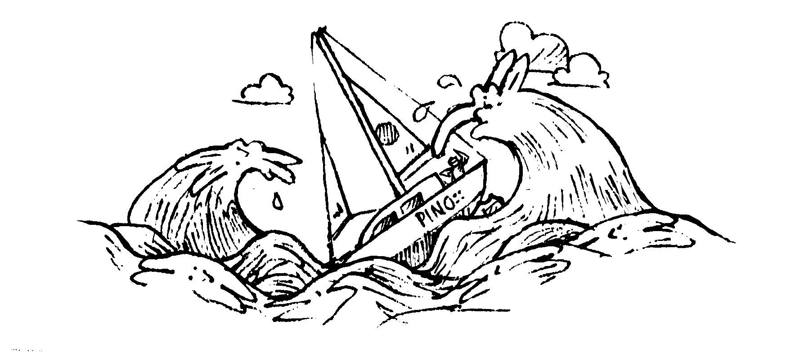

    Distance covered: 11 nm
    Distance to Victoria: 3331 nm

##### 0600
Disaster. I was sitting outside, steering the boat as we ran in heavy weather. The waves were still monstrous, but showed signs of slowing. I noticed a large wave pushing up at our rear, the strength of it caused the entire hull to vibrate. Then, before I had time to look back, another wave came... I did not see it, but it overwhelmed me. 

A giant wave broke over us, and knocked Pino over. I didn't see it happen. A wall of water washed over me. I saw nothing but water. I fell. The water dragged me off my feet, and carried me right out of the cockpit. I was underwater, my vision blurred by a curtain of seawater. I was facing up, I could see shapes, and colors through the salty, wet veil enveloping me. I remember thinking then: "Well, this is the end. This is how it happens." 

I wasn't afraid, or panicked, just disappointed? This is not how I wanted it to end.

Then, the world became clear again, Pino righted itself, as sailboats tend to do. I rose with it, clinging onto the lower lifelines, hanging outside of the boat. I was tethered to the boat — thank goodness. My lifejacket had popped open too, encircling my head like a lion's mane. I was dragging halfway into the water, coughing up salt water. The water was warm, thankfully, we were still in the kuro shio, a warm current that runs along the East Coast of Japan, and far into the Pacific. I realized what had just happened then, and screamed for Devine. Suddenly, the severity of the event had dawned on me. I saw him work his way out of the companionway, completely shook up. Our dodger was ripped off deck, in shreds, and the flexi panel on it was broken in half. The propane bin that was attached to the stern rail was laying on its side, its bindings had snapped off.

Devine ran to me, and tried to lift me up, but couldn't. "Is something dragging you under???" He yelled, panicked. "NO!" I replied, "It's the weight of the water in my clothes! MY boots are full of water! Winch me up!" I was wearing tall rubber boots when it happened, they do a good job of keeping water out when sailing,s but in this particular instance, their impermability was problematic. When people fall overboard, a common tactic is to tie a halyard to a point on their lifejacket, and to winch them out. Our halyard winches and lines were covered in broken dodger pieces, it was hard to reach them. I had an idea then. "TAKE MY LEG!" I yelled, as I managed to lift my right leg up so he could help me get it above the lower life line. It worked. Once that leg was up, it gave me enough lift so he could grab my other leg, and then it was easy to climb to safety. I imagined then how difficult it would have been to get me out of the water, had my tether been longer. At that moment, I wished for an even shorter tether. The boat was in a heave to, because it had rounded 180 degrees. Devine secured it into a proper heave to, locking the tiller so we could assess the damage.

We left the outside as it was, and went inside. I was eager to get somewhere safe. The cabin was an incredible mess. "We're dead," Devine said. In truth, we were fine, but he was shook up and the inside of the boat looked worse than it was. When the wave broke at our stern,  Devine was thrown from one side of the boat to the other, the produce jumped out of the baskets, some of the floor boards were flipped over, a bottle of cooking oil lept out of the fridge and emptied its contents over a cushion and onto the floor, a 5 liter jar of umeshu (Japanese plum wine) leapt out of that same space and hit the ceiling on the opposite side, exploding onto the navigation table and instruments. All our charts were wet, our passports too. I usually stash them in dry bags, but I didn't do it this time and I'm not sure why I didn't? There was umeshu EVERYWHERE. The stink of it covered everything.

We sat on the sticky, wet floor, wide-eyed and thinking: "Did that just happen?" I'd read of boats being knocked-over, or 'pooped' many times before, but reading about it is different than having it happen to you. I downed a can of ginger ale. "You almost lost me," I said to Devine, pained at the thought. He came over and we stayed in each other's arms, for what felt like...forever. He smiled and looked at me afterward. "You want to get married?" I laughed out loud when he said this. "Yea. Fuck it. Let's do it." I said. We made a promise then, that if we made it back home to Canada, alive, that we'd get married and that we'd try and be content with less. We don't need to cross an ocean to be happy, surely?

##### 1100
Got the boat back in order. We saw the extent of the damage: no more dodger, the wind meter was dead, no 100 watt solar panel, no back solar panel support, rig is ok, sails are ok, and the engine is ok. 

We spent the day heaving to, trying to relax. We made a plan not to panic, and to go forward. It's a long way to anywhere from here, and we've got to keep going, even if it is scary. We've got to keep going. No one was coming to get us out, we had to get ourselves out.

##### 1700
We slept in each other's arms, with alarms on to warn us off coming ships. We don't usually do this, but with both AIS and radar, we felt safe doing it, and anyway, after this ordeal, we needed this time together.

\newpage

#### June 18th

    Distance covered: 21 nm
    Distance to Victoria: 3311 nm

##### 0400
Seas are calmer, we broke our heave to and started sailing again. The winds are light, we're pointing southeast because that is all that this wind permits us to do at the moment. We shake out the 3rd reef, make coffee and have peanut butter toast. 

We recovered rather quickly from yesterday's event. One of the best things to overcome fear, and stress, is routine and goal-oriented tasks. Every day we eat, sleep, take note of our position, and check the weather. Every day we do these things, and focus on the day's problems. Yesterday is gone, today is today, and we don't have time to sit with our fears. 

The sun came and stayed with us for an hour, not long enough to dry anything, but we're happy it came at all. The sun does wonders for our mood.
   
##### 1200
We tacked back to the northeast to dodge some weather. It is raining again now, we drive from the cabin using a set of long ropes, since we no longer have a dodger to hide under. We make *pate chinois* (see recipe, p.217) for lunch.
   
##### 1400
We napped hard, then beat to weather with a good easterly heading. We are now 1066 nm from Japan, we're nearing the 165°E mark that indicates our turn northward. When you sail east to Alaska or to the Pacific Northwest, you've got to go east until you hit that mark, otherwise you run the risk of staying in the path of typhoons. 

We keep getting strong winds. Every 2 days a big system runs us over. Considering what happened yesterday, we decided that we would heave to as often as we needed to. This trip is a long one, and we need to keep our energy up. Heaving-to is a technique in sailing, it is a way of slowing a sailing vessel's forward progress, as well as fixing the tiller and sail positions so that the vessel doesn't need steering. We liked to refer to it as 'parking' the boat. We practiced this technique years ago in Canada, and again a few times in the South Pacific. 

The first time we did it at sea, was on the sail from Mexico to the Marquesas. It was early in the morning, I was outside, steering in the cockpit. The sky was grey, overcast, and I could see lightning. Then, without warning, the wind rose from a comfortable 15 knots to 40 knots. We had a full-jib and main, I couldn't hold the tiller. The sudden wind increase woke up Devine, and together we decided to heave to, to let the weather pass. We did it again while sailing from New Zealand to Fiji. We left Opua in early June, the wind stayed with us for two days, but then died entirely. We awoke Calcifer, to try and work our way past 30°S, as we were south of that line, and that a front was coming from the west. Fronts south of 30°S tend to pack a punch. Our little engine couldn't take us far enough, we were in a 'nowhere to run, nowhere to hide' situation. The system rolled in, bringing winds of 40+ knots and big seas. We hove-to, and again, waited. 

It's a technique that is worth mastering, as it could save your boat, and your life, and in difficult times, it gives you time to rest.

Our boat, with its fin keel, heaves-to well enough. Slowing the boat does cost time, but our safety is important. We've got plenty of time to get to Canada. We are so glad that the rig suffered no damage, we were lucky. Pino is a good, strong boat, we knew when we bought it, and we know it now. 
   
##### 1700
Put boat into heave to again to eat a dinner of *soy bean hummus* (see recipe, p.127), carrots and vegetables. We don't normally heave to to eat meals, but we stopped for an hour just to relax, and to spend some time together. 
   
##### 1800
We started night shifts ahead of time today, as it is getting darker earlier. We had good winds pushing us southeast. We received a message from Robusta, they are doing well, and are 300 nm away from us. They cannot send messages often, as they have issues with their radio.

##### 2000
I couldn't sit on either the high, or the low side during my night shifts. I was scared. Scared of being swept up again. I sat on the cockpit floor, moving the tiller with ropes from there. I did not think that yesterday's event had affected me adversely, but it has... everytime I hear a wave rushing up to us, my heart would leap into my throat, and my legs would turn to jelly. Big waves have the same effect, but worse. I would get panicky, with cold sweat at my back. 

Whenever my brain has a chance to idle, I go back to the event. I keep trying to re-live the moment, re-playing the memory over and over again, making corrections, as a director might do when editing a film. I find myself trying to view the scene from a different camera, frustrated with the limited first-person footage I've got. I want to view the scene from afar so I can see the wave, to see the size of it, and to figure out if I could have done things differently. I don't want to think about this, but the memory comes anyway, uninvited.

This is going to be a long, long trip, as we are not done seeing big waves.

\newpage

#### June 19th

    Distance covered: 95 nm
    Distance to Victoria: 3242 nm

##### 0400
Wind has lessened to near nothing. The sails are flapping noisily. We reefed the main to the 3rd point in preparation for tonight, and to restrict its movement.

##### 0700
We checked the weather, and it looks like we'll be heaving to for some time. The coming low will sweep right over us. After it passes, there's a patch of green on the GRIB files? Green patches mean fair weather. Is that even possible in this land of infinite tempest?

##### 1000
We found some wind. We are heading southeast, and away from the patch of no wind. Our goal is to do more southing to get better conditions when we reach 165°E or 170°E.

We awoke Calcifer, our engine, to charge our batteries, but noticed there was no water coming out of the outtake? We quieted Calcifer, and went go below into its chambers to investigate. *Sigh*. Recently, in Shimoda, I changed the water pump impeller. I'd noticed it was damaged. It looks like I put it back in the wrong way. That is bad. Calcifer is good now, at least, and if I messed up that impeller I've got another spare I can use. I can't keep making mistakes like this though, as I heard impellers are hard to come by on the ocean.
   
##### 1300
We ate *sweet and sour lentils* (recipe, p.132) for lunch outside, it started to rain but we stayed there anyway, hiding under an umbrella to eat. We've got little protection from the weather in the cockpit, so we do what we can with what we've got.

##### 2100
We heave to as the wind starts screaming into the rigging. We had trouble heaving to with both main and jib for some reason? We don't have problems doing this usually. We decide to use the main alone, but also... the jib was hard to furl. What the hell is going on? We'll investigate tomorrow, when the sun comes up and that we can see what we're doing.
  
##### 0000
Can't sleep. I am stressed about the weather, plus the bit of jib we couldn't furl is making a hell of a racket. I slept in the quarter berth, well away from the noise.

\newpage

#### June 20th

    Distance covered: 40 nm
    Distance to Victoria: 3210 nm

##### 0100
Finally went to sleep, as we slid into a calmer area of the passing low. It's hard to relax when the weather is intense outside, it always sounds worse from inside the cabin, with halyards slapping on the mast, waves smashing against the hull and the walls creaking.

##### 0400
Woke up and went on deck to fix whatever was happening with our jib and furler. The seas were still big, though. Devine added a line to the furler to keep it from spinning, and made a few more turns in the barrel so we could furl the jib in tighter. It worked. By adding more turns to the barrel, we were able to roll it up all the way. This only happens in heavy weather because we have to winch it in to furl it, and because it furls extra tight it requires more turns.
   
##### 0600
Made coffee from beans! It's a special day! Coffee from beans has a better taste, but takes more effort as we have to grind the beans first. Devine prepared the beans and set the moka pot on the stove, but then a wave came and knocked it over, spilling all of our delicious coffee. The gimballed stove does a good job of keeping this from happening, usually, but when a larger wave comes, it makes the boat rock sideways suddenly, and this movement is enough to knock it over, if say, we're not there to hold it. Our stove has pot clamps, but it only grips the base, our stovetop coffee maker is just too tall and can easily fall out of the clamps. 

This is so sad. Devine was swearing aloud, frustrated. The boat smells good, but there is coffee all over the floor, in the back of the stove and under it. All our rags are wet with salt or rain water, we can't use any of them to wipe it up. We need to wash a set but haven't found the time. 

We make instant coffee instead, as it is better than nothing. Devine is still bitter about the whole thing, but downs his cup of instant anyway. We try and imagine an extension for the pot clamps, something we could make that could hold the moka pot in place. 
   
##### 0700
Devine is reading Les Glénants. It was an intimidating first read, as we thought the french sailing terminology was difficult to memorize, being mostly familiar with the english ones from hearing them in films. "Bôme" is close to boom, but words like "l'étai" resembled nothing we knew. We always dive back into this book. We have tamed it overtime, and now consider it to be a wealth of information. 

I am sitting in the quarter berth, still afraid to be rolled over. The quarter berth is the safest place to be in such an event as it is a very restrictive space. We got a message from our friends on the sailboat Tumbleweed today! Feels good to get news from the outside world, as we spend way too much time in our own heads. We first met Morgan and Douglas in Newport Oregon in the US, they too were going to Japan. We traveled together, loosely, through the South Pacific, but they left Japan for Alaska last year.

Currently, we are more north than we want to be. The weather keeps pushing us that way. We get low after low after low, it feels like being in hell, with the possibility of good weather a distant dream. We'll likely keep heaving to until Sunday, depending on how the weather develops. This is not what we want, but depending on the weather it may be safer to do this.
   
##### 1200
We had tomato pasta with green peppers for lunch, served with chocolate and clementines for dessert. Clementines were a gift from our good friends Ami and Ayato who came to visit us in Shimoda before we left. Food gifts are the best gifts.

We are parked in the dead center of a mean system, waiting things out. Looking at the GRIB files, it's funny to see ourselves positioned in the 'eye' of this storm. The world around us is chaos, yet it is much quieter in our little parking lot on the ocean.
   
##### 1400
The seas have settled, and the wind has died. The forecast changed. We motor east to get out of this patch of no-wind. We also use this time to charge our batteries. Even this far out, at 1011 nm, we still see some of that pesky sargassum seaweed (hondawara in Japanese), the kind that wraps around your prop and fouls it up. We are careful to avoid them, we would not want to dive under the boat to clear it, not out here. The kuro shio (black current) continues far offshore, the seaweed is carried by this current, but it is strange to see it here. We have not seen large patches, not yet.
   
##### 1600
We stopped motoring and sailed with a reefed jib and main. We don't trust the weather here, better to be cautious with the amount of sail we keep up. The wind is coming out of the west, even if the GRIB files called for no wind. The seas are moderate. We don't know the exact wind strength as our wind meter died after the wave knocked Pino over. We installed telltales at various points around the boat. One of them is hung around a toothbrush, and is the best one we've made? The telltale spins right around loosely, it is sensitive and is perfect to indicate wind direction — also, it makes me laugh.

Pino is steering itself. We are navigating from inside, checking our heading on the side of the compass from the companionway door. There are zero targets on AIS, different than our 100-target average on Japan's East Coast!  

\newpage

#### June 21st

    Distance covered: 20 nm
    Distance to Victoria: 3214 nm

##### 0300
Woke up after heaving to again for the night. The wind rose, and it was too hard to steer. We broke our heave to and motored east, in calm conditions. Today promises favourable winds, finally!

We have finished all of our Japanese sliced bread. We bought many loaves before leaving, so we'd have something easy to eat in the begginning. Now, we eat cereal and oatmeal for breakfast. It was nice to have a breakfast that didn't dirty dishes.
   
##### 0600
The wind turned and rose to a pleasant strength. Sailing is nice now, the waves coming from a new direction flatten the monster waves from the previous day, like a giant hand smoothing out wrinkles.

##### 0800
Had early ramen, as both of us were very, very hungry. This may be because we've only been eating 1-2 small meals a day. It was so good. Both of us craved this salty, spicy dish.
   
##### 1100
Devine cleaned mold from the walls. The umeshu has left stains all over everything. We cleaned up most of it on the day of the accident, but we keep finding patches. Behind the radar, in the cracks of the navigation table, on the ceiling etc. We've no way of warming or airing the cabin currently, as all of the hatches have to stay shut because of salt water spray.

My ribs hurt a lot today. I took an Ibuprofen to quiet the pain, which comes and goes. I sleep in a seated position most times, and I try not to lift anything heavy.

##### 1900
Wind rose from the south, with big seas. We reefed the jib, put the 3rd reef in our main. We are wondering if we should heave to, as the waves are once again, monstrous. The GRIB files were totally wrong for this area, and we're worried it'll get much worse. We decided to push on, even if steering is challenging. We are at 163°E and want to get past 165°E as soon as possible. 

\newpage

#### June 22nd

    Distance covered: 103 nm
    Distance to Victoria: 3115 nm

##### 0300
We hove to as the morning light shone onto the sea, I stared into the depths and felt dizzy. Heaving to is a good time to figure out if what you're doing is a shit idea, or a shitty shit shit shit idea. 

##### 0500
We download the weather. The wind in this area is very strong. There is promise of lighter winds to the east. Devine gets his foul-weather gear on, and goes outside to steer. Onward to 165°E! Robusta is south of us still, but making some progress to the north. They are mending a sail and going slow.
   
##### 0600
The sky is blue? I seemed to have forgotten that it could ever be that color. It suits it better than white, or grey. The waves are still mean, but the sky reflected into them dulls out their teeth. When we get sun, we usually take everything wet out to dry, but today is not a good day for this, as the cockpit is getting a lot of spray. I have a pair of leggings outside that is well-pickled and that just won't dry. We don't want to add to that sorry collection.
   
##### 1000
The seas and winds have lessened somewhat, and the sky is still blue?! We're reminded then of what sailing is normally like. It is usually pleasant, and done in fair weather. Yes, this is what it's supposed to be like.

We cooked some *Japanese curry* (p. 145) for lunch. The wind is coming out of the southwest, with us drifting eastward.
   
##### 1400
We did it, we reached 165°E! A milestone in our trip! We hope the weather will improve in the coming weeks, as I don't think we can stomach weathering low after low after low like this. The wind is still the same. I removed my tuque and enjoyed the sun. Devine looks bright and happy today, as am I.
   
##### 1400
Cooked dinner of *pasta salad with mustard dressing* (p. 143) and ate the last 2 pieces of fresh fruit, 2 ruby red grapefruits. When we eat more, it means the weather is good and that we too, are feeling good.

Forecast is promising, but GRIB files in this area are not always accurate. This morning showed winds in the 15-20 knot range, but we had 30 knots. Usually, people say the weather is either 5 knots more, or less than forecasted, but out here there is a difference of 10 knots. There is better weather ahead, at least — well, we hope. We are happy to leave this forsaken area behind. We're running with a full jib and double-reefed main. Our paranoia with the weather is still strong, full main just isn't going to happen in this trip.  

##### 2100
Quiet night at sea. Saw some stars! It's been a while. We're sailing southeast with light rain on the horizon, just in time for Devine's shift HE HE HE HE.

In the South Pacific, many squalls would form at night. We would watch the horizon for clouds with skirts, and if we saw one, we hoped that our shift would end before its coming.

\newpage
   
# Week 3

#### June 23rd

    Distance covered: 110 nm
    Distance to Victoria: 3040 nm

##### 0300
Blue skies for today, what a gift! Devine overslept because the phone died, and there was no alarm to wake him. I drove for 4 hours straight, and it felt undending. We feel that way often, even for short 2-hour shifts. We're steering and it feels as though it's been hours and hours. Then we see the time, and it's only been 30 minutes? There ought to be a ring in Dante's hell like this, where time is warped, where the clock says it is 2h33 but it never, ever changes. Or sometimes it does change, to 2h34, but then somehow it rolls back to 2h33?! Our brains must have hallucinated the change, surely!
   
##### 0800
We have instant coffee with oatmeal. The wind is still out of the west, offering good smooth sailing and gentle seas.
   
##### 0800
Took sleeping bags out to dry, also found more mold covering a variety of objects. The pans under the sink had coffee from the recent spillage that we forgot to clean up, and that developed into mold. The papers inside the navigation table also harbor an advanced civilization of rotted matter. We want to keep our charts anyway though, as we might need them as back up. They are moist and full of spots and stains, handling them without tearing them up is difficult. We hung them over the lee cloths, to try and get them to dry but we both know that won't happen.

We had *soba* (p.142) for lunch, the smell was enough to cover up the one emanating from the rotten charts.

To be truly rid of it, we'd have to exorcize the rot demons out of them.
   
##### 1600
We have our first happy hour of the trip! We've completed 1/3 of the trip, and celebrated with a glass of red wine. We left Japan with many cartons of Japanese wine, of varying sweetness. Carton wine tends to be sweeter, but we found one brand that wasn't! Robusta made it to half the distance to Dutch Harbor, and they too celebrated this grand event. They are close, but we still don't see them on AIS. They are north of us, maybe we'll catch up? We turned northeastward at 166°E, we'll be skirting not so great weather to escape another — such is life out here! We do out best to position ourselves well to the weather, but that is not always possible.
   
##### 2100
Clear skies, with plenty of stars, but no time to enjoy them as the sea demands our attention. The wind is rising, and will steady at a good strength until dinner time tomorrow.

\newpage

#### June 24th

    Distance covered: 123 nm
    Distance to Victoria: 2943 nm

##### 0400
The seas are big, very big! My stomach is in knots from worry. I practice box breathing to calm myself. Every wave that comes lapping up the hull scares me now. I never did trust the sea, but now I am terrified of its strength and unpredictability.
   
##### 0700
We tried to have coffee outside, but 2 large waves came crashing into the cockpit, spoiling both our cups. SIGH — so much for that! I can't believe we'll have to fight these monster waves all day. I worry when I'm out here, but also am concerned for Devine when he's out there. Wind is coming out of the west, strong and steady. The next days should be calmer, although the GRIB files have been known to lie. I went to hide back inside, but I wish I was out there with him. Sometimes I wish we hadn't done this, and that we were somewhere quiet, chatting about projects and sipping something warm, not sitting here, mind racing and fearful that the sea will try and take one of us again.

We are crazy fools to be out here, but what other option was there, really? How else could we bring Pino home? It's funny. When the weather is bad, we are fools, but when it's good, we're lucky?
   
##### 1000
Total freak out. I went to steer Pino through these monstrous waves and was overtaken, again. A wave spun us right around. I was holding onto something, so I didn't hurt myself — I know better this time. We weren't knocked down, just tossed around violently. I freaked out after, refusing to drive in these waves. I parked the boat into a heave to, went inside, and just started bawling. The accumulated stress of this trip, and the lack of sleep just got to me. This was a ridiculous dream wasn't it?
   
##### 1300
We are going northeast, but mostly east. Devine is driving right now. I feel terrible but the stress of driving in these waves is just too much for me right now. Devine plans to heave to again when tired. Meanwhile, I am doing a lot of thinking, and am making sure he gets what he need. I made spaghetti for lunch with eggplants, and served a miso soup alongside.
   
##### 1500
About 20 porpoises came leaping in and out of waves around Pino. It's nice to know it can still be beautiful out here.

We downloaded a bigger range for the GRIB files, and noticed a big system heading our way — what else is new? It's going to be a strong one. The forecast may change, it often does, but we're not sure how to go about avoiding it. Devine thinks we should go south, I think north... either that, or we slow down and let it pass. This part of the ocean loves beating us down. The only wind we get to go forward is those from passing lows, which are usually too strong, and then leave calms in passing. This is discouraging. Devine is a glass half-full kind of person, I'm glad he's around to balance me out. A crew of Rekkas would be curled up on the floor, trembling and blaming each other. Fear is a terrible thing.
   
##### 1700
Devine decided to heave to after Pino got knocked around by two waves. They'd had enough. We'll heave to until this weather gets past us.
   
##### 1730
I noticed our heave to was behaving strangely... the main was flapping and causing its halyard to slap the mast. That isn't supposed to happen in a heave to, the main is supposed to be full of air, unmoving. I quizzed Devine about it, asking about how the main was positioned, the tiller too, as I could not understand why this was happening. Annoyed, I went out to see. I noticed that the tiller was lashed to the wrong side. Devine must have been tired to do this, he usually doesn't get this wrong. I went outside and lashed it to the other side. No more sounds, and the main is positioned as it should be. I stay outside for a bit to make sure everything is okay, and when I go back in, I see that Devine is sound asleep. This one needs their rest, I'll keep watch for a while.

\newpage

#### June 25th

    Distance covered: 49 nm
    Distance to Victoria: 2901 nm

##### 0230
I got up at first light. The waves had diminished enough, so I got dressed and went outside to steer us out of this hell. I unfurled the jib and steered northeast.

##### 0300
Devine awakens, and checks the weather. After analyzing the data, we tighten the sheets and inch towards the north. The low should pass underneath us. We need to steer as directly north as we can before the wind dies tonight. Devine is still tired, and goes back to bed.
   
##### 0500
Pino's sails are perfectly balanced, and is steering itself north. We let it do its thing and keep watch. We noticed the tiller bolts got loose after our evening of heaving to, went to get tools and tightened them up. We ought to put a lock nut there but we can't find one that is the right size. We need to keep an eye on this, wouldn't want it to get completely loose. The tiller handle is also rotting, with large gaps forming on the sides, and the end splitting in two. We added layers of tape to keep the slabs together. Our back up tiller is in the aft locker, if this one breaks we've got other options. Good things we planned for this, as our wooden tiller is not looking so good. 

##### 0600
Coffee time. Devine woke up and served up a cup. The coffee helped revive me. We chatted about the future, me sitting outside and he from the companionway stairs. There's no need for the two of us to be out here in the cold. We talked about being content with less again, a common theme in this trip. Pino is steering itself still, what a champ!
   
##### 0800
We make instant ramen. I crave ramen a lot these days, but everytime I eat some I get a stomach ache. I made a point of avoiding packet ramen for many years, but at sea I try not to deny my body what it craves. We didn't buy too many at least, and when we run out it'll be ramen detox time. We'll work that MSG out of our systems, somehow.

We have some crystallized ginger for dessert. Our produce is looking past its best. We've got a 3/4 cabbage that is okay, 9 carrots, with a few starting to look tired, a daikon that is getting spotty, and 1/2 an eggplant. Our potatoes and onions are looking good. We've also got some preserved lotus roots, and many other dried vegetables, but we're keeping those for later.
   
##### 1000
The wind is lessening, but isn't gone yet. Devine is reading Ursula Le Guin's "The Dispossessed", while steering with a line from the companionway stairs. I just woke up from a an hour-long nap, feeling refreshed. We got a message from Robusta, complaining about the waves. Yep, the waves yesterday were shit. Our positions on the live tracker are updating again, thanks to Devine's dad. 

Morgan and Douglas, from Tumbleweed, messaged us to report an issue with our track, saying it was not updating (since the 17th). We were concerned that people would think we'd died, or had serious issues. It is fixed now! We're glad. We're lucky to have such good land support, people to tell us if our path is broken, to help us with weather or to give us moral support from afar.
   
##### 1030
My ribs still hurt, as I never have enough time to rest to allow them to heal. The motion of the boat makes that extra difficult. When I sleep, I sit still, with cushions wedged under my back. I'm glad I can steer the boat but worry about making it worse, as I am very accident prone.

We've got our share of bumps and bruises! Devine has got splinters in his fingers, I'm not sure how that happened? He's got a bruised knee, from the knockdown, and we both have random aches, callusses on our hands etc.

##### 1400
Time to refuel. Since the seas are calm, it is a good time to do it. The wind isn't down entirely, but the boat isn't rocking too much. What was supposed to be a 5 minute task turned into an hour-long endeavour. The deck plate cover for the diesel intake was stuck! Neither of us could get it open! We tried a variety of tools, and eventually freed it up. This is my fault, I think, as I recently changed the o-ring to a *slightly* thicker one (it's all i could find). Also, the tool we use to open it fits loosely in the cap, this due to many years of hard use. We emptied one 20 L jerry can of diesel into the tank.
   
##### 1530
We had *kiri mochi* (recipe, p.137) with diced cabbage and julienned carrots for dinner. I pan-fry the rice cakes with sesame oil and season them with black pepper until puffy, and that both sides are golden and crunchy. Because it is calm out, and that Pino is steering itself, we had dinner inside together. I want to spend as much time as possible with this human. We've experienced much together haven't we?

##### 1900
It is cold outside, we steer from inside, pulling ropes between the washboards. We're going northeast, in light winds.

\newpage

#### June 26th

    Distance covered: 106 nm
    Distance to Victoria: 2794 nm

##### 0200
Red sky at sunrise. How does that saying go again? "Red sky in the morn', sailors' forlorn." It is difficult view this as a threat, as we've come to expect big heavy weather in this area. I don't feel tired from my shift, seems like I got enough sleep... for once. I am steering north, the wind doesn't permit much else. We're steering clear of a system passing below us. I'd like to make more easting but that won't be possible today. 

##### 0500
Devine brings me a bowl of warm oatmeal! So comforting. We try to save on propane as much as possible as our tanks are smaller, it's why I've been eating cold oats for the past 10 days. I wanted to keep gas for higher, colder latitudes.

It was difficult to get foreign tanks filled in Japan. While in Shima Yacht Harbour, we had to buy new Japanese-style tanks because they refused to fill ours — may have been because of their aged appearance. The issue with Japanese tanks is that they are tall and skinny, and only get taller as their volume increases. Our propane locker is made for a short and stout 9 kg (20 lbs) tank, we couldn't fit a Japanese tank of similar volume because of its increased height. This resulted in us purchasing two smaller 5 kg tanks, which wasn't ideal, but better than not having the ability to cook food.

We are still on our first 5 kg tank, so far, so good.

##### 0800
Devine awakens, serves up coffee and checks the weather, as is our usual morning routine! After today, we should get some good wind to go east. We got a message from Robusta, saying the Pacific High is appearing on Monday. That is very good news, as we need it to get further east. They are close, but still too far to see them on AIS.

Devine started reading "Canticle for Lebowitz", having finished "The Dispossessed". 

##### 0900
Devine slips on a fresh pair of socks! We've been wearing the same pair for a while as we don't have an infinite supply, nor do we want to use up our water to wash them. I alternate between two pairs of wool socks. My 3rd favourite pair I was wearing when I was swept overboard, they are dry but full of salt. They need to spend time outside, for the wind to shake the salt out of them for a few hours. We might start using water more frugally once we reach our second milestone, at 45°N 159°W.
   
##### 1430
Wind is coming straight out of the northeast. We can't make any headway AT ALL, and I am frustrated. I'm afraid it'll be the same deal tomorrow. That passing low sure is a jerk. Pino can only go northwest or southeast... and to us, both options are shit. For now, we steer northwest. Might be better to heave to than to tack back and forth between two points. I drink a ginger ale, while angry. Devine wakes up, he is hungry, very hungry, but also tired? Conflicting needs.

If the wind had a face I'd punch it. 

##### 1530
Devine is making *cornpone* (recipe, p.139) for dinner! We thought we had cornmeal left in a jar, but turns out we didn't. We opened a vacuum-sealed bag we had leftover from our time in New Zealand. I can't believe it's still good after all this time!

\newpage

#### June 27th

    Distance covered: 65 nm
    Distance to Victoria: 2735 nm

##### 0230
Finally seeing the wind turn, a little more towards the north. This permits us to do more easting. We need to keep heading that way to catch some of that sweet Pacific High breeze! The wind we've got is from a passing low, as usual, and won't last, but at this point we'll take what we can get.

We're steering from inside, as it is getting colder. Devine found a sweet spot with ropes that permits us to do little do no steering tonight.
   
##### 5h30
Pino is bashing to weather. The waves aren't too crazy, but I worry about them still. Pino's bow slams into the sea every now and then, and I can hear the anchor rattling. I hope I tied it down well this time, as retrieving it now would be dangerous. We are pointing east right now. I never thought we'd have to chase storms to get wind. Walking inside is difficult, we have to move carefully. Going to the bathroom is an interesting experience when bashing, since ours is at the bow. It's hard to focus on our business when we struggle to keep our butts down and bodies straight.

##### 6h00
We saw a cargo ship named Scorpion on AIS. It is 4 nm south of us. A rare occurence. We've got an alarm set for ships that come near, it only rang twice so far while on the open sea. Last time it rang, there was a trawler passing south, near enough that we could make out its faint outline in distance, and we could hear its engine too. Otherwise, there is no one within 48 nm of us. Land is much further than this. We'll be passing the western tip of the Aleutians soon, the more miles we put between the opening to the Bering Sea and us the better. We were pointing to it for the better part of yesterday, and it was scaring the shit out of me.
   
##### 1230
We are pointing northeast, bashing still. The wind hasn't lessened much, but it is supposed to as the day goes on. I am nervous, and I don't know what to do with myself today. I read a little, slept a little. We're doing good speed but bashing is a very stressful experience. Buckets of salt water splash up on deck and the bow keeps slamming into the waves.

I noticed some wear on the foot of the headsail, but I've no clue when I'll be able to go up there to patch it up. The weather is still too rough. I hope the jib will hold up, it has so far but it's old, very old. I've no doubt it'll enjoy a quiet life in British Columbia inland waters, once—no, IF we reach Canada. I can't talk in "whens" or "ifs" still, it's hard to imagine arriving anywhere when there's this much distance between us and land. British Columbia is a haven on a rough ocean.

We had *kiri mochi* (recipe, p.137), carrot and the last of the cabbage for lunch. Our veggie supply is looking sadder, and sadder.
   
##### 1500
We are still bashing. The sound is very unpleasant from inside the cabin. We got a message from Robusta saying the same. We are definitely going to stow our anchor away when it gets (if it gets) calm enough out there.

##### 1700
Maybe I got my wish? A calm is in our future. We were supposed to have a good breeze for the next two days, but the area looks like its going to be sucked out of all wind. I had oatmeal today for dinner, while Devine had ramen. Not in a ramen mood today.

\newpage

#### June 28th

    Distance covered: 121 nm
    Distance to Victoria: 2620 nm

##### 0900
Seas are tame today. We are heading east northeast. The wind is supposed to die gradually. We are running with a full jib, and are trying to catch all the puffs of air. A low is coming from the west and we want to make as much headway as possible to avoid it. We are doing good speed, we reached 175°E and are 2 days away from reaching 180°W. The sky is grey, but the solar panel is doing a good job still! We're thankful for that, as it means we don't need to turn on the engine as often.

Both of us slept soundly last night, we steered from the companionway stairs again and kept our heading to the east. We don't have weather yet, as we're having trouble getting a good signal. We will try again soon.

We are 19 days out of Japan.

##### 1300
We were able to download weather. It looks like the low will pass north of us — that is good news! The wind also died, we are bobbing in the waves, which are thankfully not too large. It seems like we'll be in a no-wind zone for a while. Devine is outside emptying old soy bean oil out of a plastic bag. During the knockdown a bottle of cooking oil shot out of the fridge and landed in the port side settee cushion, filling it with oil. Lacking time and patience, we stuffed the cushion in a large plastic bag and the oil has been draining out of it since that time. It is hard to clean these cushions, getting oil out of foam will be no easy task, and neither of us are willing to spend time on this. It's a shitty, shitty job. Quiet times at sea are the best time to take care of such tasks, things we normally ignore, though I think that the cushion will be quarantined until we reach land.

##### 1500
The wind is very light. We take time to do tasks on deck. We removed the anchor, finally, and stowed it below in the v-berth, buried in blankets and other soft things. The anchor locker overtop will keep it from moving around. Bashing into waves with a heavy anchor makes a racket inside, and we were afraid of further damaging the headsail furler. This happened once already while we were in Nanaimo in 2016. Our anchor banged on the dock and dented the barrel of the furler, it also bent the anchor pin.

We flipped the jib sheets around as we'd noticed some chafe, we also added tape to places they commonly lay up against. Devine tightened some halyard so they'd stop banging on the mast, and we cleaned solar connections from salt and added lanolin to protect them from corrosion.

There is blue ahead, how nice, but this also means we're heading into a calm — not so nice.

##### 1700
Storm petrels are flying around Pino island, cackling in the dark. There's at least 30 of them. We are becalmed over a buffet it seems. Tonight will be quiet, and tomorrow will be more of the same. We might have to motor east to catch a breeze, as currently the forecast has us stuck here a while. We hope it's one of those times when it's wrong, otherwise this trip will surely take us 2 months — now I'm glad we left early! We made quick *pâté chinois* (recipe, p.136), with corn, sweet potatoes and tofu. When I make the quick version, I don't bake it in the oven, I prepare the ingredients separarely and combine them in a bowl. Both of us had a big appetite today, I guess we were both tired from wrestling the anchor off the bow. We have 1 daikon left, tightly wrapped in cling wrap. It has some dark spots but feels firm. We'll cut it up tomorrow, and see if it tastes as bad as it looks.

Cruel that the wind is gone but that waves persist. I bet there's a circle of hell that is exactly this — this is a common theme in my writing isn't it? I blame the fact that I started to read Dante's Purgatorio.

\newpage

#### June 29th

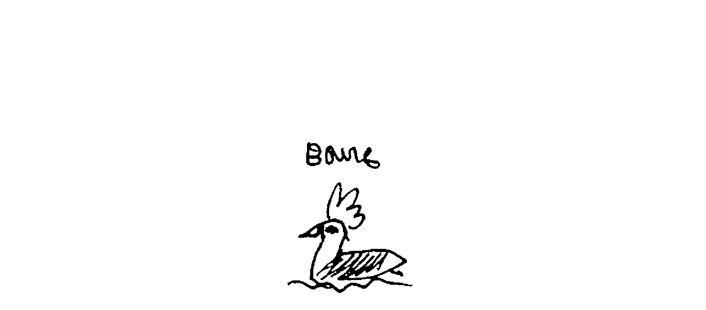

    Distance covered: 43 nm
    Distance to Victoria: 2583 nm

##### 0000
Clouds bring false hope of wind in passing. Once past us, all air is lifted out from the sea. I went back inside, no sense in bobbing in the water in the cold and dark.
   
##### 0200
Devine is sleeping hard, and I am outside, steering still. The wind has settled into the north, it's easier to steer but I must be there to keep Pino on an easterly course. The sea is settled, the sky, cloudy, but I can see a clearing in the north that will likely catch up, bringing sun and a cloudless sky this afternoon.

We had early oatmeal, as we were very hungry this morning. Cold night, had many layers on but was still cold!

##### 0600
Woke up to find Devine asleep on watch, kindle in hand. He let me sleep longer but couldn't stay awake himself. Not a big deal, as Pino is not going very fast... although, we were going southeast. I corrected the course and made coffee. We sat outside, talking about our readings. Devine disliked "The incredible tide" and its religious undertones, Miyazaki's "Future Boy Conan" is so much better. I started reading "Solaris", and I really like it so far.
   
##### 1000
We woke up Calcifer, as it is time to charge the batteries! Since we are becalmed, it'll also provide some forwardness. We each had a short nap, we're both very tired today. Whenever we go nap we fall asleep almost instantly, and waking up is very, very difficult. It may be because in hectic times, we are more alert and don't allow our bodies and minds to fully relax. We've had many times like this recently.

After waking, I read "The Long Way" by Bernard Moitessier aloud to Devine. It's comforting to have our thoughts echoed in his, somehow we feel less alone. The sea scares everyone.
   
##### 1400
We put Calcifer to sleep, goodnight Cal!

Then, we make *savory pancakes* (recipe, p.147), same recipe as regular pancakes, except that I use water instead of soy buttermilk. I like to use pancakes as quick-bread whilst sailing. The pancakes act as a sidedish to *soybean hummus* (recipe, p.133), carrots and daikon. The daikon had some nasty bits but I cut them off, and the rest was eatable, mild, but good enough by our standards. We had a glass of wine afterwards, as two albatrosses circled our boat, landing closer and closer everytime.

They kept their distance at first, but now they come right near, checking us out, and allowing us to see their striking features more clearly. We named the more daring of the two "Bowie", because of the dark colouring around its eyes, which is very glamorous indeed. Everytime we look outside we see Bowie there, paddling next to the boat, having no trouble keeping up. Love ya Bowie, you're keeping us well entertained.
   
##### 1530
We have 2 carrots left, a length of daikon, 2 lotus roots, about 10 sweet potatoes and as many regular potatoes. We have 8 onions and 1/2 bulb of garlic. We should have bought more garlic. In the end while stocking up, this staple escaped our minds. We departed Japan so suddenly that we forgot a few key things. Ah well, we'll manage without, we have garlic powder that we can use as a backup.

We dumped a 10 liter bin of freshwater into the main tank.
   
##### 2230
The wind is rising from the east, we're self-steering toward the north. The wind should turn gradually to the south, which will permit us to resume our easterly course. We have a full jib and double-reefed main.

\newpage

# Week 4 

#### June 30th

    Distance covered: 61 nm
    Distance to Victoria: 2526 nm

##### 0430
Wind is still coming out of the east, making going in that direction assuredly impossible. We are going north, making little headway to 180°W, that place on the map feels close, but far away with such winds. The breeze isn't pushing us at incredible speeds either. Marked our position on the chart and was disappointed with our lack of progress, we were becalmed yesterday and that has largely contributed to it, but it's hard to stomach with so much sea between Pino and Canada. I should be more patient, I know this. I can't control the weather and the forces that govern the winds aren't malicious. We've got to wait for wind, we've got to be patient, stoic.  

##### 0640
Bowie is stalking us. He startled me as he landed next to Pino with a loud splash. I noticed that whenever we got too far, he'd fly over, land just ahead and drift past us before repeating the motion again. Our Bowie is not shy anymore! 

##### 0800
Why am I always hungry?! After coffee comes lunch, I guess both of us eat breakfast too early these days. Devine is making *garlic, chilies and nori pasta* (recipe, p.138) — my favorite. He sautées the garlic and chilies in olive oil, then adds the cooked pasta and swirls it in until well-coated with the mixture, then he transfers it to bowls and tops it off with shredded nori. My stomach is whining as the smell wafts around the cabin. I am steering north, the wind doesn't permit much else, at least there's a relatively constant breeze. Today, we'll be making an inventory of all the food we've got left, just to see the state of things. Our snack locker is bare, but we expected that, Devine really loves eating snacks. We'll have to be creative down the line to keep this one fed and happy.   

##### 1130
We did the food inventory, Pino's stores are looking good! We have enough variety to ensure nutritive and fun meals. This is reassuring. There is food everywhere aboard, it's hard to know the state of things until we start counting though. All of the slow days we've had worried me, wondering if we'd have enough if our sail really did take 2 months. I'm happy to say that we're okay on that front. It's been 20 days and we're going through our stores at a good pace.

Wind is invariably weak, coming out of the east.   

##### 1730
Wandered into yet, another patch of calm. This is better than beating or running into high winds though. It's too bad that our options are too much wind or none at all.

A quiet ocean isn't the worse thing, as there is much to enjoy. Our neighbours the Pacific white-sided dolphins came to see us 3 times today. Because the sea was flat, we could hear them coming from far away. They are a most welcome sight. No matter how bad I'm feeling, their visit always perks me right up! Bowie left to look for food, we're left with the cackling storm petrels for company.

We moved closer to 180°W, we are at 178°E, here's hoping for wind returning later today so we can finally cross that invisible line! We noticed today that one of our spreader lights was broken, our espar heater too has issues... Pino is going to need a lot of love and attention after this trip is over.  

##### 2230
Sometimes sailing feels like witchcraft. There was hardly any wind before, Pino was bobbing stupidly in the water as I sat inside, waiting. I got tired of the motion and of the sails beating about, so I went outside to steer. Devine reduces the jib in periods of calm to reduce chafe, but keeps a tiny 'scarf' to ease the back and forth pendulum motion from waves. I felt tiny, irregular puffs of wind so I unfurled the jib and pointed us east. Perfect. Wind filled the sails and we started to go forward? It was like presenting the full jib created movement, the wind awaking with it. I was amazed, and started dancing in the cockpit, happy to be moving forward in a favourable direction! Hope the wind stays with us, if so... we'll cross 180°W! Maybe the school of dolphins from before pitied us and returned to pull us on — ah, what good friends!

\newpage

#### July 1st

    Distance covered: 75 nm
    Distance to Victoria: 2451 nm

##### 0600
Devine got up earlier today, he did not feel the need to nap in his last 3-hour shift. He stayed up with me, had a 2nd breakfast — like a proper hobbit — and made REAL coffee. We've been having instant as it is easier to manage in rough seas, but now we're running out of the easy stuff so we don't have a choice. Devine pre-ground beans yesterday for this morning, he may continue to grind more ahead of time to make sure it's never too bothersome to prepare.

The wind is light, but good, we are making headway and will likely reach 180°W this afternoon. JOY. Then, we'll be moving toward our big halfway milestone of 2200 nm. With how things are currently, this trip will take longer than 45 days, but no matter, we're in the good season and left Japan early enough that we can have many more slow days. The seas are flat today, making it easy to move on light airs. We have to go northeast to keep with the wind, there is another no wind area southeast of us that we have to be careful to avoid. Robusta is behind us, it is not easy for them to go north, as the weather there is awful right now.  

##### 0800
Devine makes *soba* (recipe, p.142) with wasabi, accompanied by a dipping sauce — fancy! The weather is calm enough for us to handle both a bowl of noodles and a dipping bowl. He also added konyakku (konjac), a block we found yesterday while doing inventory. We didn't know if it would be good to eat, as it was past its best before date, but it was perfect! I will miss konyakku, it is delicious as sashimi.

Konyakku is the food made from the corm of the Konjac plant, the meat is processed into a jelly-like substance. It is typically mottled grey, brown-ish, and springy in consistency. It doesn't taste like much, but has a vague salty flavor, with a slightly fishy taste and smell (from the seaweed powder added to it). It is valued more for its texture than flavor.

I've come to value the texture of food because of my time living in Japan, anything that is chewy, or slimy, I found, was really fun to eat. 

##### 1030
I made pitas, not for a meal but to snack on. I'm glad the weather allows for this kind of messy cooking. The wind is good, we are pushing northeast. The sea is calm, the sun is bright and the sky is clear. We're gliding at 5-6 knots.
   
##### 1200
The dolphins are back! They swam with Pino for a good hour. We love watching their dorsal fins cut through the water, the shine of their backs gleaming in the sun. Once in a while, a row of them all jump out together, prefectly synchronized in a neat line. It looks like a glitch in the Matrix — almost too perfect. It's hard to be sad when dolphins are near. Now, if only Bowie would swing by to say hello.

##### 1400
We are so close to 180°W, to one of our big milestones! Crazy how much progress we make with good wind. Marking our position on the chart is more exciting when there is enough distance between points.

We have an early glass of red wine to celebrate our near victory. We sip it as I continue to read "The Long Way" by Moitessier to Devine. The sun is warm and being outside is so damn pleasant!

##### 1500
I make *Japanese curry* (recipe, p.145), or "kare", a staple on Pino. It's a dish that I can always finish, even when not hungry. We both have a kare stomach. I used up the last carrot to make it. Now, our fresh vegetable bin is near empty, occupied by a quarter daikon and two preserved lotus roots.

##### 1730
WOOHOO! We made it past 180°W! We are officially in the Western Pacific! Exciting! This also means that we get to experience July 1st twice, as we are going back a day — funny how that works. It's nice to see degrees going down. We have a long way to go still to reach our destination which lies at 123°W, but it's a start, and we've got to appreciate little victories. Tomorrow morning, we'll celebrate this passing with pancakes and maple syrup, we'll open our last can of delicious liquid gold.

##### 2100
Devine makes miso soup, and eats a pita, I can smell the food as I am sleeping and its making me hungry. My dreams are interweaved with this scent. Giant pita people with dresses of cascading miso.
   
##### 2200
Awoke for my watch, Devine is at the navigation table, reading and wrapped up in blankets. It is very cold tonight. I slip on my foul weather gear even though I've no plans to go outside. The set keeps me warm. I've got my warmest clothes on underneath too. I make myself a bowl of cereal to quiet my stomach, although in truth, I'd prefer something salty. My body craves salt at sea, it seems it isn't enough to be pickled from the outside, my insides demand the same treatment.

I wash my face every few days to remove the accumulation of salt, my face feels smooth, and as do the tips of my fingers? Our bodies don't get rinsed often, as we are conserving water. We wash whenever we change clothes, which on this trip isn't terribly often. Sea life puts us on a different beat, I like it, but I do miss hot showers and our little room heater. It's a shame our Espar diesel heater is broken, but again, even if it wasn't I doubt we'd have enough power to sustain its use, as it is coldest when the power it at its lowest. Tomorrow is our scheduled time to wake Calcifer so we can charge our batteries. Our neighbour under the stairs is doing well, and did not think the knockdown bothersome — good.

##### 2230
Calm, calm. We've drifted into another no-wind desert, a rift between two systems that is 100 nm wide. We thought we could keep Pino under light wind, following the southern edge of a system, but it is difficult to know for sure where the wind ends. No forecast is that accurate. Because of this, planning is difficult.

Our main is flapping, waiting for wind to fill its belly, to give it purpose. Not tonight. Maybe things will be different in the morning, in the meantime we'll have to endure the flapping.

The night is quiet otherwise, with stars in full view. The moon has set, making it easier to see the tapestry in detail. I see 3 ships on AIS, all far away. Busy, busy seas no? May they stay far away, may we never hear the sound of their rumbling engines cutting through the quiet in our vicinity.

\newpage

#### July 1st (again)

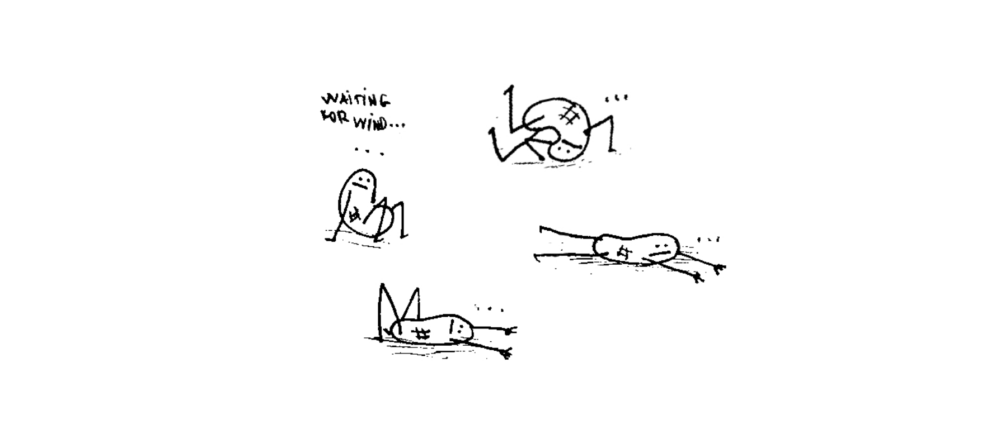

    Distance covered: 110 nm
    Distance to Victoria: 2461 nm

##### 0130
The wind is gone. All of it. The water is still, mirror-like. I go outside and reef the main in the dark to stop it from flapping. The sun is rising, I can see the outline of Shearwaters resting on the waves.
   
##### 0600
We make *pancakes and maple syrup* (recipe, p.147) to celebrate our passing of 180°W!

Calm, calm, calm. Flat calm. Silvery, rippleless seas. We drifted last night until 4 h this morning, then turned on the iron wind to charge the batteries and to give ourselves a false sense of progress. Our dolphin family came to say hello today, we saw their outlines perfectly in calm waters. We felt guilty to be motoring with them around, I imagine the sound must be deafening underwater. Devine charged the Nikon yesterday and was able to take footage of our sea family.

As we drifted in quiet waters this morning, I saw a strange creature pulsing in the water, it looked like a creature that had been turned inside out, translucent and pinkish. It had multiple bulbous protrusions. The ocean feels alien with such things living in it. We dubbed these strangelings "mimoids", like the manifestations in Solaris.

Devine went up the mast to the first spreader to fix a light that had broken off, it was hanging by its wires. Devine feared that one day it would fall and smack us in the head. He secured it with tape, a good temporary fix. He was happy to come back down, even after only being up there for 5 minutes, as the bosun's chair was giving him a hell of a wedgie. "Ahh! My balls!" Dev whined as I helped him down.
   
##### 0700
I've been doodling a lot at night, drawing silly cartoons. My peanut people doodles keep me busy, it is therapeutic. Humor is a good way to deal with stress. It's something I did too when working at an animation studio in Japan. My computer was garbage and crashed constantly, between reboots I'd draw cartoons, featuring my derpy computer. It helped diffuse my anger and made working there bearable.
   
##### 0800
Devine made a glass noodle (potato noodles) stir-fry for lunch, using spices, our preserved lotus root and half a daikon. He also added bits of dried tofu. We love adding this type of tofu to meals as they soak up all the flavor. After lunch, Devine and I napped hard in succession. The sea is calm, with a swell coming out of the east. No wind, well... if one can call the occasional puff of air wind. We are pointing Pino's bow east, into the swell. I sing some Deathcab For Cutie as I steer...

> "I wish we could open our eyes, to see in all directions at the same time.
> Oh what a beautiful view, if you were never aware of what was around you.
> And it is true what you said, that I live like a hermit in my own head
> But when the sun shines again,
> I'll pull the curtains and blinds to let the light in—"

Something I do when my brain is too tired to brainstorm projects, or when it doesn't want to dwell on memories past, or on a future when land is near.
   
##### 1000
Pino clumsily wanders into a patch of resting Shearwaters. They are such skittish things. Even if we steer clear they still run, feet and wings flapping as they try and get away. Sometimes they dive underwater. I saw one do this today, but it must have been confused because it resurfaced even closer to us, and in a panic it took to the air, feet splashing and wings lifting water as it took off. These birds don't like us at all.

##### 1300
Time to continue to read "The Long Way". I read aloud, snacking on peanuts with a glass of red wine. We are still on Japan time, deciding that we both liked a 2 h sunrise and a 17 h sunset. 13 h is 16 h, the time before we make dinner. These days we start our evening shifts at 17 h, as to make the most out of daylight hours. We're glad for long summer days, short nights are more pleasant as it doesn't get too cold. Robusta sent us a message, they are aiming for Dutch Harbor now and report the air being much cooler. Anja wonders how we'll cope with the cold without heating. We don't really know, but we'll figure something out. At the worse, we'll wear our sleeping bags?
   
##### 1430
Devine makes dinner today too, consisting of tomato pasta, with soft tofu and nori. He added some red miso to the sauce, I really like it! It adds a lot of depth.

There is a tiny breeze, it helps us keep a heading east. We're cruising at a slow 2.5 knots — better than zero no? It will likely die today, with the forecast calling for an even calmer calm, if there can ever be such a thing. Perhaps it is a place where even sea life is still, slumbering peacefully before the next low comes rolling in. We should get some weather on Friday, maybe enough to propel us to our halfway mark.

Devine prepared some epoxy, and filled up some holes left on deck by our former dodger after it was ripped off. The dodge was held in place by many little clasps, they all broke.
   
##### 1500
We are still finding patches of mold in weird places, courtesy of the exploded jar of umeshu. That jar of plum wine exploding onto the ceiling is still giving us trouble, weeks later. I don't think I'll be able to drink umeshu again without a ghostly smell of rot wafting under my nose, a reminder of a disastrous event. If we drink some, it will be in the company of others, and we'll share the story. Perhaps making it part of a tale will make drinking it bearable.

The breeze is still with us, the sky is overcast now though, it is much cooler outside without the warmth of the sun.
   
##### 2330
Light winds, Pino is self-steering to the southeast, sometimes we can nudge it back to east with ropes. It started to drizzle, so I went inside. We're moving at a low 2.5-3 knots. It is difficult to find motivation to adjust sails in the rain and in the dark. I'm doing what I can from inside, hoping the breeze won't leave, it just might as the current forecast calls for zero winds in this area — and yet? The sun cannot rise fast enough. I am tired today, and hoping the brightness of the day will kick that out of me.

I feel bad because I dropped a glass jar onto Devine's bony side while reaching for a snack in the dark. He was not pleased with me.

\newpage

#### July 2nd

    Distance covered: 41 nm
    Distance to Victoria: 2488 nm

##### 0400
July brings grey days and rain, a drizzle, annoying and ever-present. Weak winds are with us, still, we try and keep with it. Today, I am a slave to the compass, sacrificing comfort for forwardness. I prepared warm oatmeal, but the pan is dirty — Devine had the same idea. Warm meals on cold mornings feels good. I wonder if the solar panel will work today, given the grey conditions and low visibility. I miss the sun already. I'm glued to the stairs, hands on ropes, guiding Pino along as it doesn't care to guide itself today, like this amount of wind isn't worth fussing over — with 2 knots of speed I am inclined to agree, but still, there's a will in me to steer so I will steer.

##### 0530
Slave to the compass no longer, I've left my post, annoyed. The forecast I checked inspired this decision, as the coming calm is complete. We will not be sailing today, maybe not even tomorrow... this part of the ocean is not what I thought it'd be. It's like the doldrums of the north, but only around Pino. I've lashed the tiller, and rolled in the jib, now Pino can go wherever it wants at a snail's pace. There are waves that carry us onward, I wonder if this is what was propelling us on too last night. Today will be a quiet day, spent in a monochrome, wet world. The rain is too light to catch, I'm hoping for a good downpour so we can replenish our tanks. We are using as little water as possible, but catching a few liters would reassure me, and maybe permit us to wash a few neglected items.

Noticed we were getting a few amps from the solar panel after all, that is good.
   
##### 0900
I made *mapo tofu* (recipe, p.148), with the last bit of daikon. We ate it, while Pino was engulfed in a thick fog bank. Been a while since we've been in weather like this, our world has become much smaller suddenly. The waves are down, as is the wind. The ocean is quiet.
   
##### 1000
I transcribe email addresses into a notebook reserved for this purpose. I had many Japanese boat cards to add, many more than I thought. I like keeping addresses all in one place.

Devine spotted a whale, far, far away, and wonders if it'll come closer. We have been on Japan time since the start, but I checked local time today, Adak time, and I feel less bad about our early afternoon wine.
   
##### 1100
The fog has lifted, Devine decides to try and raise our Frankensail, a sail we made out of old material our friends Kako and Hiro gave us. He raises it using our spare jib halyard, the tack set on the baby stay fastening. "Hey! We're a cutter now!" Devine exclaims, all smiles. Ahead lies what we've come to call a "bobbing bird bank", a gathering of birds at rest. As per usual, they're in our way and they scatter as we come near. When the birds are bobbing on the seas, you know wind isn't coming. They save their energy, waiting for a time when a breeze can carry them on again. Energy is precious out here. These birds are light and frail, but very hardy. It's amazing they can thrive out here.
   
##### 1200
Napped for 1 hour, but had 3 bad dreams, 2 of which consisted of me falling in the water. In the first dream, I fell from the cockpit seat into the gap on the floor, which wasn't a floor at all but a window into the ocean. I could not climb back up. 

In the 2nd dream, the front of the boat was a sheet of ice? I crawled on my belly to the edge to catch a glimpse of some seals that were there, poking their snouts through some holes. As I got closer, a shift in our "ice boat" rolled me off into the icy water. 

In the 3rd dream, we were sailing on Pino, very much like now, and Devine decides to take a break from sailing so we appear on land, elsewhere. He assures me that we can go back to Pino in 2 days when the wind returns. I quiz him about it, how he plans to take us back. "We'll book a flight," he tells me. "The pilot isn't going to land on the ocean! They won't parachute us down either!" I say. Devine starts thinking it over, then realizes what we've done. We cannot return to Pino. My sister appears then: "I didn't think you could do that with a boat! Taking breaks and all!" I am tear-eyed, "YOU CAN'T!" I scream, upset at the thought of Pino being alone, without us on it to guide it back home. In this dream, of course, I've no clue how we got off mid-ocean in the first place. 

Strange dreams. This wasn't the restful, peaceful sleep I was hoping for.

##### 1730
We are relying on very fragile systems. We depend on Devine's ancient Iphone 5 for navigation and for weather, and today it developed this weird bug, which scared me. My phone died early on in this trip, I'm not sure why. As I was charging it off a rechargeable battery one night, it began vibrating and would not stop! Then, I couldn't charge it anymore and the battery went flat. I tried cleaning the charging port, but it didn't help. 

We've got an older phone with Navionics and Iridium mail as backup, but I worry, as I hate depending on these flimsy, buggy devices. I am angry that we didn't plan this better. We talk a lot about over-reliance on tech, yet we keep making mistakes. Though in truth, we had 3 working phones when we left, and we did not think it possible that all 3 would fail at the same time. Our safety is tied to the working of these devices and it is scary. It is dumb and I am angry.
   
##### 2200
Ok. Little freak out just then, but the phone is fine. Still, I hate relying on such things.

We are becalmed, again. Pino had a good run today though! Now, there is fog and it is wet out. I await the sun, the wind... I can hear Storm Petrels cackling outside. Seems like they only ever come around the boat at night, to laugh, as if they know how eerie it is for us to hear. Robusta is more north, but also suffers from lack of progress. Sailboats are creatures of movement, ours has not had many opportunities for it lately. 

As we bob around, I hear voices in the rigging, a sort of squeaky "hellooo." Other times, while sitting outside at night, we'd hear "hey's!" and "check its!" When extremely tired, the brain not only finds words in sounds, we also have conversations with ghosts, asking questions, receiving answers... sometimes my own answers were so absurd that it would startle me into wakefulness. I'd start combining words to make new ones, or invent new ones entirely while being sure of their meaning. Questions like: "Where is the turtle there?" I'd answer with "the meeting last time", then say "in the mihtime" or something.

Lack of sleep does weird things to one's brain. Don't get me started on the things I saw moving in the compass! A head, nodding, agreeing to all of my nonsense, always. It would swallow me right up, my head swimming with numbers in a clear liquid, enveloped in yellow light. Thankfully, we hallucinate less these days, being becalmed allows for more sleep.
   
##### 2330
Found wind for 1 hour, but lost it again. The wind is rude during calms, it leaves abruptly and without warning. Light drizzle, fishing boats to the south. I continued to read Solaris, then painted my nails yellow due to boredom. I cared more about the act of painting my nails than the look of it. I had the same approach to knitting, just making endless scarves because I liked the movements, then when I ran out of yarn, I'd take it all apart and start over. Though, now that I have color on me I regret it, as the mustard yellow makes my nails look rotten. I also suspect that my midnight application gave Devine a headache — bad idea overall. I can never wait for them to dry. Impatient, I slipped on a pair of gloves to unfurl the jib outside after hearing some wind, and now, my nails are yellow with little bits of black fuzz mixed in. Now I've got hairy, yellow nails. Fantastic. A victim of my own impatience and eagerness to catch wind.

\newpage

#### July 3rd

    Distance covered: 82 nm
    Distance to Victoria: 2540 nm

##### 0500
What is this strange sensation on my skin? Like it is being caressed... it is also moving the water?! WIND. Lots of it! We are heading northeast at a pleasantly refreshing 5 knots! Pino is zoooooming! It looks like this patch of wind will stay with us for today. I am really looking forward to hitting our unnofficial halfway mark. We've been looking at it for too long now, it laying ahead, teasing us with its unnattainableness. We will reach you yet!

We set up food goals for each milestone. Halfway means opening a bag of gobou (burdock root) and renkon (lotus root), a mix we bought at a specialty grocery store in Shimoda. It was pricy, but it is shelf-stable and looks delicious! Looking forward to it.
   
##### 0730
Devine woke up with a headache. I make coffee, he decides not to have a cup, as it could worsen the pain. Moments later, he tastes mine and brews a cup, drinks half, decides he can't finish and so this means I get another mug of hot coffee to finish! JOY.

Pino is doing good. The sky is grey, but bright. Our solar backpack is outside, charging up our two little battery banks. Devine went back to sleep, I'm okay to watch as it isn't much effort, Pino is steering itself.
   
##### 1200
A dark, blocky shape appears at our stern. It's a ship, a cargo ship. It doesn't broadcast on AIS. I take out my binoculars and try to figure out its course, as it is still far and difficult to make it out. For now, it looks as though it is barelling toward us. We keep our course and watch. Phew, we can see its stern at an angle, it's going to pass us well to starboard. It went by us, I could make out much of its deck, although it carried no cargo. It's waterline was high because of this. This is the closest encounter we've had with a big ship so far.

We make *penne with a red lentil sauce* (recipe, p. 140) for lunch. The food helps to diffuse Devine's headache, a little, but he hopes to nap again right after the ship has passed us. The wind has lessened, but is still with us. Pino won't self-steer now, I pull ropes while standing on the companionway stairs. Afternoons are lonely when Devine doesn't feel good. We are 150 nm away from the halfway mark.

##### 1730
The wind is much weaker now, I still need to guide Pino along. It is cold, so I continue to steer from inside. It is not fun, as I am glued to this spot. Pino keeps trying to go north, and I want to go east. Not Pino, nor the wind care what I want. It is going to be a long night. Plus Devine has an indigestion and I am not sure what is causing it. I made him some fizzy water to help settle his stomach. He also ate a bit of crystallized ginger, claiming it helped. If we had fresh ginger, I'd brew him a cup of ginger tea.

We skipped dinner today, as Devine wasn't hungry and I had no desire to cook something complicated for myself. I made a small bowl of cereal, and a pita with peanut butter. Breakfast for dinner — hell yes. I remember my mom telling me a story about my childhood, that I always asked for toast with a thick layer of peanut butter, only because I liked to plant smurf figurines in them — how ELSE will they stand?

It is quiet and cold in Pino's world today. The days blend with one another, and Vancouver Island is a distant, fictitious land of plenty. We won't accept it as a reality, not now, all land is fantasy. Our world is ocean, skies, sun, stars, porpoises, dolphins and seabirds. This is our 24th day at sea. I realize I should not be counting, counting only makes me anxious, and eager to arrive.

We've started to wash our dishes using water from our pressure sprayer. We filled it up at the pontoon in Shimoda before leaving. We put the container in the left sink. It works well. Our main tank is reserved for drinking and cooking. Conserving water early is the safest thing to do, as our current speed doesn't inspire much confidence.

We've fallen into a trap, the tricky web of the guardian of the Aleutian Island monster. It grabs winged creatures like us in passing, and is determined to keep us.
   
##### 2215
I keep having boat-related dreams. Some of these dreams mirror the current moment perfectly, down to the last detail. In sleep, I remember where the wind is, if it's gone, I know when it's coming back too. The nonsensical bits are enough to set it apart from real life though, but in some of the dreams, there isn't an overabundance of nonsense. My mind recreates our voyages, exactly as they happened, or are happening.

The wind is with us, but has switched direction and is blowing from the south. Pino seems content with the change, gliding on without assistance. The night is not as dark as it usually is, the moon and stars are hidden but their light shines through the grey veil. I think it is a full moon tonight, this may account for the marked brightness.

Devine makes late night ramen on his last shift. I am happy he is eating and that his stomach appears to be more settled. I am wearing my scarf tonight, it helps keep the breeze from entering my collar. It keeps me comfortable and warm.

\newpage

#### July 4th

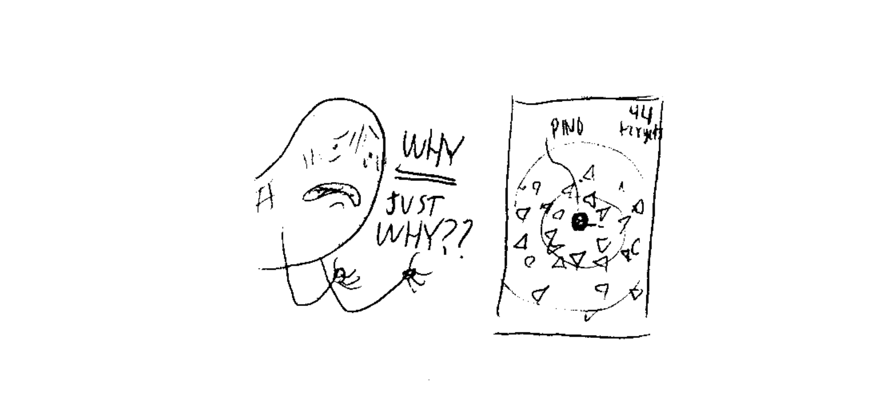 

    Distance covered: 120 nm
    Distance to Victoria: 2636 nm

##### 0500
The wind was good for most of the night, light, but good. Now, it has abandoned us once again. I wake up Calcifer. "Wake up Cal! Time to go to work!" Calcifer rumbles to life, spitting water and smoke, and does this without complaining — unlike us. If our electronics could be powered by whining we'd be set. We'll get our wind back eventually. Meanwhile, a system is forming ahead, one that I'm not certain we can avoid. We'll keep an eye on it, see how it develops in the coming days.

We reached 175°W today, with only 96 nm left to our halfway mark. I am as sick of not crossing it as I am of writing about not crossing it. There's fog, but thick enough to obscure all. Coffee time cannot come fast enough, my veins demand it. 

##### 0600
I am charging electronics, managing them to see which need it the most. We don't have an infinity of USB ports or outlets, so I've got to swap items out when they're done so I can charge other devices. The solar backpack is outside again, charging up the big battery bank. It charges slowly, but it'll get there! This backpack is a good backup to have, should our other panel fail.
   
##### 0800
Devine makes *cornpone* (recipe, p.139) for lunch, served with canned soybeans, onions and spices. A simple, hearty dish. Everytime I look at the bowl served to me I've doubts whether I can finish it, but I always finish. My stomach is not easily filled at sea, it is a vast ocean. Very different than at the start of the trip when we could barely finish our food.

The wind is good, the seas are flat and we are flying! We put Calcifer back to sleep, job well done friend, our batteries are healthy again. Pino island is drifting happily, its residents too, are happy. Captain Ninj, our resident mascot of plush and beads, is giving us tasks to do from his spot on the starboard side settee. Our armchair captain enjoys the comfort of the sleeping bags.
   
##### 1100
While napping, I dreamt of Lin Pardey. She was very old, dressed in a woolen outfit, bleached by the sun. I could tell it was bleached because the underside had colour, it was bright blue, or at least it used to be. The woolen hood covered her eyes, but not her mouth and nose. She was in a place where no one knew who she was, what she'd done and accomplished in life. She kept most of her skin hidden as she had an illness of sorts, it wasn't easy to recognize her. Devine & I found out she was there and went to see her to keep her company, as we did not want this amazing woman to be alone. She spoke to us softly, but with much emotion, I don't remember what she was saying, but she was sad, so, so sad.

Devine wiped rust that had formed over some of our sailing needles, and was in the process of sewing a patch to our laundry bag when I awoke to tell him about my dream. He'd also set up a Rasperry Pi to work on his off-time. He found a way to back up work using a UBS key on Linux.

We have to alter course to avoid a fishing fleet that lies ahead. We see many targets on AIS but they all bear similar names, ending with numbers. The last time this happened, the other ships turned out to be buoyed beacons, marking the position of their nets. We hoped this wasn't the same deal, as avoiding them all is hard. I really despise this industry. They shouldn't be here doing this. All of the trash we see on the ocean is from fishing. Foam fenders, floats, nets etc. They are filling it with garbage while emptying it of life. I really, really hate them. 

##### 1530
It's worse than we thought. We've stumbled into a minefield of fishing vessels, a fleet of over 40, all huddled in together around us. They're covering 40 nm of ocean, going around them was just not possible. There is room to go between them, but it is scary. AIS has been beeping non-stop for the past 4 hours. We thought we'd reached the end but we saw many more appearing on AIS. What a nightmare. I thought we'd be clear of these monsters tonight but no. How is this possible? Why are they all here? I feel like a mouse in a pit of snakes.

 

The sight of all these targets is too crazy, I almost don't believe it. They're all Chinese-flagged vessels, all huddled up together here — a hellish sight. I really hope fog won't set in, otherwise this could get dangerous. This is worse than sailing in Japanese coastal waters. We went through thinking that we'd reach the end of the fleet soon, but the thing is that AIS doesn't load all targets, especially those beyond 12 nm. There are many, many more ahead.

There are no birds here. I understand. If I could leave this place skyward I'd do it.

   
##### 2300
We've passed it, but boy did it ever shake my trust of this ocean. I enjoyed its vast emptiness, and now we run into mid-ocean traffic of the worst sort. There is another cluster south of us, glad that it's there and not here. We spent the day weaving our way through them. The upside in all this is that we passed them quickly, as the wind was with us. Pino ran at 6 knots, eager too it seemed to leave this accursed patch of ships. When darkness fell, each ship turned on their lights, each one illuminating everything around them. It was easier to see where they were, but it also exposed just how many were around us, their light burning into the clouds above. Absolutely surreal, and horrible! Each time we approached an island of light we could hear their powerful engines whirring, and could smell their exhaust fumes. I was afraid they'd all start moving at once. It was like tiptoeing through a cave of sleeping bears. "SHHH! Must not wake them or they'll swallow us up!"

The wind is light now, and we cannot download the weather. We'll try again tomorrow morning. I am tired from this day, these ships sucked out all my energy. I can't relax either, afraid to see another cluster ahead. Tomorrow will be better, it's got to be better. I want to be with the birds and porpoises again.

\newpage

#### July 5th

    Distance covered: 41 nm
    Distance to Victoria: 2671 nm

##### 0100
We got a message from Iridium saying our account was about to be suspended. We think we may have used up all our data minutess. We can't check the weather, but SMS still work and we're trying to get in contact with them to append more minutes. Devine's dad is also helping us with it. What a shit show. We should have purchased more, but also, I don't know how it is possible that we went through it all. We did have some issues with the device, with it stalling during some internet calls... maybe this ate up extra minutes. Either way, this situation is shit, as we don't know what's going on out there and we can't broadcast our position.

There is some good news though, as we've reached our halfway mark and ate the gobou and konyakku mix over a bed of soba! As per usual, reaching a milestone also means drifting into a calm. This calm came with rain, that we promptly collected with an upside down umbrella, the water pooling in the middle and emptying into a bucket we set underneath it. We collected enough to fill up our pressure sprayer for washing dishes.

I did not sleep much last night, but I feel okay, food and coffee does wonders for the body and mind. Devine is napping now, while I'm dressed in my oil skins, awaiting wind. While outside, I noticed something bobbing on the water's surface, something in two smooth, shiny, rounded parts. I thought it was a gum boot. I looked away for a second, and it disappeared? Either I'm crazy, or the thing decided to sink as I looked away. I spotted it again aft of us, with only half of the mound appearing on the surface this time. I grabbed the binoculars to try and make out what it was...a SEAL! I saw its whiskers, its snout and ears. It was checking us out. It made my day.
   
##### 0730
I am sitting outside this morning, trying to catch every puff of air, but it is too light and the air is too cold, plus a fog bank approaches. I furl the jib again, going inside and waiting in the companionway for signs announcing the wind's return: ripples in the water, a low wooshing sound. The sea bears no folds and is quiet, not a woosh to be heard.

I am tired. I may need a second cup of coffee to help me through today. Being animated by artificial means is necessary sometimes at sea, it makes me focused, determined. If I had giant oars I'd go and row Pino along, moist air be damned. 

##### 1200
The sea is like melted silver, flat and barely undulating. The fog drifts in and out, moistening all in its path. We can hear everything on a quiet ocean, the sound of a whale breaching, its breath resounding over long distances. I saw pillars of water far away, marking its position. I followed its track for some time before I saw it dive, its tail fanning over the surface of the water as it did. Its tail looked like a massive plant, growing out of liquid metal. Our friend the seal is still with us, we can see its fins peeking out, hardly ever its head. Maybe it is sleeping? We also saw what looked like a brown, spotted albatross, paddling quietly in the water. I never tire of seeing birds. Right now, we are adrift next to a group of sleeping shearwaters, resting before the wind comes back. We are lying alongside, pretending that we too, are birds. We close our eyes. Rest. Rest plenty before the wind comes back.

Sometimes though, I grow tired of resting. I am restless to sail, to move forward. I continue to watch the sea for ripples, but it is as still as ever. It is hard to distinguish the water from the sky, it is dizzying. It is almost as if there is air underneath us. If I were to take a step out, I'd fall, not sink. Devine is sitting at the bow, playing the harmonica, providing a fitting soundtrack. We try and make the best out of difficult situations, conserving food, water, resting our bodies and minds, and being careful not to succumb to the gloom bug. We must never despair.

\newpage

# Week 5

#### July 6th

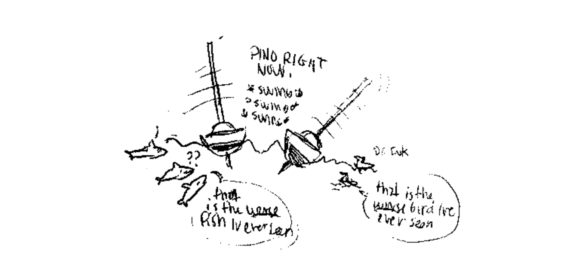

    Distance covered: 97 nm
    Distance to Victoria: 2733 nm

##### 0500
The wind has been erratic, coming and going, always from the north, or the northeast. At times, it was so weak we could go neither east or north. Other times, the same strength permitted us to sail into it? Both of us are confused. The seas are also messy. Pino is sailing, but we're getting slapped by wavelets from the sout, west and east? The westerly swell is notably bigger. The fog is here again, and it is thick. I can see the sun still, a diffused ring of light perched up above. We're happy to be moving forward but being outside is uncomfortable, the fog leaves droplets of moisture all over Pino, and us if we happen to venture into the cockpit. 10 minutes out there and my eyelashes have wet beads in them, and my foul weather gear becomes thoroughly damp and heavy.

This morning at 1 h, when I went to sleep, I noticed that I could see my own breath. Yep, it is cold in here! I was lying in bed, in a pile of sleeping bags, buried within to try and shield myself from it.

Devine made a lantern our of a can of Yebisu beer yesterday, he hung it up and placed a candle in it. It helped us save power at night, while giving the room a nice ambiance. If we near our hands to it it gives off a bit of warmth too, it feels good after a cold shift.

Our next milestone lies ahead, 90 nm away. We'll hit the 2000 nm to Vancouver Island. It's a lot of ground to cover, but we've already done so much. If the wind stays we'll meet our goal soon enough, but it is difficult in these waters, where the wind is far from constant. We still don't have weather, as the Iridium office is closed on weekends, and that the next working day is a holiday. Sigh. We'd like to know what's going on out there, we can't read the waves and wind like Moitessier — at least not yet. Maybe it's time to unbox the sextant, although it won't be easy to take noonsights in fog. We started to learn, already, but neither of us have mastered it. 
   
##### 0700
Devines makes penne, using our last bag of fun-shaped pasta. He serves it with indian spices and tofu. "Experiment!" he says, handing me the bowl. I like Devine's experiments, he's got a gift for cooking with limited ingredients. He somehow always manages to prepare something delicious, something that feels fresh despite having no fresh ingredients. At this point in our trip it is an important skill, as we have nothing but potatoes, 1 preserved lotus root, dried radish and canned vegetables.
   
##### 0900
We sail in and out of fog banks. Sailing in fog is hard on the eyes, its brings everything out of focus. I've got a massive headache right now, because my eyes strain too much, but also from constantly turning my head to look at the compass from the companionway door. I steer outside when the fog clears, and retreat indoors when it settles around us. Fog makes my clothes damp in a second. As Devine drives, I read "Golden Apples Of The Sun", a collection of shorts by Ray Bradbury. Really fun stories in which I can practice making voices, something I really enjoy doing and that distracts us both.

We're sailing east into the wind, it is hard, as the waves make us yaw, and that self-steering is not possible. Can't complain though, as we are going forward, it's what I wanted, although I do wish that wind came at us from a better quarter. What I wish doesn't matter though, because we've got to live in the moment, what is is, and we've got to push on.
   
##### 1730
We give up — well, for today anyway. The wind died, gradually. We stayed with it for as long as we could, hand-steering into the waves, tacking north to find more wind. Devine started up the engine for 1 hour, motoring north to try and find wind. Nada! The gloom bug is back, we're doing our best to fight it off. I took a angry nap, but it did little to freshen my mood. Everytime we get wind I think: "This is the wind that will take us home!" It is silly to think such things, for a reliable breeze in an area outside of the trade wind belt. Our GRIB files are more than 60 hours old, not a good reference anymore for what's happening out there. We thought we could use it to approximate the conditions, but in an area of supposed fresh winds, we've got nothing. Pino is still, as if it's forgotten what sailing is, it just might, with all of the calms we've been having. I'm beginning to forget what progress feels like.

In better news, my ribs are better! I can sleep in almost any position, but I must be careful not to strain. Lifting heavy objects is still hard, and on some rare occasions I get dull pain. All in all, it's better than it was and I am glad. 

Now, we await wind, if it would be so kind as to return to instill a bit of hope in us, some faith in the possibility of making it to land... someday. I often joke that Pino is a log, when we're not going forward. In such times, I feel the log would get to its destination faster. Maybe Pino is just tired? Steering us from calm to calm to rest its rigging and wings. We pushed you hard these past 4 1/2 years, haven't we?

\newpage

#### July 7th

    Distance covered: 99 nm
    Distance to Victoria: 2795 nm

##### 0100
Calm, calm, calm, always and forever. Not much to say. This constant quiet has robbed me of all words, but thankfully, I'm still able to laugh at this situation through cartoons. This logbook is filled with them, and they get sillier as the gloom bug grows in size.

> "Be patient. Wind leaves, but it also always comes back!"
   
##### 0400
I awake to the sound of the engine. We hadn't agreed on using it today. Devine is driving, says he saw a tern flying and is following it, saying that it knows where the wind is. But no, it doesn't know this, and neither do we because we still can't get GRIB files. "Motoring won't help," I say, Devine finally agrees and turns it off. I take his place then, steering into nothing. Devine appears high-strung, annoyed, and he starts digging through the cockpit locker to get to our old dinghy oars. He finds them and elongates one of the two using a boat hook and some hose clamps. He takes it to the side of the boat and starts rowing...! What I said about rowing Pino earlier has happened, but as you can expect, it did little to propel us onward, especially with one side doing the work and because the oars are too small and not really very good ones. The paddle is too small. I urge Devine to stop, to go to bed, as I can tell he is frustrated. When Devine looses his cool, then you know that things are bad, but also, he has a headache again and I blame this for the momentary breakdown. "Go to bed." I say again. He stops, leaves the oar on the side and slips inside. He is tired, he needs his sleep.
   
##### 0800
I am starving. I am always hungry these days. When Devine wakes up he makes tomato pasta with mushrooms and dried tofu. Pasta remedy to heal our bodies! I feel better, and he does too, a little. The wind is here, light, but it's here! We're steering northeast, although we've got to alter our course to the east to let a cargo ship move past us.
   
##### 1450
There are many ships on this route, with more encounters as we go north. The wind is great, it is a good fresh wind and Pino is steering itself northeast. Our world has been bordered by fog for most of the day. We don't stay outside as it is too wet. We're sailing close-hauled, pleasant, as the waves have not had time to build yet, due to the fact that we started in a calm.

I made *chocolate cake* (recipe, p.146) today, a request from Devine. I prepared it on the stovetop in our cast-iron pan with a heavy lid, let it bake for 15 minutes and let it cool with the lid on. It baked wonderfully. 

Life aboard is quiet today, Devine is reading "The art of UNIX programming". We should have left with more books. "Golden Apples Of The Sun" is great to read, we went through 3 shorts this morning. Ray Bradbury has a fun writing style. In one short called "The Murderer", a man is jailed after killing a variety of noise-producing devices, being fed up with it and wishing for a quieter world. That struck a chord. In a noisy world, people don't have the mind space to reflect on what matters.
   
##### 1600
Devine makes cornpone and serves it with canned kimchi. It's a very good, filling and simple meal. I like it a lot! Cornmeal is a humble ingredient, one that I've come to love over the years. It is cheap to buy, versatile and it lasts a long, long time.

A lesson in this trip, is that any metal, piece of electronic or paper product will suffer from moisture. This notion isn't entirely new to us, but the speed with which it degrades these things is astounding! The chart that I use to mark our position everyday has a lot more mold now, but we keep using it, as it's all we've got. There are little black dots all over it, and any mark we make using a marker pen bleeds out. We've got to use a ball point pen to keep our positions on the map readable.

We have a box of electronics and wires that we use everyday, which houses the Iridium and Devine's old IPhone (and corresponding wires). Everytime we use them, we put them back into their box afterward to protect them. We've also added a pack of dessicant to minimize moisture. We keep the logbook and some other important notebooks in a plastic bag with more dessicants, we'd hate to lose the content of these books, which contain notes on future projects, drawings etc.
   
##### 2200
At this point, the GRIB files are so old that there is no way to know whether there is still a patch of bad weather ahead or not. The wind is definitely increasing, but remains manageable. We keep our course east, with little to no adjustments. I am inside, wrapped in a blanket, and gaze outside every 20 minutes or so, the time it takes for a ship to catch up. I also check AIS often. I look at Navionics too, although there is little point in checking our progress every hour, it is better to check after the day is past. We measure our advancements from 9h-21h, as 9h was the time we departed from Shimoda. It is strange to think that we were in Japan, that we made it, had a lovely time there, and left. I almost don't believe it, and I know I'll likely think the same of this passage. Some things we do are just too crazy, even for me to believe. A small plastic boat sailing around the Pacific.

I'd rather be here than on a plane though, that much is sure, as I hate to be bombarded with advertisements. Visiting an airport is an attack on the senses, a place of masterful trickery, where you are made to walk through rows of gifts shops, perfume stands, jewelers... the only way to have peace and quiet is to go to a paid lounge. Quiet and comfort comes with a price tag. It's crazy to think that people thought it a good idea to do this, who would design such a space? Such a world centered not on the well-being of people, but on how much money they can get them to spend. It is like this was designed by beings who've no idea what humans need, by creatures who have no empathy. That episode of Black Mirror where people run on treadmills for money, and pay not to see ads in their rooms, feels all too true while in airports.

\newpage

#### July 8th

    Distance covered: 49 nm
    Distance to Victoria: 2836 nm

##### 0000
I realized something tonight, that I had not checked the fuse for the sailing instruments. After the knockdown, I'd just assumed the wind meter had died, but it HASN'T! The fuse blew out! I switched the fuse (same rating) with the one from the steaming light, and it WORKS! WOW. That, is awesome! I turned the switch on and heard the familiar beeping as it sprang to life! Though, we don't really need it? We've been sailing without it for nearly 3 weeks now. It's definitely not an essential part of our boat, but still, I'm glad it's working.  

##### 0500
The wind is strong and steady, still on the same northeast course. In 1 hour, we'll reach the 2000 nm milestone we set on Navionics. Then, it's 450 nm to the Turn Off. We call the Turn Off the place where we can turn and aim straight for the entrance to the Juan de Fuca Strait. Looking forward to that! I think we even have a small milestone before that, celebrating the fact that we can see our position along with Vancouver Island on the same chart. Little milestones keep us happy, they keep us busy.

There are some fishing boats ahead that I can see on AIS, I hope it isn't another large fleet... we'll have to wait until we get closer to find out.

There is fog all around us still, it just won't leave. We're staying inside as we're getting a lot of saltwater spray in the cockpit. I'm eager for a shower, but not the cold, salty kind. Sometimes, the fog blanket thins out just enough that we can feel the warmth of the sun, other times we are rewarded with patches of blue sky.
   
##### 0830
I made kare soba! Which is basically just Japanese curry over soba noodles. The wind has increased and cutting vegetables was tough. I cut the potatoes in a way that there's a long flat edge, this way, they don't go rolling off the cutting board. We have 5 sweet potatoes left, and 6 regular ones, although they're fairly large and each one could be counted as 2.

We received a message from Devine's dad, saying that he'd contacted the customer service at Iridium and that we had indeed, run out of data minutes. Our plan was topped up, and we're able to update our position on the live map, check emails and the weather — finally! We had many messages from Robusta, saying they'd run out of coffee, and that they looked forward to touching land, even if it is only 10°C outside. We told them we'd be passing Dutch Harbor, and that we'd head straight to Canada. After the knockdown, we weren't sure if going straight home was the best idea, but now we think we can make it.

The weather is set to increase, which means we'll be going forward for the next few days, but we've got to be careful. It's been a while since we've encountered such weather, and I don't want a repeat of what happened off the coast of Japan. We reefed down the jib, it helped stabilize Pino, but it has offset our course a little, not a big deal because the fleet of ships is still ahead. Yep, another fleet of Chinese-flagged vessels. As we are nearing them, the number of vessels increases. First, there was 2, then 4, now 9. The closer we go, the higher this number will go. Our reefed jib is giving us more northing, it will permit us to sail around the northernmost edge of the fleet.

We're going at 4.5 knots. I'm glad to have the weather, but seeing the forecast is worrisome in other ways.

##### 0900
Noticed our headsail carts are staining our jib sheets black. The aluminum is being ground down. Let's hope they will last the trip! This hardware is original, past their prime. We think they will fair just fine, but we're keeping watch anyway. They squeak a great deal more than they used to, we sometimes have to pour dish soap over them to quiet them. Elderly Pino is doing good.

##### 1330
We passed between 2 fleets of fishing vessels, Japanese ships to the north, and Chinese to the south. We crossed the invisible line dividing the two. We are safe now, well out of their path. Wondering how many more gatherings like this we'll encounter.

The fog is thick, thick. I can't see a thing. Looking outside offers nothing but grey, the sea too is that colour. I wonder if we'll ever see a full blue sky accompanied by a wam sun again. The weather tonight should not be too crazy, but we're ready for anything. Devine went outside to put a piece of Sunbrella on our jib sheet, to a part rubbing against one of the stays to protect it against chafe. That is always a problem in heavy weather, and our jib sheets have seen a lot of weather and ocean.
   
##### 1400
When I look at a rough sea, I can't relax. My legs start to tremble. I realize now it's going to be a very difficult 4 days, difficult for my nerves. I didn't used to be like this, I was more confident before, but that wave knocked it out of me. I fear I will never be rid of this. 

Though, wind like this means forwardness, and I am thankful for that, but I do wish it didn't have to go to such extremes. No wind is maddening, too much wind is frightening. They're both bad for different reasons. Bouts of calms I used to think of as 'mini vacations on the ocean'. I no longer think that.

I'm on watch and it is hard to keep from snuggling up to Devine in the covers, ignoring the chaos outside, buried in soft fabric. "The weather can't touch me here! OH no! I am safe in the fort with Devine." Pino doesn't feel unsafe to me, that I want to make clear. The noise inside the cabin is what scares me the most, as does the roar of the waves, like a monster is outside, trying to get it. Even if a fort is strong, you can still tremble within its walls. 

##### 1500
The weather got to me. So I climbed into bed with Devine. He woke up not too long after that, because I tried laying down over his legs and accidentally pinched him. My not-so-gentle act robbed him of sleep.

We prepared the last two packets of ramen for dinner, something simple and warm to appease my stress. It helped. We continued to read "Golden Apples Of The Sun". We only have one short left. We read "The Foghorn", it illustrated the mood outside perfectly. I calmed down after that, the wind too, and with it the waves. We kept the reefed jib as the wind may increase again tonight, but for now it has slowed our speed. No matter.

These ramen are making me crazy thirsty, I can't stop drinking water. 

##### 2230
The wind has freshened a little, I can tell by the sounds the boat is making. Pino rounds up and rights itself again after big waves toss it off course. This won't last though, we're pushing on as winds will lighten by morning. On watch, we do checks outside often, but with more wind comes a risk of getting a salt water shower. We open the companionway hatch quickly, hope for the best, and glance all around. Lights? No? Yes? No! Good. Get back inside, close the hatch. No spray — phew! Earlier tonight, Devine wasn't so lucky, he opened the hatch, stuck his head out and SPLASH! Not a wave washing over, thankfully, but a spray, just enough for a light evening pickling.

I bought boxes of Clif Bars in Japan before leaving, as filler for our ditch bag but also as a night time snack. A few weeks ago, we started rationing them so they'd last till our arrival in Canada. Devine cut them into 6 pieces and placed the slices in a jar for easy access. In the beginning, we were wolfing down entire bars, initially out of hunger, then out of boredom, then as a way to keep awake. We try and be more reasonable now, we get 3 slices per night, each.

\newpage

#### July 9th

    Distance covered: 59 nm
    Distance to Victoria: 2860 nm

##### 0700
Been turning radar on more often, as there is no break to this fog. We don't leave it on, as it is a power-sucker. This, paired with AIS is essential out here. I can imagine that it wasn't crucial during Moitessier and Lin & Larry Pardey's time, as there was less shipping. Now, I see targets everyday, as cargo is circling the globe from one port to the next.

Gliding at a reasonable 4-4.5 knots, heading northeast. The winds will shift to the southwest tomorrow, and will increase a lot. If it gets too crazy we will heave to. I've no desire to take risks anyore, not for speed anyway.

As I am writing this, the fog cleared ahead! WOW! Look at that horizon line! What-a-BEAUTY! Never thought I'd miss the sight of it this much. I will not last, but for now I'll take it, it is here, it is pleasant and I am happy. The world just got a lot sharper and I love it!
   
##### 0800
We're still on the same propane tank, I am surprised we haven't run out yet. Our backup tank is still full, strapped to the aft rail. I decided not to bake on this trip to save on gas, and it makes a huge difference! I hope that when we run out, that the weather won't be too crazy, as it is a pain to hook up. I make stovetop pitas now and then, but because I cook each one in a cast iron pan with a lid it cooks faster, saving us precious fuel. In general, our meals are done after 10 minutes of cooking, with the flame burning hottest in the first 3-5 min. Most meals I cook with a lid, after that, at a low setting. Glad my efforts to conserve fuel have paid off, and that it doesn't affect the quality of our meals.
   
##### 0900
Creatures of habit, we prepared cornpone with kimchi, and canned corn — that's right, double corn. We crave this dish a lot these days. For dessert, we had the rest of the chocolate cake with some strawberry jam as a topping. I made some while in Shima Yacht Harbor in Mie. Fruits are expensive in Japan, but Kako brought us to a fresh market in Matsusaka and we found cheap tubs of strawberries there!

Tonight, we will prepare hummus and stovetop bread. We don't have fresh vegetables to eat with it, but it's okay. I'll also be using garlic powder instead of fresh cloves, as we only have 1/2 a bulb left. I'll hate myself forever for not buying more fresh garlic. 1/2 bulb is really no garlic at all, when many our recipes use up 6 cloves.
   
##### 1500
Quiet afternoon on Pino Island. The waves are down, making it more pleasant to move around inside. I just awoke Calcifer, for a short 2-hour charging session. Our batteries are doing well, we found that charging them for 2 hours, with another 2-hour session 12 hours later helped them perform better. Despite being constantly engulfed in fog, our solar is able to charge our batteries a little, today we were at 13.4.

I ate fermented radish that Kako gave us before leaving, she gave us two jars, plus two others of raggyo, small onions preserved in soy sauce and vinegar. We also prepared garlic miso, but they're not good to eat anymore I think. It's an amazing recipe and is easy to prepare, it consists of peeled garlic cloves with the tips cut off, buried in miso and left to ferment for 1 month. It is delicious, and not overly spicy, or salty.

The wind will rise tonight as the low passes over us. It won't be as strong as what we had near Japan, but we'll be careful anyway. We're doing good speed, rapidly approaching our next milestone: The Turn Off. It is 370 nm away, not too far. Devine added other milestones in-between, to make things exciting. We'll likely cross the 1750 nm left mark in the coming day. Captain Ninj is pleased with our progress, "the gnocchi—" he says, "—it is near! SOON the potato pillows will enter your mouth caves!" Yes Captain Ninj, and we will be happy when they do.
   
##### 2200
This is officially the longest sailing trip we've ever done, two days ago we passed our record of 28 days to the Marquesas, from Mexico. Already then, we had this passage in mind as it is much longer, but also inevitable if we want to go to Japan and back home. The passage to the Marquesas had better weather, consistent winds and assured rain because of squalls. The passage to Canada has been an entirely different experience, we thought that rain would be a frequent visitor but it has largely avoided us, especially when we need it the most. We collected water once, not since. We've no real way of measuring what is left in our main tank, but with the extra 50 L we added, it will extend its use for sure. If we are careful, we can go 1 1/2 months on this tank. Our extra jerry cans total 70 L. I'd like to keep these for cooking and as drinking water.

With 1800 nm left, being careful is essential. We don't know what could happen that could slow us down, meaning more days out here where we consume water. Here is hoping we get some rain, one big downpour to dissolve the crust of salt enveloping Pino, to fill a few upside down umbrella's worth of extra water.

The night is smooth, so far. We are staying ahead of the weather, pretending it won't catch up. I realized today that I stopped dreaming? Seems like they stopped when the wind returned. I've got a more active mind during bouts of calms. With the winds we've had yesterday and today, those calms feel like a distant dream. Not sure we've seen the last of the calm calms, I could never say anything like that with confidence, not out here.

\newpage

#### July 10th

    Distance covered: 133 nm
    Distance to Victoria: 2941 nm

##### 0630
A ship is passing north of us, we're angling east to not cross its path. Had a good restful night, no drama, and we like it that way. We passed the 1750 nm left milestone, and so we treat ourselves to *soba* (recipe, p.142), complete with dipping sauce and our bag of special toppings from Aoki: flavored take no ko (young bamboo). Ahead, lies our bigger milestone: The Turn Off. It is 270 nm ahead. I can't believe our progress! The weather has not hit us yet, but it is coming! No signs of a calm ahead either. OH JOY OH JOY! If we can continue at this pace, we might arrive in 49 days, now that, would be something!

Fog is ever-present, but with a bit of sun shining through. It isn't too cold either, even at night. We sit at the navigation table with a sleeping bag, and with it we are comfortable. Robusta is near Dutch Harbor, maybe they've arrived already. We got no message saying so today, we'll miss exchanging emails with our schnaubees.
   
##### 1330
Quiet morning aboard Pino. We started doing readings of Cyberiad by Stanislaw Lem. Devine's read it many times already, but thought it would be nice to re-visit it, with me reading it aloud. It provided many hours of fun. It is such a good read, a great mix of humor and sci-fi. He is a versatile writer, I'm amazed to see the difference in writing styles between that and something like Solaris. Cyberiad is more casual, more humorous, but still manages to retain its complexity. Amazing read.

The fog parted today as we were chatting, glass of red wine in hand. I peeked outside and just... laughed! I felt such joy at being able to see far ahead. It's had to describe what I felt really, such unbriddled joy! I missed seeing it, but more than this... it is such a relief to see the world and ocean with such precision, clarity and colour!

Devine is making *garlic, nori and chili flake pasta* (recipe, p.138) for dinner. We're using up our last onion, and the bulb of garlic is thinning out. These ingredients usually go last, but the potatoes are still plentiful. Staples in Canada, like carrots, onions and potatoes, are things that are cheap and easy to buy in large quantities — but not in Japan. Yellow onions were sold in packs of 3, and were expensive. The carrots too, sold in 3's, expensive. Why 3?! It's possible that the price of a big bag would deter Japanese buyers, as in general, produce there is costly, but still. When stocking up for this trip, we told Robusta the number of onions we got and they were shocked, because they'd seen the price at the market. We had little choice, since we don't have a fridge and that we had to buy many more long-lasting items to make up for it. At least, Japanese groceries stock many great items like dried tofu (koya dofu), kiri mochi (rice cakes), fu (wheat gluten blocks), preserved lotus root, dried seaweed, dried mushrooms etc.
   
##### 1400
The wind is rising out of the southwest. We have to hand steer to keep with the waves. It's been a while since we've steered outside at night. It was very cold, made colder by the lingering moisture in the air. It clung to our clothes, wool hats and gloves. After our shifts, we'd huddle under a pile of sleeping bags to try and warm ourselves as quickly as possible, to fall asleep as quickly as possible. I'd curl up into a ball, to try and accumulate warmth fast. Sleep doesn't come when I am cold.
   
##### 0000
Saw a ship on AIS called KDDI Cable Infinity. It's one of those vessels that lay internet cables in the ocean! On AIS, it warned ships of its limited manoeuverability, and to stay 1 nm away. Funny to encounter a ship like this here, they certainly aren't working in the best of conditions, as the seas and winds are high. The fog too, is thick and laced with rain. On one hand, they're here for work, cause they've been asked to be here... but we're a 'pleasure craft'. They must be looking at us wondering the same thing. "There's rain and wind and fog! Why the HELL would THEY be out HERE...?!"

\newpage

#### July 11th

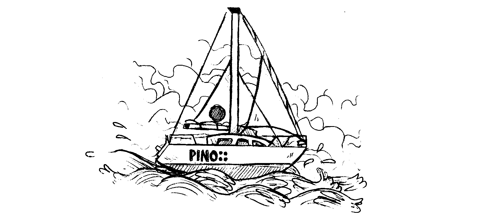

    Distance covered: 46 nm
    Distance to Victoria: 2950 nm

##### 0100
We keep to Japan time still, as the days are long, and that we enjoy a midnight sunrise. The fog is always thick in those early morning hours, visibility is limited. No ships nearby, at least, no monstrous fishing fleets either. The wind is 15-20 knots, looks like it won't be as strong as forecasted. I am starving though, I am always terribly hungry in the morning. I am a chasm of hunger, a foodless void, a mass of flesh in need of immediate sustenance. The groaning of my stomach creates ripples in the ocean.
   
##### 0300
Devine makes coffee, we drink it together and check the weather. Robusta sent us a message, they haven't arrived at Dutch Harbor yet, but they're at an anchorage that seems pleasant. Ah, land! Rather not think of it. It's getting closer though, this weather has been carrying us across fast, so different than the period of calms we suffered recently. The downside of this point of sail is the hand-steering, but really, it isn't all bad, not when there's promise of a warm and dry sleeping bag inside.
   
##### 0800
The sky has blue in it, fog has cleared. Waves are better too. I don't have to wear my scarf and gloves! This sun will help dry our wet clothes, before tonight's inevitable wettening. We make *Japanese curry* (recipe, p.145) for lunch, with white rice, potatoes, dry tofu, Japanese curry pickles and a can of green peas. Delicious. Expected the green peas to be the soft, discoloured, mushy kind, but they were a nice clear green and somewhat firm? Now I wish I'd purchased more. There's no way to know what you'll get when it comes to canned food. Canned brussel sprouts in Tahiti were amazing, asparagus in New Zealand were disgusting, but potatoes were good! It's a good idea to buy cans ahead of time to taste them, so as to no buy too much of the kind you realize you hate, and more of the good kind. Wish we had purchased more of those canned brussel sprouts. We ate it on passage later and couldn't believe the taste and texture, but of course by then, it was too late, the Carefour grocery was long gone. We never did see canned brussel sprouts again, but even so, I doubt they'd be any good.

We are nearing the Turn Off, it is 138 nm away! Then, it's GNOCCHI TIME!
   
##### 1400
Time for another freak out moment! I was steering outside, waves were okay, manageable, than overtime there would come trains of waves, sweeping in threes, each one larger than the next. This is common on the ocean, but I was also getting cross waves. While I steered through the train of threes, another set would come and hit Pino on the side. I freaked out because of the size and ferocity of the crosswaves, with some peaking way high, above the lifeline "Not again..." My legs are noodles. J'ai des jambes en nouilles. I was so scared they could barely hold me up. I wanted to heave to then, but I had to wait for the threes to pass. Once they did pass, I parked Pino and hurried inside, finding Devine reading quietly on the starboard side settee. "You okay?" he asks me. When I park the boat, it is usually because things aren't okay. I went to lie next to him and shook for hours as he tried to calm me. Devine decided to try and steer, and did so for a while but stopped as the crosswaves were too much, even for him. We decided to heave to for the night to let this awful weather pass.

Devine made pasta, I ate it while half asleep. Today's stress robbed me of rest. We shared a can Yebisu beer too, to make sure I'd get knocked right out.
   
##### 1700
Everytime we near a milestone, we hit a wall, whether it comes in the form of a calm or strong weather. There is always something, and this time is no different. We are at a wall, with big weather all around, and ahead. These walls are, for the moment, impassable, keeping us and our destination apart. The Turn Off lies ahead, but a patch of very strong winds bars the way, reaching far north and south. We'll check the weather tomorrow morning, to decide if we should go, or wait. It's possible the weather will lessen, but it can also get worst.

This streak of rough weather is a cruel, cruel thing, a horrible weather monster, guarding the east, keeping small ships from passing. Vancouver Island is concealed behind it, uncaring. "What can we do to appease you? OH great streak?" It doesn't answer. Well, it answers the only way it can I suppose, with lashes of rain and gusts of wind. Maybe it intends to let us through, and we are misunderstanding each other? As different sorts of beings often do, being dissimilar in every way.

I am eager, scared to see how this develops. 40 knots of wind isn't a big deal for most vessels, and it isn't for us either, technically, but it can get dangerous if the wind blows that strongly for hours and hours, then the sea has plenty of time and inertia to grow into something terrible. In Japanese, the word for waves is "nami", they call waves "nami usagi", or "rabbit waves". This is a perfect way to describe the ocean, full of rabbits waves.

\newpage

#### July 12th

    Distance covered: 52 nm
    Distance to Victoria: 2948 nm

##### 0100
We checked the weather. Bad, bad news, the streak is still there, and its brought friends. We're not sure where to position ourselves to avoid it, as it is MASSIVE. Getting nearer to the Pacific High would be ideal, but it is impossible with the time we have, the wind doesn't allow for much either. One option is to keep heaving to, but this will push us deeper into the system. Our boat might be fine, we might also get battered — no way to know. Another option, is to head a few degrees north, where it will be a tad calmer, but the winds there will switch to the east and there's a chance we'll get sucked back in. There's a calm forming north of that area that we can sneak into, but we fear the waves generated by the system that will enter that area, heaving to in a calm is impossible, and we'd have to take the sails down and do the mad pendulum dance.

Nothing is guaranteed, neither the calm, nor strength of that system. Conditions change daily, mostly in small ways, but also in big menacing ones. Today, we got the big menacing kind of update. I am tired of being afraid, of waiting, I'm tired of these walls that keep forming around us. The next 4 days will not grant us much progress, we'll be hiding from the monster streak, waiting for its anger to subside so that we can transit past it. There's a chance too that once the streak leaves, that it takes all wind with it. It is what it is, and it sucks. I am sick of the Pacific Ocean.
 
##### 0400
I dared to be hopeful, just 2 days ago, chatting with Devine about the future, about life in Canada, family, projects and friends... ah, and food too! How we miss french fries and strong Canadian beer. I don't mean to sound like we've been defeated, far from, but I am angry that I dared to hope for these things so soon because it makes being far away so much harder. I am getting impatient. I want to bring this amazing human I'm with safely to shore, that's all I care about, not the boat or the things in it, although the boat is required to make it happen.

The gloom bug is strong today isn't it? You let it in! Why'd you do that? It's easy to succumb to it while in bad weather, with our goal being so far away, but I'm here, with the most fantastic human there is! That's good isn't it? Even in bad times it's good. My brain defaults to this kind of negative thinking when I am tired, and I definitely am. A sure way to slay the gloom bug, is to sleep.
   
##### 0600
I slept so, so deep. My sleep has been light these past 24 hours, sensitive to any and every sound and twitch of the boat. I don't have trouble napping usually, but it's been rough. I'm glad I was able to get some rest, as I feel better now, more relaxed.
   
##### 1200
Devine took the wheel at 9h30, after checking the weather and seeing a safer spot for us up north, though it means hand-steering in shit conditions for a while to get there. The waves from yesterday's winds are still here, mountainous and persistent. He steered for some time, while I made *pâté chinois* (recipe, p.136) for dinner. He hove-to as we ate it, warm inside. Then 1 hour later, off he goes again to steer for another 3 hours. We only need to go 30 nm to avoid a bad spell of weather south. Then, we'll have lighter winds to continue to head north to hopefully avoid Wednesday's flare-up. We hope to get some days of reasonable winds after that to make it past the Turn Off. It's close, so close, but we cannot go east, not yet.

It is definitely discouraging to not work towards our goal because of strong winds, but we've got no choice, it is the safest thing to do. Sometimes, the long way is the best way, detours and all. After that, we have 1500 nm to the opening to the Strait of Juan de Fuca. With what we've done already, it doesn't seem like much, but if we keep getting flare-ups like this it will amount to many more miles. It is best not to count detours.

I'm in a better mood than yesterday, as we've got a plan. Having a plan feels better than idling, waiting for the storm to come. We hope that this bad streak will be a distant memory, as we glide on a corridor of smooth, fresh winds all the way home!  

##### 1300
Collected a bit of water with the umbrella system, which I poured into the pressure sprayer for dishes. The rain isn't terribly strong, or consistent out here. We still haven't touched our extra 70 L of water. I put my ear to our main freswater tank today, to try and gauge how much was in it. It isn't full, that much is obvious, but there is still enough sloshing around in there.

As for the diesel, we're at 1/2 a tank currently, with 3 extra jerry cans, totalling 60 L. We've used Calcifer sparingly in this trip, only to charge batteries, hardly ever for forwardness and we will continue to do this. We tried to time our charging sessions with calms, to help us move along, and also because it's better to motor in calms than in rough weather. The engine doesn't like being tossed around, neither do we. We want to have enough diesel to motor through the Strait of Juan de Fuca, and into Victoria Harbour. Distances will seem so small once (if) we get in sheltered waters, with everything being a day sail away! Ah, the dream! 

##### 1600
Devine comes in for some hot chocolate. A mix of cocoa powder, kinako powder (roasted soybean powder) and sugar — yum! Warm, and comforting. Devine downs it in a second, and then falls asleep. I watch him doze off, as I struggle to finish mine, as it is very, very sweet.

\newpage

# Week 6

#### July 13th

    Distance covered: 84 nm
    Distance to Victoria: 3014 nm

##### 0000
We hove to for the night, bypassing some weather lying east of us. With the system that's coming, it's a good idea to rest up anyway. We're going to need energy to face the waves, winds and cold.
   
##### 0330
Went outside to street to dodge a boat headed our way, a large cargo ship. On AIS, it looked like it would be crossing our path so I went out to steer out of its way. There's a chance it would divert, but I prefer not to assume that it would.
   
##### 0400
I heave to again so we can look at the weather together over coffee. We need to make a plan, to stay safe. Looking at it, we noticed it changed a lot, as it always does.. Going north yesterday was a good idea, as we are now on the top-end of the mean red streak of weather ahead. We're going to be heading northeast, taking short 2-hour shifts in the day with plans to heave to for dinner. We've got a long way to go still, we decided that it's okay to take the time to eat together, to warm up. We make mistakes when we're tired.
   
##### 0530
Rain on my shift, I have an extra coat on but I'm already freezing. Devine has fewer layers but seems fine? It is entirely possible that he just complains less. I'm a whiner. A jet of water aft of Pino startled me, looking back... I saw a sei whale! It was so close!!! Swimming just 5 meters off our stern. I saw the shine of its grey back, and its upright dorsal fin as it dove back under. I shriek, as I tend to do when faced with large creatures, both out of awe and and fear, fear because it was so close! I thought it had gone, but then it re-surfaced AGAIN on the starboard side, just as close as before...! What do I do? Shriek again of course! Followed by: "WHOA! THIS WHALE IS CRAZY!" Then it dove back under, and comes back even closer. I couldn't believe it. "AH! YOU CRAZY, BEAUTIFUL WHALE! WHAT ARE YOU DOING?!" I saw its face that time, as if it was checking me out. I saw its eye and mouth before it rolled back into the water, disappearing forever that time. I steered away to make sure I wouldn't cross its path. This is the 3rd time a whale that big comes this close to the boat. It's impressive.

My 2-hour shift went by real slow, after that event. It's possible that it felt like forever because I had an incredible urge to pee, that's what I get for downing my coffee so quickly.
   
##### 0700
Ahh! The joy of hiding in the sleeping bags! My shift ended and I am inside, trying to warm up, head and body covered in downy goodness! I appreciate my time in this bunk so much more when it is freezing out there. I can feel my hands and feet recovering. Venturing outside the covers means insta-cold. No thanks. I am hiding right now, in my warm fort. It is over 80% humidity in the cabin, and the Hygrometer does not lie. That is humid!
   
##### 1100
My patience is short. The conditions out there aren't terrible, but self-steering is not happening. If we let Pino have its way, it would steer us southeast, not good. I tried various ways of getting it to keep to the east, or the northwest, but no. After a while I just lost it. It might be because we've been out here a while, or that the grey fog we're in is getting to me, but it is HARD. All days are HARD. I'm trying to stay optimistic, because after all, we eat well, the wind is mostly okay and we've got each other. I wish I didn't default to moroseness. Devine's presence helps though, at least there's that. When I lose all will to steer, he volunteers and goes, rain or shine. If I was in a better mood, and that he felt downtrodden, I'd likely do the same... but these days, it falls onto him.

I want to have a good course always, I should know better. I know with sailing you can't always point where you want. The path to our destination will never be a straight line, it'll curve, zig zag and sometimes overlap itself. You can't be in a hurry. I know all of this, but I still think it, like my brain is ignoring wisdom on purpose to torture me.

The gloom bug isn't here to stay, it's not all I have on my mind, there is also gnocchi banging around in here. Well, the idea of gnocchi. We've nearly reached the Turn Off, nearly... but fuck it, we're eating those stupid potato lovelies TODAY. We'll be hitting that milestone in the night, so it doesn't matter when today, technically. Potato pillows, in my mouth cave....TODAY.
   
##### 1400
We are ZOOMING! Devine unfurled the jib entirely and we are GOnortheast! Riding those wave beasts like a surfboard! Last I looked, we were riding at 6-7 knots? Whoa. The wind is set to lessen tonight, if this morning'd weather forecast holds. We're trying to skirt past the top of this low, but it might catch up. For now, our speed is good, but I hope it doesn't increase suddenly in the night as a full jib is difficult to furl. It isn't hard to furl normally, but the furler is a bit stiff these days. The anchor damaged the barrel, it made a dent to accompany the one we already had, and it is harder to furl because there is less room in the barrel for a fully-coiled line. We want to fix this, to get the dent out, but the weather these days doesn't permit much. We're still waiting for a good time to fill the diesel tank, an operation that requires no rain and no saltwater spray. We've got half a tank, not bad, but we need to feed it. Calcifer needs its special juice.
   
##### 1700
The wind increased, instead of lessening, that, and rain. A LOT of rain. Not a very pleasant evening. High winds is one thing, but it's hellish when combined with rain. We are both very tired tonight. Our sleeping shifts were disrupted by the flapping of sails as we let Pino steer southeast a while. I went out to correct the course, but did not last long. I can only stand being out for for short periods of time in these conditions. Two hours is forever in outside time.

\newpage

#### July 14th

    Distance covered: 85 nm
    Distance to Victoria: 3065 nm

#### 0000
Rose with the sun, and went outside to steer us northeast. Wind has lessened, I guess yesterday's calmer weather was delayed to today. Waves are big but round, manageable.
   
##### 0230
Devine wakes up, we have oatmeal and coffee as we check the weather. We make the decision to keep going northeast, what we saw advised this decision. I go back out and steer some more, unfurling the jib to 100%. Pino glides at 7 knots. Perfect. It would be even better without rain though! Can't have it all.
   
##### 0630
Devine makes lunch, garlic pasta with shredded nori. I park Pino and get inside, peeling off my many layers, wet on the outside and gradually dry inside. I was wearing 2 sweaters, 1 fleece, foul weather pants, oil skin pants, foul weather jacket, rain jacket overtop... wet gloves, hat. I wasn't cold wearing this, though I dread having to go to the toilet. I usually delay it, waiting until the very last moment before going, then I yell: "PRAIRIE-DOGGING!" and run inside, beat my way out of my prison of fabric and race to the head.
   
##### 1200
I make *kiri mochi with soft tofu and kimchi* (recipe, p.137) for dinner. I opened the pack of special kiri mochi, sliced thin with kuromame (black beans) in it. SO GOOD. We did not heave to to eat, as we wanted to keep making progress. We ate in turns.

Rain is consistent. I set up a bucket under the main to catch some extra water for washing dishes. We've not yet touched our extra 70 L.
   
##### 1400
Read Cyberiad aloud to Devine, cup of wine in hand, celebrating nothing and anything. Read two shorts, which made me laugh out loud a few times. It is beautifully absurd, told in a very clever way. Now I understand why it's one of Devine's favourite books.

I go outside to transfer the collected water from bucket to bin. It filled half of a 10 L bin. Halfway into the trip, I wished for rain, now I wish it'd stop. Everything inside is moist, or thoroughly wet. I've got 2 dry and clean dish towels left, hm, must use sparingly. The bowls cannot be allowed to air-dry, as they won't anyway, and will develop rot.
   
##### 1200
The wind increased, a lot. We were a bit over-canvassed. Devine begrudgingly goes outside in full foul-weather gear to reduce the jib. The wind increases still, as does the rain and waves. We'd been skirting the top edge of a streak of bad weather, and now I think its caught up to us. Devine heaves to. I hate having to stop so often as it does hinder our progress, but continuing also affects our safety and mental health. Waiting is the best thing to do right now. The wind will lighten early tomorrow, we'll resume this infernal dance then, hopefully the rain will let up too, as it came with the low. In the meantime, the bucket is back outside under the main, gorging itself on rainwater. Enjoy, you're the only one who does.

\newpage

#### July 15th

    Distance covered: 106 nm
    Distance to Victoria: 3158 nm

##### 0400
We've resumed forwardness. The waves are up but we've got to continue as another system is trailing behind and will surely catch up if we stay put. These systems all want to waltz with Pino, but Pino is sick to death of it.

The rain has let up, we don't know how long that'll last but we'll enjoy it for now. I know Devine is, as he is not as rain-ready as I am. He has no rain boots, as they became too leaky early in the trip, and no oil skins to hide under. Our foul weather gear does keep wetness out, a little, but doesn't dry fast enough... and even if dry inside, it feels moist because of the damp outer shell.

We have coffee, warm oatmeal and I step outside to steer us along.
   
##### 0700
Devine switches foul-weather suits, wearing his bright red one. Dry clothes attact rain, I tell him to be careful. He steers, I am indoors, getting ready to rinse off my hair for the second time in this long, long trip. I waited as I did not know if we'd be getting rain, and it seemed frivolous. Now that we have some extra water, hell, I SPLURGED. Washing your hair isn't splurging, I know, but such is life on long, seemingly unending ocean passages.
   
##### 1430
We heave to for dinner, as we both need a break. We have a glass of red wine plus *nutritional yeast kishimen* (recipe, p.134), a good meal day. I made peanut butter glass noodles with tofu, dried daikon and potato for lunch.

The waves are still with us, and the wind has turned a bit. We're forced to hand steer downwind, not my favourite. We'll be outside tonight, pushing hard to make it to a safe zone, as per usual, more weather approaches. We'll make it out of the first bad patch, but the second is wide. We're nearing the 1250 nm mark to the Juan de Fuca Strait, we cannot get there fast enough. Sometimes we wish we had a giant dial aboard, counting our miles covered and what we have left to do, a colorful, ridiculous thing with little doors to open for each big milestone, like opening a door on a christmas calendar, but with lotus roots and beer as prizes.
   
##### 2100
Dall's porpoises came by brieftly today, white-bellied lovelies. We could see them, leaping out of the water from afar. They had a lot of air time! Wish they'd stayed longer.

I'm doing my best to stay upbeat, but I am getting worn down by all this grey weather and oncoming storms, I might be feeling this way because I am tired, I've had trouble getting deep sleep. I didn't sleep well last night because of AIS beeping, warning us of a ship. Then after that, the wind died and the jib was flapping rudely. We always wait a little before furling it, as sometimes the wind comes right back. It did return, but it was weak and we had to furl it after all.

I motored for 2 hours on my first shift to charge our batteries, we need to do it often these days, as cloudy skies don't permit our panels to draw from the sun. Once in a while, we get a 'fog sun', a bright diffused halo in the sky. That is the most sun this part of the ocean will ever grant us. Fog sun works with our panel, I did not expect that.

\newpage

#### July 16th

    Distance covered: 117 nm
    Distance to Victoria: 3251 nm

##### 0100
I steer outside, as there is no fog or rain. Devine too shared in this delight last night. We both saw stars twinkling brightly in the sky. Stars. It's been a while! For a moment, it was like being in the South Pacific again, with a good wind, calm seas and a perfect show of lights overhead. We would see this every night, but it never lost its novelty. When I saw them in the sky tonight, along with the moon, I smiled. I felt better.
   
##### 0400
We have coffee and oatmeal, classic morning on Pino. We find ourselves sandwiched between two cargo ships, bound for the US, and further south, we see more on AIS. Civilization is near. Cargo ships carry their goods to port, and Pino carries the rabbits home. One ship passes close, I can make out its shape on the horizon, then as it passes us I see its full of containers, weighing it down. I can read the letters on its side, "MCS", painted in white.
   
##### 0700
Devine awakens. He is starving. He makes stir-fried potatoes with tofu and shiso pickles. Pino is doing amazing speed on calm seas. We are thankful for this. Steering outside is nice when the waves are down, we glide without resistance, pushing through the waves noiselessly.

It isn't raining, so I take this rare opportunity to fill up the diesel tank. Operation fill-up was a success, with no freak wave slashing up onto the deck. I can fill the tank myself, thanks to a little syphon we got while in New Zealand. I tie the diesel bin on the cabin-top rail, so it stands a bit higher, than I jiggle the syphon and have it empty into the tank through a funnel with a fine mesh strainer. No mess, no problem.

We are considering stopping at Ucluelet if we get low on fuel, but I don't think it'll be necessary. Landing there would shorten our trip though, that is something to consider, say, if we are tired. I've already marked the positions of the customs and fuel dock on Navionics. The little marina there looks nice, going there is tempting, but I wonder what the situation is now for Coronavirus as we've been in the dark for 37 days. WOW. 37?! That's long. I stopped crossing dates on our calendar because it discouraged me, although the cartoons I've drawn in the margins always make me smile. Cartoons for the mind.

   
##### 1200
Devine is asleep. I am steering outside under a proper sun?! With a blue clearing? WHAT! It feels great to see colour in the sky again. It won't last, but for now, it is nice. I am lonely though, even if there are two of us aboard. We're rarely together as one is often sleeping while the other is awake, or steering outside while the other is keeping warm in the cabin. When the weather is good, or when we can self-steer we do activities together, like reading, drinking something or talking, but we haven't done a lot of that these past few days and it makes me sad. We're together, alone. At least we take the time to eat together for dinner, heaving to for a short hour. We plan to do this today.

A ship called "Cosco America" passes south of us, I resist the urge to radio in to ask for Clif Bars, nutritional yeast and olives. "You want us to fill your boat with olives?" To which we say. "Buried in kalamatas yes that's right."
   
##### 1500
We eat the last of the cornmeal with kimchi and soybeans. I will miss eating this. Devine prepares it so well! We heave to to eat it in bed, sharing our "1250 nm to Vancouver Island" can of Yebisu beer!
   
##### 2100
Calm night, not too cold out there as there is neither rain nor fog. Dolphins startled me in the night as I sat outside on watch. Day dolphins are a gift, night dolphins are scary, as I cannot see them. All I hear is a sudden: "SPLUH!" sound as they surface, a sound which I am never ready for.

\newpage

#### July 17th

    Distance covered: 118 nm
    Distance to Victoria: 3335 nm

##### 0000
Light comes early now, on Japan time. We have oatmeal, as we are both starving. I go to bed right after. I used to hate sleeping after eating, but on this trip I just don't care, I meet my needs and that's it.
   
##### 0400
Coffee time, and weather checking. The dance of storms continues, our partner will swoop us up tonight. We'll reduce sail before that happens. The wind turned not long after coffee, weakening from west to south, bringing plenty of rain. We decide to reduce the jib now, as to reduce heel.  

##### 0700
The wind has lessened, rain has stopped. We unfurl the jib again, adding to our speed. Devine makes soba with wasabi for lunch, we eat in turns. Then I read two shorts from Cyberiad aloud to Devine. The wind is good and permits Devine to steer well enough from inside. Thankful for this moment of brief calm where we can do things together, to keep our minds off the ocean and the weather.
   
##### 1400
Kare for dinner! Yep, we still have a ton of these and we are not tired yet! I used up our 2 last sweet potatoes, some dried radish, dried tofu and soy bits. Glad that we brought 3x900 g of soy meat, and 10 packs of dried tofu (with 5 per pack), this stuff adds bulk to our meals, filling us right up! We have a glass of wine, and enjoy it for a short hour before I go back to steer Pino along.

We've been pushing hard these past few days, doing as much distance as we can to position ourselves well to the weather. It has paid off, but it is exhausting, as these systems don't stop coming, ever. At least we are dry, there is little rain and it isn't overly cold.
   
##### 2100
The wind was supposed to increase, it hasn't. This could mean many things, that it's been delayed to later, that we've moved past it or that it won't increase at all. We both had good shifts, nodding back at the face in the compass all evening. We're thankful for long summer days, it makes this journey more bearable as everything is more pleasant in daylight. We charged the batteries for 2 hours, they were running low. Looking forward to getting proper sun time to give them a constant, full charge.

\newpage

#### July 18th

    Distance covered: 113 nm
    Distance to Victoria: 3407 nm

##### 0400
There is is, the wind! It is very fresh and the waves are quick, they like to knock us around, see how much we can stand. "SO do you still like the Pacific Ocean?! Huh? HUh?! How 'bout... NOW!" the rabbit waves say. Such rude rabbits, can't they see we're tired?

"Sick to death of the Pacific Ocean" is stuck on repeat in my head. This ocean offered us many amazing moments, images that I will remember forever, but inversely, I'll remember the terrifying bits always.
   

##### 0600
Devine wakes up, staring at me from his bunk. "HUNGRY." He was hungry before he napped, and now his stomach woke him up, demanding to be filled.

At this point in the trip, I've reached maximum annoyance with this ocean, made worst by my own hunger, accumulated tiredness and the fact that I don't have anymore clean pants to wear. I've got to choose the pair that stinks the least, or the one that is the least damp. Tough choice. My fleece has an odor in it that I can't stand, I smell it every hour of every day, it smells old, damp and well-worn. I keep wearing it though, just like I keep wearing the same pair of blue wool socks, as they're what's keeping me warm. I shook the salt crystals out of them, then back on my feet they went! Devine's been wearing the same pants since the start. All our clothes are looking past their best, 39 days of cold and wet sailing will do that. It's actually been 40 days, but since we've experienced July 1st twice I like to substract that day, it makes me feel good to pretend we haven't reached 40 yet.
   
##### 1200
We open our 1000 nm to Vancouver Island prize, the bag of renkon (lotus root) preserved in a sweet soy sauce. It is SUCH a delicious mix, glad we got it, because at this point in the trip we're doing poorly on the fresh vegetable front. We have a few white potatoes left, that's it!

Now, we're down to 3 digits! This is definitely worth celebrating! We ate the renkon with soft tofu, short grain white rice (sushi rice) with bits of shredded nori, accompanied by a glass of red wine and some dekopon yokan (orange-flavored red bean cake) for desert. After dinner, I went to steer, then I switched places with Devine for 1 hour so I could have a break before my first long shift starts.
   
##### 2200
Very tame winds and seas tonight, I keep over-steering because of how calm it is, causing the jib to flap and the jib sheet blocks to knock around noisily on deck. Even with this noise, which occurs every 15 minutes, Devine doesn't wake. I over-steer because I am tired, it is hard to focus. My movements are jerky, unprecise. I'm too tired to brainstorm stories for my comic, all I've got is the muted sounds of a calm ocean... a sound that can lull you to sleep in a second if you're not careful.

\newpage

#### July 19th

    Distance covered: 110 nm
    Distance to Victoria: 3476 nm

##### 0000
All my shifts were hard, spent fighting sleep. It is hard to fight such a determined opponent. Every chance it gets, it creeps up on me, and robs me of my wakefulness. With nothing to focus my eyes on, it is quite hard to keep entertained. The sun rises in the last 2 hours of my last shift, it'll be easier then to ward off the sandman. I am looking forward to more than 2h30 hours of consecutive sleep, but after 40 days of travel, I am impressed we can keep our energy up. On the 28-day transit to Nuku Hiva, both of us were hallucinating at night, constantly near the end. We don't suffer from this now because the days are long. Many hours of darkness makes it difficult to keep sane.
   
##### 0300
Oatmeal time! Seems like we'll have enough oats for the entire trip after all, I am glad, as I don't care to eat anything else in the morning. When it comes to breakfast, I am a creature of habit, and it looks as though I've converted Devine (he normally favors cereal).

We download the weather, coffee in hand. We're southeast of a bad streak of weather, riding alongside in calmer winds. We are making good speed and don't have to worry about being over-canvassed. We'll be going along this streak for the next two days, then it looks like a patch of calmer weather approaches. Devine changed the GRIB file coordinates yet again so we could see the wind on the west coast of Canada. It's nice to finally see what's brewing in this region! The wind here circles the Pacific High, going south, to southwest, west then North along the coast. We are about 880 nm from the entrance to the Juan de Fuca Strait, and it is crazy to think that we are so close! I'm still waiting for something bad to happen, something that will keep us from our goal. It is almost too crazy to be true. Land, and not just any land, home, where we started from in August 2016. I'm both excited and scared.
   
##### 0600
We make soba with renkon (lotus root) left-over from last night, as yet again, we are hungry, insatiable sea beasts! We eat well enough, I don't understand why our stomachs are so demanding. Boredom? Maybe. The motion of the boat is constant, and we are awake for much longer in a day, it's possible that this is why we're hungry, always. Also, our legs are always sore, from standing, from shifting our weight back and forth all day.
   
##### 0800
THE SUN. THE SKY. Today is the day we've been waiting for, a calm day of full bright sun with clear skies! We bring clothes outside to dry, foul-weather gear, cushions and shoes. While taking things out, we discovered many more patches of mold. A gym bag we found was covered in green moss—ick! We found two wooden plates, also fuzzy. Today's day of sun turned into operation clean-up. I cleaned the mold off the cabin walls with white vinegar, wiped moisture from under the cushions and left dishtowels out to dry on the lifelines. We found a lot of rotten wood too in the cabin, where the chainplates come through the deck, on top of the floorboards, on random places on the walls, especially where wood meets the floor. We're going to have to change a lot of this wood.

Pino is a very leaky boat, and has been for a while now. We think the toerail is leaking, that along with other points on deck we've yet to identify. It's hard to figure out where it's coming from as sometimes the water travels far before leaking inside. Pino was a turn-key boat when we bought it, and 5 years of hard sailing have turned it into a project boat.
   
##### 1200
We're starting night shifts earlier today, to try and delay the sunrise hour to a more reasonable time. Because of this, I prepared lunch earlier, I made pate chinois, using up 2 white potatoes out of 5. We still have plenty of cans, but we'll have to get creative soon as we're running out of 'fun' cans. Our locker is FULL of soy beans though, I bought extra so we could continue to prepare soybean hummus in BC—a Pino favorite. 

##### 1400
Clouds are rolling in, the low is catching up! Things are good though, for now, as we can self-steer. Devine is reading "The care and feeding of the offshore crew" by Lin Pardey, and I'm checking the manual for our Yanmar engine. I noticed it was leaking oil, a fairly new development, and I'm not sure why? I wiped the oil off, and we'll test it to see if it happens again.
   
##### 2230
Ah, morning at near eleven, I like that the sun rises at this time. The night was uneventful, with Pino steering itself on increasing winds and seas. We've managed to bypass a lot of bad weather these past few days, not sure can avoid this system entirely, but for now we're placed well to it, and even if we get sucked into it the winds should not get too high. In this point of sail though, we get tossed around a lot, with waves hitting our side.

We're almost below 800 nm to the Vancouver Island entrance. I hope that we won't come at a time a gale forms along the coast, it is possible, and we'll plan for it, but wouldn't it be nice to arrive somewhere in lighter winds? Our experience thus far, arriving anywhere, is coming in full speed into a protected cove, atoll, port etc, exhausted due to days of boisterous weather. Wouldn't it be amazing to break that pattern?

\newpage

# Week 7 

#### July 20th

    Distance covered: 125 nm
    Distance to Victoria: 3566 nm

##### 0300
Today, as Anja from Robusta would say, we are being tossed around like a soba. The weather caught up, and we are getting some good waves and gusts of wind. Our speed is good, carrying us rapidly toward our goal. The wind is supposed to come out of the northeasttonight, been a while since it came from that direction. This bitch of a system will also leave behind a few bald spots of wind in the area, some of which we may not be able to avoid. Doing some good northing is difficult, as we don't want to end up in one of the larger bald spots later, we've only got a few degrees left to do in that direction. Currently, we're at the latitude of Cape Disappointment, north of the Columbia river in Washington. Ah, Cape Disappointment, lying north of Cape Expectation. A grey bumpy day awaits Pino and crew today.
   
##### 0600
We make kuromame kiri mochi (rice cake with black beans) with canned kimchi and soft tofu for lunch. Wished I'd bought more of this brand of mochi. Because it is sliced thinly, it cooks fast, and has a nice texture and taste. The company making it is called "usagi mochi" (rabbit rice cakes), their logo features an illustration of two rabbits pounding mochi and it is too perfect!

We continue readings of Cyberiad, an activity we look forward to everyday, where we wander into the imagination of another, offering some respite from our own as we spend plenty of time in our own heads. We've done a lot of thinking in this trip, now we need to start doing. Our thinking quotas have been spent.
   
##### 1030
I make *soumen (wheat noodles) with a lentil sauce* (recipe, p.140) and served with a sweet potato I found! It had fallen out of the basket where I store them under the sink. Glad I found it, as its sweetness lends itself well to the dish, I'm glad I found it now instead of later, rotten and oozing in the bilge. Later, we share our 750 nm to Vancouver Island Yebisu as I continue to read Cyberiad.

Pino isn't driving itself well today, Devine is on watch, making sure we stay on course. He is sitting in the companionway stairs, and I'd prefer he stay up there as he is farting up a storm — as am I, actually. Not sure what it is we ate that is causing it, but it does not stop! We are trapped in a capsule of stink, we shoot smelly bullets at all hours, and without warning.
   
##### 1100
Devine cleans and sharpens our knives to pass the time, while we quote the movie Hackers aloud. We miss movies, and popcorn, and people and cities. I'm glad we're progressing, but we're still a week or so away, and time is going by real slow. We are restless, and running out of reading materials. Our meals are still interesting, at least, even if most of the jars in our pantry are empty, clinking together after every passing wave. Our jars didn't used to "clink", as we kept them full and the weight kept them still. Our shelves are a symphony of knocking glass, which we try and quiet by shoving old socks between them. The symphony isn't melodious, but disorganized and unpleasant. There is always something rolling around on a boat, something that is clinking, banging or ringing. We silence one thing, and when that sound is gone we take notice of another. It's an impossible task, and we just don't have enough old socks.
   
##### 2100
Boisterous night, as the weather flared up momentarily. It's going to die off by midnight, but for now it is wild. Steering is okay as we've got a reefed main and jib, but the wave trains are constant and massive, nothing compared to what we saw near Japan but still large, and fast! The wind is coming out of the southwest. It is noisy inside of the cabin, with everything creaking and cracking in the night. Despite the noise we sleep well, with Pino doing record speeds.

\newpage

#### July 21st

    Distance covered: 84 nm
    Distance to Victoria: 3621 nm

##### 0200
The wind is not down yet, and some light fog has set in. Pino is devouring degrees eastward, and has been for the past 5 days. It feels good to be moving, but progress also means that we have to work harder. We are more attentive to shifts in the wind, to the size of the waves... it is overall more exhausting.

##### 0500
A calm lies ahead, but we might be able to sail through and past it, as our speed is good. We need a calm to run Calcifer though, to charge our batteries. Calms are a great time to do this. The wind is looking good for the next few days, provided we aren't becalmed. Yesterday we did record speeds, running through 2 1/2 degrees in 24 hours. The coast of Vancouver Island lies ahead, with just under 650 nm left to reach the Juan de Fuca entrance buoy. I might just get my wish of a calm entrance, we'll see (and hope) that the weather holds. We'll hit 140°W soon, meaning that it'll be time to open yet another door on our milestone dial. The prize? PANCAKES! Pancakes with maple syrup we've been saving. JOY. Our overall morale is good, but we have a lot of ups and downs in a single day, we get frustrated when the jib flails when Pino oversteers north, when the jib sheet blocks bang on deck and when unwashed dishes rattle in the sink.

Our arrival is becoming real, this is what we hold onto, what pushes us to keep steering in shitty conditions, what animates our tired bodies and minds. We're at day 42, but everything previous to this day already feels alien, like the time we spent in Shimoda, and previously in Minamiise — were we really there? Then I look at our sailing track and pause. "Did we really sail all that?" It was a crazy plan before we left, it is crazy to be in the thick of it, and it is insane to think that it will end. My brain still has trouble believing that this passage CAN end. This has been our reality for what feels like... forever, stuck in our little fog world. Land is coming into focus now in my head, it is becoming less phantasmic. The fabled land beyond the fog of war.

We got messages from friends and family, all kept up with our progress, and somehow, knowing that makes us feel less alone. "You're almost there!" they said. Almost, yes, almost there.

##### 1300
Motoring as the wind is weak, and we want to keep moving as the patch of calm will keep enlargening in the coming day. It's been very rainy, there is no fog sun and Pino's batteries need charging.

Our days all melt into one another, like one long day made up of an infinity of hours, living in a grey world has a way of making everything feel the same. Nighttime helps to separate our days, but it is also a blur as it seems we're only ever just waiting for the fog to clear. I made *rice noodles with a peanut butter sauce* (recipe, p.135) for lunch, using up our last can of peas. For dinner, we had Japanese kare with tsukemono, dry tofu, dried radish and half a white potato.

We are running downwind, not my favourite point of sail as it requires a lot of attention, gybing is easy in big seas. The waves have calmed somewhat, courtesy of the calm at our heels, but they're still there and we feel them, racing toward us, lifting us up before setting us back down. I fear being becalmed again, as it'll delay our arrival. I am impatient. I am eager. I am ready to be back on land, and I want this to be soon. Of course, the wind will determine when, but oh how I wish we were just a day away! We've got 6 days left, and those will undoubtedly be the longest IN MY FREAKIN' LIFE.

##### 1400
The calm is here, it's caught up to us. We stopped motoring early on, as we downloaded the weather and saw that the calm extends too far ahead, if I continued now I'd be wasting fuel. For now, it is best to wait, the wind will return, it always does. We take a nap together with Devine on part-time watch.

\newpage

#### July 22nd

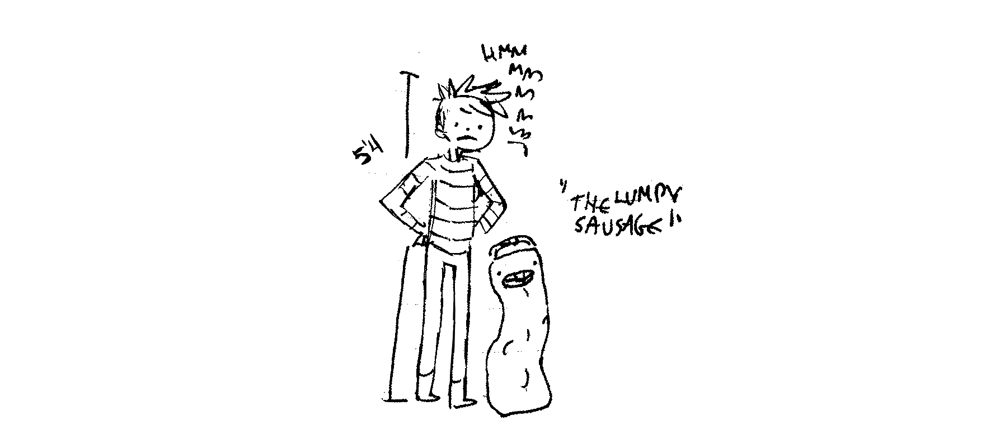

    Distance covered: 45 nm
    Distance to Victoria: 3648 nm

##### 0200
We got some good wind for 1 hour, then off it went again, I guess it didn't feel like staying. We make pancakes and maple syrup to celebrate passing 140°W. Cooking while becalmed is easy, and it means we can spend time together. At this point though, I'd rather we spend time together in a harbor, but what can I do, really? The weather determines all. It is funny to see that most of the area has wind, most of it except for a small patch... around Pino. It looks like the ocean wants to keep us around a little while longer. "I can be calm and tame, see? SEE?! Do you still like me?"

Do we still like the ocean? Yes, of course we still like it, we've spent too much time in it as of late, but we'll always love it. During this trip, we'd often ask ourselves, why do we do this? Why put ourselves through this crazy sailing across a vast ocean business? We don't really know why, but when we left Canada with Pino to go south, we knew we'd be taking it back home afterwards, that was a promise we'd made. No matter what, Pino would come back with us. We're a team, and we're closing this circle together.

##### 1300
What to say about today... calm days are torture when this close to our goal. The waves are slow but frequent, tossing us around. The calm, according to this morning's weather, will stay until this evening, 6 long hours away. I tried steering with the 2-3 knots of wind there was, but it is too much work for too little reward. Devine is reading Akira, while I sit outside, watching the horizon for ripples in the water. My patience meter depleted, I went inside to clean the dishes dirtied from dinner. I made rice with soybeans (canned), topped with a sweet and sour sauce, sauteed with some dried seaweed and 1/2 the potato from yesterday. We're eating a lot of beans these days, it was a staple on this trip, eaten in the form of soybeans, dry tofu, silken tofu and kuro mame, yokan, kinako powder. Looks like this day will consist mostly of sleeping, reading and waiting for wind. People on land complained of boredom during Coronavirus quarantine, well, they'd go stir-crazy on a voyage like this. This is quarantine on steroids. There is no internet, not enough power to watch films all day, not enough books to read, limited water and food... and a look outside our window offers nothing but grey.

I've noticed I've always got one word stuck in my head, a new one everyday that I repeat like a mantra. The word stays with me, especially when I'm too tired to think. Today's word is "flummoxed", yesterday's was "cassowary". Not all words are as great as these, a week ago I kept repeating the phrase "tits up", tirelessly. Maybe this is my brain's way of dealing with boredom. Repetition. Keeping the space filled with words leave little room for anxiety to take root.

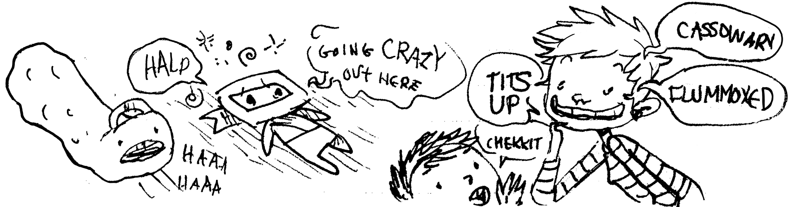

Today, I re-packed our ditch bag, the current bag grew a bit of mold as it lay under the space where we'd hang our wet clothes. I pulled out what I thought to be a large dry bag, thought it would serve as a good replacement. I rolled it out once to look at it, but never tried to pack anything into it, I'd noticed then how long it was and thought it would be perfect for this. I assumed it had as much girth as it had length — far from! I put two big items in, and noticed how narrow it was, and so instead of bulging outward it grew skyward. With all the items packed in, it was no wider than a soccer ball, but reached up to my waist, like a long, awkward, slender worm. I named it: "The lumpy sausage". Now everytime I look at it, I can't stop laughing.

##### 2300
The wind returned! I switched the sails (as they were on the wrong side) and we sped off! The wind started fast, blowing at a good 13-15 knots — perfect. Well, it would have been perfect if I hadn't looked at AIS to see that there was a large cargo ship heading straight for us, running on the same longitude. SHIT, I thought. Diverting southward seemed dumb as it was angling more that way, so I tightened the sheets and went as close to the wind as I could. It was enough to steer us 1 nm north of it. I saw its lights as it passed us, relieved and thankful for AIS, it saves us a lot of time and anxiety. It's easy to see their course and to divert appropriately ahead of time.

The rest of the night was uneventful, we are zooming forward, beating into the wind and waves. Last night was especially cold though, even with two sleeping bags I was frozen. Now, I sit at the chart table, fleece and puffy jackets on, tuque, scarf and foul-weather pants and I feel better, especially too since I've just finished a bowl of warm oats.

\newpage

#### July 23rd

    Distance covered: 109 nm
    Distance to Victoria: 3699 nm

##### 0400
Beautiful sailing today, so far! The wind is coming out of the north, Pino is self-steering to the northeast in direction of Vancouver Island. The sky is blue in part, but as before... it is cold! I doubled up my leggings with another pair I found, and slipped on another sweater for a total of 3, plus scarf and tuque. It is always cooler inside the boat, as it retains much humidity.

Devine is taking notes on his computer, while I've just awoken from a post-coffee nap. We're going to prepare lunch soon! We're in the habit of always discussing what we'll be cooking while having coffee, we look at the state of our ingredients and plan based on that. We still have plenty of canned kimchi, a few cans of corn, 1 of potato and plenty of beans. We still have a jar of dried radish, which I'm really thankful for! It was a gift from Kako. The daikon adds variety and texture to our meals. I found one full bag of kiri mochi too! A nice surprise as I thought we'd finished them all. Our supplies have definitely dwindled, but did so at a reasonable pace, same for or 5 kg propane tank and for our water. We've got another full 5 kg propane tank left, plus 30 L extra water in jerry cans, along with whatever is left in the main tank.

We've been lighting candles at night, to keep the inside of the cabin lit while not disturbing whoever is asleep. We've gone through most of our collection, but still have 1 long one, which we'll use up tonight, and 3 little ones that only last 3 hours each. We need more candles aboard, the lighting is soothing, pleasant, and uses no power. Devine found a clever way to set up the tall ones, in a way that they won't fall over. They sit on a plate on the gimbled stove, secured by two pot holders.

##### 2000
Devine prepared all meals today, with lunch consisting of one-pot pasta, cooked in very little water with all of the ingredients mixed in (chilies, soy bits, olive oil, garlic). The water and flavour is absorbed by the noodles, there is no waste and it's very, very good, especially if topped by shredded nori. Dinner was a stir-fried rice dish with kimchi, soft tofu and corn. We finished the last of the chocolate cake too.

Today was very quiet, with Devine doing a lot of writing and reading, and me drawing, keeping watch outside and sleeping. I was very sleepy today, so sleepy I nearly fell asleep while steering from the companionway stairs. I took 2 naps, on top of the 5 hours I get per night. I think the reason I may be tired is because we've been shifting hours around, delaying the time our night watches start as the night is coming earlier and earlier as we go east. Days of calm also mess up our sleeping schedule, as we don't adhere to strict rules, we sleep whenever. My body demands a steady sleeping schedule to function, something that is hard to come by on a passage. We're looking forward to sleeping a full night together in the same bunk, it's been too long, I crave both the rest and companionship.

Tonight promises winds of 10-15 knots, smooth, easy sailing. We made it under 500 nm, now THAT is exciting! We've got maybe 4 1/2 days left, if the wind holds! We finally switched away from Japan time to Vancouver time, now hours of the day feel more normal.

\newpage

#### July 24th

    Distance covered: 104 nm
    Distance to Victoria: 3773 nm

##### 0400
The trip's accumulated tiredness has pounced on me, its kicked me in the head and left me writhing on the ground in a pool of patheticness. Its attack triggered many, many emotions.

It started with me outside in the cockpit, Pino was running downwind, and I was trying to pull in the main after gybing accidentally. Gybing scares me, as I am afraid of breaking something, this event already caused me some stress. I set our course back, then I pulled in the main sheet because I wanted to fix a block that was twisted under the preventer line. While pulling, the boat heeled because of a wave and I slipped on a rope lying on the cockpit floor. I fell, and hit my ribs on the edge of the seat. I now had a bruise matching the one on my left side. It hurt like hell. I just started cursing. I was angry. Then, that anger turned to tears and I just started to cry. I was just so fucking tired, of it ALL. My fall, and the morning's difficulties tipped the boiling pot of water that was my brain.

"You okay?" Devine said as he came out to see me, sitting on the cockpit floor. "What happened? What's wrong?" I just pointed to everything. Yep, I was spent. The vase had tipped, the patience meter was empty, the gloom bug pricked me and the tears came and would not stop. Devine to the rescue. He knew what was wrong, really, it wasn't the pain, it was everything. Our callused hands, our swollen fingers, our bruises, the lack of sleep, our hunger, our impatience and eagerness to arrive... everything. He felt these things too. He dug out the Chromebook and found movies for us to watch, to distract ourselves from the repetitive tasks we'd been performing these past 46 days. He always knows what to do to calm me, to make me feel better.

That's all I have to say for today, as my brain is mush and I haven't got the energy. Today is a day of rest.

\newpage

#### July 25th

    Distance covered: 99 nm
    Distance to Victoria: 3832 nm

##### 0400
Passed a lighted buoy to the north, been a while since we've crossed structures that aren't other ships. Steering was hard at times, last night the wind gave us forwardness, which we need, but it was hard on the hands. Downwind sailing requires a lot of focus too, making it even harder. Devine is in the habit of making miso soup during his night shifts, for warmth and to calm his stomach. I still rely on small slices of Clif Bars, it gives me enough energy to go through 3 hours of steering in the dark.

##### 0930
We have coffee later today, as Devine is too sleepy to wait. At this time my body craves the liquid, to revive my flesh and to warm my blood, which is icy cold. We are lizard people in need of sun. He woke up around 9h30, and was happy to announce that he'd already pre-ground the beans and that the coffee would find its way to me sooner. YES. I'd already downloaded the weather then, seeing more light winds in our future. We'll do our best to stay patient, but it is tough, as we are lying 310 nm away from the entrance buoy. So close! We've got fuel, but want to keep it. We have a small allowance to cross narrow calms and to charge our batteries.

##### 1400
We put on Watchmen, gawked at the cinematography. It's nice to be distracted from sailing, for once. We needed to have these little movie marathons, it makes our world feel normal. We take breaks to peek outside now and again, as the sky is freakin' gorgeous! The clouds are puffy and dark on the horizon, but there are none above us. We haven't had fog in a while, very glad for clear days of full visibility, it helps brighten our mood. Because the seas are calm, I decided to make a small batch of pitas.

##### 1800
We watch Kiki's delivery service while eating kare. Wind is still at our backs, we're doing good speed and think we might be able to bypass that coming patch of calm. It's weird to stare ahead and to think that Vancouver Island is out there, that it'll appear on the horizon soon. It's okay to start thinking in "whens" now, rather than in "maybes" and "ifs". We are arriving. It's happening. Looking at our track is strange, I remember doing it but it is surreal. It's strange to have the past, present and future in focus.

\newpage

#### July 26th

    Distance covered: 50 nm
    Distance to Victoria: 3868 nm

##### 0300
Devine has been devouring books. He finished Dante's Purgatorio, Don Quixote and is now nearly done with One Straw Revolution. It is rare nowadays for us to have so many consecutive hours of "no plans", "no work" and "no social obligations", it is too easy to go through books, but I also suspect that Devine is a fast reader. He spends his entire night shifts standing on the companionway stairs, kindle in hand, rope in the other. His brain must be whirring hard because he ate two pitas last night.

##### 0600
We have a foot pump in the galley, with a pedal pushing against the pump to draw out water. One of the two pegs securing the pedal to the pump broke yesterday, not an easy fix. We have a spare pedal, but the fitting requires removing both the intake and outake hoses, not very convenient. It is hard to do a good seal, as the hoses are old, and this late into the trip I don't want to risk losing any water due to leaks. I did a temporary fix, with a rope wrapping around the top of the pedal to a pipe running underneath it, this helps keep the broken peg down, and I also added tape pulling the pedal forward to even it out. It's working well, so far! Let's hope it holds.

##### 1100
Afer coffee, comes soba. Devine prepares soba for lunch with wasabi and soy meat. We cook them in so little water that they absorb it all. It results in soba covered in a gooey secretion that soba masters would shame us for, but we're okay with it, it tastes delicious and there is no waste. Soba masters don't have to worry about water, we have a good excuse.

We've got 210 nm left. We've awakened Calcifer so we could motor through a calm to get past 130°W, where the wind is scheduled to return. There is a mean system forming in the ocean a few days from now, and we don't want to be in it. We're done having storms chase us. It is nice today, with calm seas, a warm sun and clear skies. We're sitting outside, getting some Vitamin D while trying to picture the outline of Vancouver Island in the distance. At times at sea, we see cloud patterns on the horizon that look like land, like mountains. It is too easy to trick our brains into believing there's actual land there, it's easy to warp our sense of space. We haven't seen land in 47 days, maybe it's easy to do because our brains long for the sight of land, for the shadows of great snowy peaks rising in the east. Soon, soon. In the meantime, we've got to watch for traffic. The Juan de Fuca Strait is a busy sea way, though after navigating the east coast of Japan I can't say I'm too worried, instead of 100 targets we'll get 20 and that is fine.

##### 2020
We reached 130°W and put Calcifer to sleep around 1600. A bank of fog rolled in, and right back out, we're glad it didn't decide to stick around as we are really enjoying the fair weather we've been having, it's like being fully awake. Fog dulls your senses. The wind is returning gradually, we are cruising along slowly. It is easy to sail on little wind when there are no waves. Wavelets are the best. Cruising at 4 knots with a full jib and double-reefed main. We don't have to keep it reefed but at this point in the trip we are lazy, and besides, our speed is good. We've got 180 nm left! Soon we'll be aligned with the top of Vancouver Island!!!

We are watching The Incredibles 2 this evening, with some popcorn! A little treat is nice every now and then. We're going to watch it until our night shifts behind at 2100. Things should be smooth tonight, here's hoping we make good speed and get there fast.

\newpage

# Week 8 

#### July 27th

    Distance covered: 59 nm
    Distance to Victoria: 3910 nm

##### 0400
Realized that the GRIB files I downloaded yesterday were lower resolution weather, and did not rightly show the severity and extent of the weather running along the coast of British Columbia. Upon seeing the detailed forecast this morning, we triple-reefed the main and braced for impact. The weather was horrible. We got huge waves, lots of wind and thick, thick fog. I was very discouraged, disheartened with what lay between us and our goal, yet another monster on the ocean, one my body and mind were just not up to facing. We were both sad, and angry for a while. We sat inside wishing it'd all end now. Then a group of dolphins appeared in the fog. A large group! Devine saw them swimming around the boat, they kept us company for a long while. We could hear them chatting through the hull, like several squeaky toys were being squeezed underwater. Everytime I heard a squeak it made me smile, it made us feel better and gave us the courage to push on. Thank you dolphins for being there with us, as always.

##### 2000
Because of the very bad weather, and because it will be our last night in the Pacific, we decided to do shorter night shifts. One hour off, one on. It wasn't tiring to sleep less, as steering wasn't too difficult for prolonged periods. Doing this brightened our mood, we even prepared another cup of coffee to sharpen our focus!

\newpage

#### July 28th

    Distance covered: 109 nm
    Distance to Victoria: 3981 nm

##### 0300
Beautiful night. Winds are calm now, as we have left the bad patch of weather behind. I can see the stars! Also, the bioluminescence in the water is crazy! Every wave splashing stirs up an explosion of sparking green light. We feel better now, as we survived yet another hard moment. The coast lies ahead, we are near but can't see its outline yet.

##### 0800
"LAND!" Devine screams at me as I sleep. "LAND!" I scream back at him, sitting up in the bed. It's land! It's here! It's REAL. We are almost home! Except, the wind has died, and we are motoring. We've got a full tank plus an extra can, we'll be good to make it to Victoria with this. We hope to sail part of the way though, wind permitting. The entrance buoy is 20 nm away! Then, we're that much closer to Victoria Harbour — another big milestone. Shipping is heavy, especially as we near the buoy, but it is easy to plan with AIS. We do our best to stay out of their way.

##### 1200
We are passing the entrance buoy and the Swiftsure Bank. The current is against us, but it is supposed to switch soon and we'll have 1 knot with us. We continue to motor as we lie in the path of ships, we need to steer further to clear the busy lanes.

We can see land on both sides! The day is perfect, just perfect. Well, it would be perfect if there was wind! Devine makes soba and serves it with our last tetra-pak of soft tofu.

##### 1300
We see something moving in the water a good distance away — a sailboat? No. There is too much wake, and the rig is too strange... a motor boat? No. Too high. Also, it looks like it's pulling something? A tug boat? Nope. It's a submarine! I've never seen one cruising in the water before! It broadcasts no position on AIS, we can see its front sticking out of the water, making it seem like there's a little building moving on the surface. The wake further back is from another bit of the submarine, peeking out of the water near the stern. We couldn't believe it... a submarine?! We wondered where it came from, if it was American or Canadian, and wondered where it was going, and why?

Meanwhile, a jet traces line in the sky, a whale-watching boat zooms around us, making our AIS go crazy, there are little fishing boats bobbing around near the Swiftsure Bank too. It is so busy here, and ALIVE. It feels good to be somewhere lively again, so, so good.

##### 1400
The wind came back and we can sail! We're doing a good 5 knots, cruising alongside the shipping channel. We finally made it out, away from the threat of these behemoths. It looks like we'll arrive in Victoria Harbour tomorrow morning, with yet another night spent on the water. It's fine, but it looks like it'll be spent in obscurity as there is fog coming. Glad it stayed away for most of the day, granting us an amazing view of the coast. I make dessert pancakes, using up the rest of our maple syrup.

##### 1900
Devine makes spaghetti aioli for dinner, we drink matcha afterwards and watch The Royal Tenenbaums. We take turns looking outside, keeping watch. The fog has only set on the south side of the Strait, on the American side. The wind is still good, we're running downwind. We close the jib and run under main alone.

\newpage

#### July 29th

    Distance covered: 4545 nm
    Distance to Victoria: 79 nm

##### 0200
The wind has increased a lot, we ran at 6 knots under a reefed main all evening, but as we neared Sooke the current turned against us, in strength! To go forward, we had to use the iron wind. Calcifer helped us go forward, but it felt like pushing through jelly. We had trouble making it around the Race Rocks lighthouse. Its light lay ahead, and we weren't getting past it. Devine was steering outside, and I was in the doorway, telling him to go south or north, zigzagging to work our way east as going straight on was not possible with this current. I was directing him because we had a very narrow corridor to work with, with Race Rocks to the north, and a busy shipping channel lane to the south. I had me eyes on both Navionics and AIS. As we lay south of the lighthouse, 5 cargo ships were moving in the lane south of us, back to back to back. I couldn't believe the timing of it. If no one had been there, we could have used that space, to tack out to avoid the worst of the current which is stronger near the lighthouse. This wasn't an option tonight.

Because of the difficult conditions and our imminent arrival, we both skipped sleep, knowing we'd be in a harbour soon and could rest then.

##### 0500
Eventually, we worked our way past Race Rocks and turned north to Victoria. The waves weren't any kinder here. We steered outside in the cold, again, dodging ships coming in and out of the harbour. Twice we heard terrible banging on the hull, then saw the source: logs, many logs in the water...! We had trouble seeing them as the water was very agitated, and the sound was loud because the waves threw them against us. Pino suffered no damage that we could see, but the sound was frightening! We came upon a third log, but managed to avoid it. Again, our arrival into port wasn't quiet, but boisterous, and we couldn't wait for it to end. "WHERE THE FUCK IS THE BREAKWATER?!"

##### 0600
We finally arrived at the entrance, tired and tired. Though the sun rising illuminated the mountains on the American side of the Strait, their bottom obscured by a long fog train, thick and going far east and west. It looked like a long marshmallow, floating over the water. We worked our way past the breakwater and into calmer waters, following the yellow buoys into the entrance channel. I furled the jib and lowered the main, and began running around deck, looking for our fenders and dock lines, things I am not certain I could get out in time as they were buried deep. Devine motored slowly to give me time to do everything. I never get a good first look at the new harbours we visit, because I am always running around deck, setting up lines, lowering sails, fastening items to other items, talking to authorities on VHF...

We worked our way over to the customs dock, tied to it, without any drama, and we took our first steps on land... well, on a thing that wasn't our boat, as a floating pier isn't technically land. It was a heavy concrete pier, and was very still compared to our boat. My steps felt heavy, like I had rocks in my boots, or as if the ground was pushing up against my feet. Devine stepped off then too. "Feels SO weird!" He says, stumbling, while pulling the stern line in. We tied Pino up, jelly-legged on the pier, smirking like idiots. "MADE IT!" we said, throwing our arms up. It was finally okay for us to say this, nothing could take it away, no log in the water, no storm, no nothing!

We both took a few steps back to look at our Pino, the vessel that carried us so far, so safely. It looked a bit sad without a dodger. We noticed the front of the bow was covered in green slime, and the stern had a few goose-neck barnacles stuck to it. Pino has looked better, and will look better again soon.

##### 0700
I called the Canadian Border Control from a phone on the dock, giving them details of our arrival and trip. "Where are you coming from today?" they asked. "Japan." "Washington?" "No no. Japan." I say again. "Oh...OH! That's a lot further!" I laughed. Two officers came to clear us in person afterwards. We were excited to talk to people, other people! We talked their ears off, asking questions, making jokes, being overly-excited and overly-eager to talk about things, to talk about well, anything! We showed them our moldy passports, they laughed, saying they'd seen worst. We didn't know what to expect coming here. They told us there weren't too many coronavirus cases here, but that we had to self-isolate for 14 days before setting foot on land. I expected it, but wondered why it was necessary since we'd already spent 50 days away from everyone and everything. They told us it was a blanket rule, gave us masks, and off they went!

The hard part now, was finding a place to quarantine from, as they told us most marinas don't want to do it to protect their customers. We called the Victoria Harbour Authority to get their advice, as we couldn't go directly at anchor since we had little water and almost no food left. One of the workers made a few calls and found us a secluded spot on a private finger, near the Johnson street bridge. She explained to me where it was on the radio, but by then I was tired, and not entirely familiar with the area. I understood nothing. I asked her to repeat, and as she was saying it... "Break break! Hey I can take you there!" Tim, on a harbour patrol boat called in, we could see him cruising around the harbour. He pulled up to the dock, grinning, and told us to follow him. What a friendly, friendly guy! We waited for a float plane to land, and then followed him to what would be our home for the next 14 days, a spot between a tugboat, and an empty finger for float planes.

We couldn't go on land, but at least others had access to us! From here, it would be possible to get food, water, to wash our clothes etc. At this point, we didn't know how we'd be getting groceries, as most of our friends are in North Saanich, and we weren't sure if we could get a good WIFI signal. A gate separates us from the real world, we can see people, we can hear them too, but cannot take part in land life, not yet. It's nice to be here though, to know that we are finally safe, that we can cook without having to hold onto anything, that overnight sailing is a thing of the past, that we can sleep at the same time, in the same bed... that the storms are out there, what a feeling! We have flocks of geese flying over our heads, float planes too, there are water taxis zooming back and forth, carrying passengers from one shore to the other, we see people in cafes, chatting and eating, teenagers sitting in the park, laughing. At night, the Empress hotel is lit up, the harbour is bright, and even late at night we hear people talking. It's strange, all of it. Strange, but good. We are glad for the noise.

We look at each other, sitting on deck and admiring the view. "Hey..." I say to Devine, "i'm proud of you!" Devine smirks, "I'm proud of YOU!" We look at the Delta hotel across the water. "I guess the french fries and cold beer will have to wait huh?" Devine nods. "Yep, the bath too." We went to sleep that night, dirty, tired, but happy. We're here. HOLY CRAP we're here...!

> Limbo. Harpies everywhere.

> Being surrounded by ships, can't enjoy the sea.

> Incessant gales, can't sleep.

> Forever becalmed, can't move ahead.

> Overpowering tide, can't go into port.

> Sunless sky, can't charge the GPS. Lost. 

\newpage

# Closing words

\newpage

If you ask us why we decided to go sailing, we don't think we could give you a straight answer. Even the authors of our sailing manuals cannot explain what might compel anyone to do it, even after being made aware of the many perils of an ocean. Why would anyone do something with a very real risk of not making it back to shore, and furthermore, for no obvious reward?

It seems unjustifiable, or at least masochistic, that a person would wilfully put themselves through potential misadventures for fame and curiosity alone, mountain climbers might echo these feelings although we don't know any with whom we can verify this. And so, perhaps we do these things in the name of freedom, freedom to practice direct experience (with all that entails. Discomfort, pain, hunger and so on), here we shall name this calling to live deliberately, using Thoreau's words.

### Living by proxies

Smart devices to take away the pain of thinking deep thoughts, social things against the solitude, forever removing ourselves, in exchange for protectedness, for a complete thoughtless socialized inexistence.

A creeping numbness might be to blame for our own search of this direct experience, in the form of long distance sailing, to let ourselves feel cold so we could sense the subtler changes in the weather, to go hungry to appreciate simpler foods.

Similarly, one might begin to talk instead of watching talk-shows and to play instead of watching game shows — To value the entire spectrum of sensations as necessary members of the whole that is the deliberate existence, with its potential for failure, awkwardness, loneliness, harm and death included.

### To feel secure

Convenience products will protect those living at odds with nature. Novel and fashionable horrors will be popularized to subvert anyone into docility, else new fears will be provided as obedience demands.

In the name of security, a modern citizen will be thoroughly handled. A modern civilisation will deem itself total as it finally does away with all inconveniences, vanquished the totality of the Unknowable, the Indifferent, the Unorganizeable, of Nature, by means of paving over it.

We have seen the non-participation to the throughput mechanisms of society labeled as escapism, but we look at it in reverse where one escapes by being apart from nature. An illusory sense of dominion and domestication of nature might make one think of it as a place where one can escape to, and this is re-enforced when seen through the lense of a synthetic protective layer of proxies and simulations, but the protective layer doesn't curve outward upon nature, but inward upon the individual. And that is absolute escapism.

We believe that one can use nature's indifference as a reminder of the actual fortitude of their being, to learn of one's own true capacity for resilience when communing with nature — Ideas altogether at odds with modern stories, or an invitation to be part of something.

> "Modern man requires more and more comfort both at home and in the car. Sailors, too, want more comfort in their cruisers, but comfort cannot be combined with simplicity. And when life is no longer simple, it loses both beauty and joy." (Sven Yrvind, 2017) 

We'll end this story by thanking those who helped us during our 14-day quarantine period. Thank you Jason, for doing our laundry and for bringing some amazing take-out food, Brian, for the extra baking supplies, Cameron, for happy junk foods, Robert, for the fresh produce, Judie & Colin, for the company, Marie, for the pocket wifi, brew and fresh produce, Colin N., for the mouse and Warren for the fresh produce and beer.

Thank you for reading.

\newpage

# Pino's pantry

At sea, cooking is an activity that divides our days, and that has the greatest effect on our energy level and happiness. We take turns cooking in the galley, Devine prepares lunch and I, dinner. When the weather's bad, or that one of us lacks inspiration, one may choose to prepare both meals in a day, but overall, it's a task we prefer to share.

Below is a list of items that we had aboard Pino on the passage from Japan to Canada, followed by recipes that were mentioned earlier in the book.

#### Textured vegetable protein (TVP)

> TVP is a soy product, made from defatted soy flour that's been cooked under pressure, and then dried. It is a shelf stable product that comes in a variety of shapes, ranging from tiny pellets to large nuggets. Aboard Pino, we prefer the smaller grind, as it doesn't use up as much volume in a jar. We use it instead of mince meat in spagehtti sauces, sheperd's pie or tacos. 

#### Nori

> Nori is an edible species of red algea. It has a strong flavor, and is often used in dried sheets to wrap sushi. Dried sheets of seaweed are made by a shredding and rack-drying process that resembled papermaking. Nori sheets should be kept in an air-tight container because they can easily absorb water from the air.

> It is also a garnish or flavoring in noodle preparations and soups. 

#### Koya-dofu

> Koya-dofu is freeze-dried tofu. The variety sold in stores is made with soy, coagulants, and baking soda. It resembles a hard sponge, and needs to be re-hydrated for 5 minutes, and then firmly pressed before use. It can be ground into tofu meal and flour. This tofu kept us fed on this trip, we bought many boxes and had many left-over in the end. Tetra-pak tofu was hard to come by in Japan, and this was a welcomed replacement.

> Japan has a long history of freezing foods that contain a large amount of water, then thawing and drying them to remove all moisture to produce a lightweight, dehydrated food with a long shelf life. This practice is said to have originated on Mt. Koya:

> "According to undocumented legend, it was developed by a Shingon priest named Mokujiki Shonin, who succeeded Kakkai-sonja. He obtained large amounts of soybeans from the head Shingon temple and encouraged each of the mountain temples to make their own tofu, miso, and shoyu. In order to preserve some of the frozen tofu until the spring equinox, he developed a system for drying it as follows. Firm tofu was frozen outdoors in the snow on cold windy nights, allowed to stand on shelves in a shed for 5-15 days at temperatures below freezing, thawed in warm water and pressed lightly to expel the melted ice, then dried in the shed using heat from charcoal braziers. (W. Shurtleff et.at A. Aoyagi, 2004)"

#### Peanut butter

> A spread made from dry-roasted peanuts without added sugar or oils are preferable. We enjoy making our own using our food chopper (meat grinder), running the peanuts twice to get a smooth texture. Roasted, unsalted red-skinned peanuts yield the best flavor and texture. 

> Peanut butter is a rich source of protein, we always keep a jar in our ditch bag. Consuming it regularly on a passage helps keep our energy levels high.

> Additive-free peanut butter in Japan is difficult to find, or it is very expensive. For the passage to Canada, I also bought nerigoma (tahini). It is available in most grocery stores in 100 g jars, or in large bags of 1 kg. In japan, they also stock kuro nerigoma (black sesame pasta), which has a deeper, more complex flavor, but like peanut butter, some varieties have added sugar. Look for jars with 100% sesame as the sole ingredient.

#### Kombu dashi

> Dashi is a soup stock and essential condiment in Japanese cuisine. Dashi contains one or two ingredients, and is often made from konbu (dried kelp), katsuoboshi (dried bonito flakes), shiitake (mushrooms), iriko/niboshi (dried anchovies/sardines) or a combination of these. Dashi creates a sweet, savoury umami flavor.

> Dashi is used as a broth base for Japanese hot pot dishes, simmered dishes, noodle soups, it's also used as a seasoning liquid (for rice). Konbu dashi is the easiest stock to make, it has a subtle taste and is often mixed with shiitake dashi. The mushrooms used to make shiitake dashi are used for cooking.

> We carry kombu dashi granules aboard Pino, as a way to quickly flavor dishes. The alternative is to buy strips of dried kombu strips and to soak them in hot water. The seaweed flavor leeches into the liquid, which can then be used to flavor foods. On a boat, using whole konbu isn't ideal. Using granules is the next best thing. In grocery stores, they are usually sold in small indivually-wrapped packages. I bought a larger 500g bag of granules, which solved the packaging issue.

#### Miso

> Miso is a traditional Japanese seasoning produced by fermenting soybeans with both salt and koji (fungus Aspergillus oryzae) and sometimes with rice, barley and seaweed. Miso is salty, but it's flavor and aroma depends on the ingredients used or the fermentation process. There is a wide variety of Japanese miso, it is typically classified by grain type (barley, buckwheat, rice etc), color (white, brown, black & red), taste (sweet, salty, earthy, fruity etc) and background (where it's from). The most common miso flavor categories are: Shiromiso (white), Akamiso (red) and Awasemiso (mixed). Generally speaking, the darker the color, the longer it’s been fermented and the stronger it will taste Miso is a rich source of protein. 

> The type we use in recipes, is a white, rice-based miso, that is sweet and earthy. White miso is excellent in soy bean hummus. We also carry a darker variety, a black miso that is very intense, but very good. The darker kind is used for dipping sauces and soups.

> We prepare miso soup often on passages, especially when hungry during night-shifts. Just 1 tbsp in some hot water, with some dried wakame, makes for a comforting, and satisfying snack. Miso will lose its flavor if cooked for too long, so it is best to add it toward the end of the cooking process.

#### Garlic powder

> Garlic powder is dehydrated garlic. It is used in recipes where moisture content is key. 1/8th of a teaspoon of garlic powder equals one fresh garlic clove. To make garlic powder, the cloves are peeled and sliced, and then heated to a temperature of between 150-160°C to remove all moisture. The dehydrated garlic is then sliced, chopped and ground into a powder.

> Garlic powder was a useful alternative to the fresh variety while in the South Pacific, as it was difficult to find. It's good when mixed into smooth sauces.

#### Nutritional yeast

> Nutritional yeast is a deactivated yeast, sold as yellow flakes or powder. It has a cheesy, nutty taste and flavor, and some fortified varieties are a good source of B12. 

> Nutritional yeast is often confused with brewer’s yeast, but the two are distinct. Brewer’s yeast is aptly named, as it was initially offered as a byproduct of the beer brewing industry. Nutritional yeast adds a lot of depth and flavor to a variety of dishes, and acts as a dry, shelf-stable replacement for cheese.

> Nutritional yeast isn't easy to come by in Japan, but we left New Zealand with plenty in stock. Store in a dark, dry environment, as B12 is sensitive to both moisture and light.

#### Chickpea flour

> Chickpea flour — also known as besan, channa dal or gram flour — is made from ground raw, or roasted chickpeas. Roasted varieties has more flavor, while the raw variety is bitter. Chickpea flour has a higher protein content than other flours.

> This type of flour has a long shelf life due to the low-moisture, and low-fat content. Chickpea flour has a texture and taste that is ideal for savoury pancakes and omelettes. When mixed with an equal volume of water, it can be used as an egg replacement.

> Chickpea flour and besan flour are both made from chickpeas, but chickpea flour is more coarse and requires more water than besan. This should be taken into account when cooking.

#### Mirin

> Mirin is a condiment in Japanese cuisine. It's a type of rice wine, but with a lower alcohol and higher sugar content than sake. The sugars form naturally during the fermentation process, and are not added.

> There are 3 types: Hon mirin (true mirin), which contains about 14% alcohol, second is Shio mirin which has less alcohol (lower than 1.5%) and third is Shin mirin, which has less than 1% alcohol while retaining the same flavor.

> Mirin adds sweetness to dishes, it helps tenderize, and add luster to foods while masking unwanted flavors.

### Oils

> Our preferred cooking oil is olive, but we also carry roasted sesame oil to flavour rice, and to use as a base for vinaigrettes.

\newpage

# Tips for cooking at sea

**Cut vegetables small**. When prepping for your meal, cut various vegetables roughly the same size and shape. This will ensure uniform cooking. Cut them small, into cubes or julienned. It takes more time to prep, but uses less fuel.

**Cleavers are useful**. When cooking at sea, we aim to keep things simple and quick. We like to use a vegetable cleaver (a less brutish version of the meat cleaver) to cut food, and to carry cut items to a pot or pan. Because the blade is wide, it's easy to scoop everything off a cutting board in one go. It saves another dish to use the cleaver as a carrying tool, and it saves the time that woud be taken in getting —and cleaning­— a plate.

**Measure ingredients beforehand** The easiest way to cook spice-heavy food was to have everything measured out, and laid out next to the stove in the order it was added to the pot. I place all measured spices into a bowl, mixed in together to minimize dishes, and to create fewer opportunities for multiple dishes to leap off the counter. I usually place it atop my gimbled stove. Scrounging through my pantry looking for bottles of spices and measuring them directly into the dish the moment the recipe called for it, which was both stressful and inefficient. 

**Re-use tools** On passage, we keep two bowls, two forks, two knives, two spoons. Keeping fewer tools will encourage re-using them instead of dirtying those that are clean. 

**Use a pressure cooker** Cooking food with a pressure cooker helps to save fuel, and halves the cooking time of food. 

\newpage

# Recipes

\newpage

## Table of contents

> Sweet and sour lentils              128  

> Soybean hummus                      130

> Nutritional yeast pasta             131

> Peanut butter noodles               132

> Deconstructed Pâté Chinois          133

> Kiri mochi with vegetables          134

> Chili garlic linguini with nori     135 

> Corn pone                           136

> Penne with a red lentil sauce       137

> Soba                                138

> Pasta salad with mustard dressing   139

> Kimchi-fried rice                   140

> Japanese curry                      141

> Stove-top chocolate cake            142

> Pancake                             143

> Mapo tofu                           144

\newpage

## Sweet and sour lentils

Ingredients
-----------------------   --------------------------- 
Soy Sauce                 30 ml
Japanese rice vinegar     30 ml
Peanut butter             15 g
Maple syrup               30 ml
Roasted sesame oil        5 ml
Arrowroot starch          15 g
Chili pepper flakes       10 g
Garlic                    3 cloves
Ginger root               15 g
Brown lentils             100 g                      
Vegetable broth           350 ml                     
Carrots                   1 cut into small cubes     
Daikon                    4 cm, cut into small cubes 
Chives                    3 stalks, chopped thinly                   
-----------------         ---------------------------

Mix first 7 ingredients together in a bowl. Stir until well-incorporated. Add 3 minced garlic cloves, and roughly the same volume of minced ginger root.

Rinse 100 g (1/2 cup) of brown lentils. Transfer rinsed lentils to a pot, and add 350 ml of vegetable bouillon (or plain water). Bring to a rapid simmer, then reduce heat to medium, and simmer uncovered. After 10 minutes, add the chopped carrot and daikon to the pot. Let mixture simmer for an additional 10-20 minutes, add extra water as needed. If lentils are tender, they are ready. Strain lentils and return them to the pot. Pour sauce onto lentils, mix well.

Serve into two bowls with some chives. Eat wrapped in salad or cabbage leaves, or with crackers.

\newpage

## Soybean hummus

Hummus
-----------------------   ------------------ 
Soy beans                 300 g (150 g, dry)
Tahini    				  15 ml
Lemon                     1/2, juiced
White miso                15 g
Olive oil                 15 ml
Garlic                    4 cloves
Black pepper              to taste
-----------------------   ------------------ 

Soak 150 g of dry soy beans (yields 300 g cooked beans) overnight, or for a minimum of 8 h. Then, cook in a pressure cooker for 15 minutes. Strain beans, rinse and transfer to a bowl. Alternately use one 300 g can of soy beans.

Puree the cooked soybeans with 45 ml (3 tbsp) of tahini, the juice of 1/2 a lemon (or some other acidic ingredient), 15 ml (1 tbsp) of white miso and 30 ml (2-3 tbsp) of water. I used a potato masher, but any blending tool will do.

Bring a pan to medium heat, add 15 ml (1 tbsp) of olive oil, then add 4 cloves of chopped garlic. Pan-fry for 2-3 minutes, then add 2 chopped jalapeno peppers and continue to pan-fry for an additional 5 minutes, or until well-cooked. Add mixture overtop of soy bean hummus, and season with black pepper.

\newpage

## Nutritional yeast kishimen

Pasta is available in Japan, but it isn't cheap. It is better to seek local alternatives. For the trip, we bought pasta, but also plenty of kishimen. Kishimen are wheat-based, cut into flat strips, that don't become soggy when cooked for a long time. We consider them to be the Japanese equivalent of linguini. 

Sauce
-----------------------   ------------------ 
Kishimen                  2 portions
Water or Soy milk         250 ml
Dijon mustard             5 ml
Smoked paprika            3 g
White miso                5 g
Lemon juice               5 ml
Arrowroot starch          7 g
Olive oil                 15 ml
Yellow onion              1, chopped
Garlic                    3 cloves, minced
Nutritional yeast    	  15 g
-----------------------   ------------------ 

Cook kishimen (wheat noodles) according to package instructions, drain and reserve for later.

In a bowl, add 250 ml (1 cup) water (or soy milk), 5 ml (1 tsp) dijon mustard, 3 g (1/2 tsp) smoked paprika, 5 g (1 tsp) white miso, 5 ml (1 tsp) lemon juice, and 7 g (1 tbsp) arrowroot starch (cornstarch is also fine). Mix well, reserve sauce for later.

Bring heat to medium. Add 15 ml (1 tbsp) olive oil to pan. When hot, add 1 chopped yellow onion. Cook until browned. Then, add 3 minced garlic cloves, and cook for 3 minutes.

Lower heat, add sauce and mix well. When thick, take off heat and mix in 15 g (1/4 cup) nutritional yeast. Serve over kishimen.

\newpage

## Peanut butter rice noodles

Sauce
-----------------------   ---------------------------- 
Peanut butter             60 g
Soy sauce                 20 ml
Sugar                     10 g
Cornstarch                10 g
Garlic powder             1 tsp
Ginger root               5 g, grated
Curry powder              5 g
Water                     60 ml
Rice noodles (flat type)  200 g
Koya-doufu                1 block
Daikon                    2 cm, cubed
Sweet potato              1 small, or 1/2 large, cubed
Garlic                    1 clove
Chili flakes              5 g
-----------------------   ----------------------------

Mix 60 g (1/4 cup) peanut butter, 20 ml (1 1/2 tbsp) soy sauce, 10 g (2 tsp) sugar, 10 g (2 tsp) cornstarch, 5 g (1 tsp) garlic powder, 5 g grated ginger root and 5 g (1 tsp) curry powder. Then, add 60 ml (1/4 cup) water, and mix until well incorporated. 

Cook rice noodles according to package instructions. Drain, set aside.

Soak dry tofu in water. When soft, drain and squeeze water out. Cut into cubes.

In a pan, heat some oil at high heat. When hot, add 1 clove of minced garlic, and 5 g (1 tsp) chili flakes. Cook for 30 seconds. Add the 2 cm of cubed daikon, and 1 small cubed sweet potato. Cook until the sweet potato is soft. 

Add dry tofu and cooked noodles, then add the sauce overtop. Cook for 1-2 minutes until sauce starts to thicken. Divide into two bowls.

\newpage

## Deconstructed Pâté Chinois

Pâté Chinois is a Québec recipe, which typically consists of a baked dish with 3 layers: Mince meat at the bottom, a mixture of corn niblets and creamed corn in the middle, and mashed potatoes overtop. When underway, we prefer to prepare the ingredients together in a pan on the stovetop. The result is satisfying, and takes a lot less time and fuel to prepare. We prefer to use sweet potatoes, as they cook faster than white potatoes. In a floating kitchen, cooking time matters. 

Sauce
-----------------------   ----------------------------------- 
Olive oil                 15 ml
Yellow onion              1 medium, diced
Sweet potatoes            2 medium, skinned and cubed
TVP     				  40 g 
Soy sauce                 15 ml
Vegetable broth           60 ml
Smoked paprika            3 g
Corn niblets              1 small can
-----------------------   -----------------------------------  

Bring a pan to medium heat, add 15 ml (1 tbsp) olive oil. When hot, add 1 diced yellow onion, and cook until browned. Add the cubed sweet potato, and sauté until tender. Add the TVP (textured vegetable protein), as well as 15 ml (1 tbsp) of soy sauce, 60 ml (1/4 cup) of vegetable bouillon (or 1 tsp dried vegetable broth in 1/4 cup of water), and 3 g (1/2 tsp) smoked paprika. Cook together for 3-5 minutes, then remove from heat.

Cover the bottom of the bowls with corn niblets, and add the potato and TVP mixture overtop. Season with salt and black pepper.

Optionally, sprinkle with nutritional yeast, and serve with Sambal Oelek (hot sauce).

\newpage

## Kiri mochi with vegetables

Ingredients
-----------------------   ------------------------ 
Roasted sesame oil        15 ml
Kiri mochi                6 blocks
Black pepper              to taste
Carrots                   2, julienned
Cabbage                   1/4 head
Kimchi                    320 g
-----------------------   ------------------------ 

Heat a pan at medium heat, when hot, add 15 ml (1 tbsp) of roasted sesame oil. Then, lay the 6 kiri mochi blocks in the pan without overlapping them (cook in groups of 3 if using small pan). Using a pepper grinder (or mortal and pestle), grind some whole black peppercorns to season the 6 blocks of kiri mochi. Turn them over when the bottom sides are puffed and brown, wait till the blocks are slightly browned, and puffed. To know if they're ready, try and poke a sfork through the middle, it should be easy to pierce — although it will stick to your fork!

Remove skins, and julienne carrots (or cut into thin, long sticks). Finely shred 1/4 head of green cabbage. Place vegetables at the bottom of two bowls. Cut each kiri mochi block into 4 smaller pieces, and divide into bowls. Top with kimchi.

\newpage

## Chili garlic spaghetti with nori

Ingredients
-----------------------   ----------------------------- 
Spaghetti                 2 portions
Olive oil                 30 ml
Garlic                    5 cloves, minced
Red chili pepper flakes   5 g
Salt & black pepper       to taste
Nori seaweed sheet        1, cut into thin short strips
-----------------------   -----------------------------

Cook pasta according to package instructions. Drain, and reserve.

Heat pan at medium heat, add 30 ml (2 tbsp) of olive oil. When oil is hot, add 5 minced garlic cloves, and cook for 2 minutes. Add 5 g (1 tsp) red chili pepper flakes, and cook for an additional minute. Take off heat, add pasta and mix well. Season with salt and black pepper and transfer to bowls. Using scissors, cut thin strips of nori on top of pasta.

\newpage

## Corn pone 

Ingredients
-----------------------   ----------------------------- 
Corn meal (medium grind)  150 g
Olive oil                 15 ml
Salt                      1.25 g
Boiling water             250 ml
-----------------------   -----------------------------

Place 150 g (1 cup) cornmeal, 15 ml (1 tbsp) olive oil, and 1.25 g (1/4 tsp) salt in a bowl. Pour 250 ml (1 cup) of boiling water over the cornmeal mix, stir well. The cornmeal mix should be wet, and easy to form into shapes.

Cover bottom of a 20 cm (7") cast-iron skillet with some olive oil, bring up to medium heat. When the oil is hot, press the cornmeal mix into the pan, and fry until bottom is browned. Put a plate over the top of the pan, keep your hand on the plate and flip the pan so that the corn cake ends up cooked side up on the plate. Then, slide the corn cake back into the pan (cooked side up).

Brown bottom for an additional 4 to 6 minutes, or until well-cooked. Cut corn cake into two, and slide into two bowls. Serve with some stir-fried vegetables, or kimchi.

Optional: instead of making one big corn cake, you can divide it into 4, or 8 smaller cakes.

\newpage

## Soumen with a red lentil sauce

As we had a limited supply of pasta, we used many alternatives, like kishimen (mentioned earlier) and soumen. Soumen are fine white noodles, wheat-based, similar to vermicelli.

Ingredients
-----------------------   ----------------
Soumen                    2 portions
Olive oil                 15 ml
Yellow onion              1 medium
Cumin seeds               2 g t
Turmeric powder           1.25 g
Carrots                   1 medium
Potatoes                  2, medium
Green cabbage             1/4 head, medium
Red lentils               100 g
Vegetable bouillon        350 ml
Salt                      to taste
Black pepper              to taste
-----------------------   ----------------

Because they are thin, soumen noodles take less than 3-4 minutes to cook in boiling water. Stir the noodles while cooking to prevent sticking. When soft, strain the noodles and give them a quick rinse to help remove the excess starch.

Heat a pot at medium heat, then coat bottom with 15 ml (1 tbsp) of olive oil. Add 1 medium diced yellow onion, and sautée it until browned. Add 2 g (1/2 tsp) whole cumin seeds, and 1.25 g (1/4 tsp) of turmeric powder, and cook for 2-3 minutes. 

Add 1 medium diced carrot, 2 medium (chopped into small cubes) potatoes and 1/4 head (chopped) medium green cabbage. Mix well, lower heat, cover, and cook for 5-7 minutes. Add water if vegetables are sticking to the bottom.

Mix in 100 g (1/2 cup) of red lentils, and 350 ml (1 1/2 cups) of vegetable bouillon (or plain water). Mix well, and bring to a boil. Lower heat to a simmer, cover, and cook for 10 minutes. When ready, season with salt and black pepper. Serve over soumen.

\newpage

## Soba

Soba are brown noodles made with buckwheat flour, often served at room temperature, and served with a dipping sauce. Soba is also served hot with broth. It is usually sold dry in supermarkets, divided into portions.

Ingredients
-----------------------   ------------
Soba noodles (dry)        2 portions
Daikon                    1 cm, grated
Black sesame seeds        to taste
Konbu dashi granules      3 g
Water                     120 ml
Soy sauce                 30 ml
Mirin                     15 ml
-----------------------   ------------

Bring water to boil in a pot. Add the soba noodles to pot, submerge noodles, and lower to a simmer. Cook according to package instructions, which is usually anywhere between 5 and 8 minutes. Check for doneness. When done, drain and transfer back to the pot. Cover noodles in cold water, and run your fingers through the noodles gently, agitating them to remove the excess starch. It's possible to skip this step, but the noodles will be gummy. Drain noodles, and divide into two bowls.

Grate 1 cm of daikon radish, and serve overtop of noodles, along with some toasted, black sesame seeds.

Combine 3 g (1 tsp) kombu dashi granules with 120 ml (1/2 cup) of water, 30 ml (2 tbsp) soy sauce, and 15 ml (1 tbsp) of mirin. Serve as a dipping sauce, or pour over noodles. 

\newpage

## Pasta salad with mustard dressing

In this recipe I used whole-grain mustard, also known as 'grainy' mustard due to the precense of whole mustard seeds. It's a good idea to prepare jars while still in port, and then you'll have plenty of mustard for the passage. We picked up seeds while in Fiji, and have been preparing our own mustard ever since. 

Ingredients
-----------------------   ----------
Penne                     2 portions
Olive oil                 15 ml
Apple cider vinegar       15 ml 
Whole-grain mustard       15 ml
Nutritional yeast         4 g  
Salt                      to taste
Black pepper              to taste
Yellow onion              1, medium 
Green pepper              1, diced
-----------------------   ----------

Cook pasta according to recipe instructions. Drain, reserve. 

In a small bowl, mix 15 ml (1 tbsp) of olive oil, 15 ml (1 tbsp) of apple cider vinegar, 15 ml (1 tbsp) of old-style mustard, 4 g (1 tbsp) nutritional yeast, and a dash of salt and black pepper. Mix well.

Heat a pan at medium heat, cook 1 diced yellow onion until browned. Add 1 diced green pepper and cook for an additional 3 minutes. Turn heat off, add cooked pasta as well as the mustard dressing, mix well, and divide into two bowls.

\newpage

## Kimchi-fried rice

Ingredients
-----------------------   -----------------------------------
Short grain white rice    2 portions
Olive oil                 15 ml
Yellow onion              1 medium
Garlic                    3 cloves
Kimchi                    320 g
Tofu                      175 g (1/2 of 350 g pack)
Soy sauce                 15 ml
Sesame oil                5 ml
Nori sheet                1 sheet, cut into short thin strips
Black sesame seeds        To taste
-----------------------   -----------------------------------

Cook short grain white according to package instructions. Washing the rice to remove to excess starch will make the rice less sticky, but I tend to skip that step while at sea, as it uses up too much water.

In a large cast-iron skillet, add 15 ml (1 tbsp) olive oil over medium heat, and add 1 diced yellow onion. Cook for 2 minutes, then add 3 cloves of minced garlic, cooking for 1 minute before adding 320 g (1 cup) of kimchi (as well as some of the juice). Cook mixture for 3 minutes. Add tofu, and cook for 5 minutes, stirring occasionally. 

Add the cooked rice to the skillet, breaking up the clumps while stirring, and cook for 5 minutes. Add 15 ml (1 tbsp) of soy sauce and 5 ml (1 tsp) of roasted sesame oil. Divide into two bowls, and garnish with strips of nori seaweed and some black sesame seeds. 

\newpage

## Japanese curry 

This recipe uses ready-made, store-bought curry bricks, which are concentrated cubes of spices with a thickening agent which creates a thick, spicy sauce when simmmered with water. These bricks are inexpensive, and easy to use on long, ocean passages.

Instead of Kouya-doufu (dry tofu), you can use TVP or 175 g (1/2 of 350 g pack) or jouon tofu (tetra-pak tofu).

Ingredients
-----------------------   ------------------------------
Short grain white rice    1/2 cup, dry
Kouya-doufu               1 block, cut into cubes
Sesame oil                15 ml
Yellow onion              1 medium, diced
Carrot                    1, cut into small cubes
Potato                    1 medium, cut into small cubes
Water                     250 ml
Curry bricks              2
-----------------------   ------------------------------

Cook short grain white rice (sushi rice) according to package instructions.

Re-hydrate dry tofu in a bowl of water, chop into cubes. Reserve for later.

Heat 15 ml (1 tbsp) of sesame oil in a pan over medium-high heat. Add 1 chopped yellow onion, 1 chopped carrot, 1 peeled/diced potato and the dried tofu. Sauté, stirring occasionally, for about 5 minutes. Add 250 ml (1 cup) of water, and simmer for about 10 minutes. Add 2 curry bricks, and simmer gently until the curry bricks have come apart, and that the liquid has thickened — about 10 minutes. Serve over hot rice.

\newpage

## Stove-top chocolate cake

Ingredients
-----------------------   -------
All-purpose flour         180 g
Cocoa powder              35 g
Baking soda               5 g
Salt                      1.25 g
Granulated cane sugar     100 g
Canola oil                120 ml
Coffee                    250 ml
Vanilla extract           10 ml
Apple cider vinegar       30 ml
-----------------------   -------

In a bowl, mix 180 g (1 1/2 cups) of all-purpose flour, 35 g (1/3 cup) of cocoa powder, 5 g (1/2 tsp) baking soda and 1.25 g (1/4 tsp) salt. 

In a separate bowl, mix 100 g (1/2 cup) of granulated cane sugar, 120 ml (1/2 cup) of canola oil, 250 ml (1 cup) of coffee (instant or brewed), 10 ml (2 tsp) vanilla extract and 30 ml (2 tbsp) of apple cider vinegar. 

Mix wet ingredients into dry, until well incorporated. 

Oil the inside of a 20 cm (7") cast-iron skillet, and bring to medium heat. When hot, pour cake batter into the skillet and spread it out with a spatula. Cover the skillet, set the heat to low. Bake on top of stove for 20-30 minutes or until the cake is firm to the touch. Turn off the burner once the cake is done.

\newpage

## Pancake

Ingredients
-----------------------   -------
Soy milk                  240 ml
Apple cider vinegar       1 tsp
Spelt flour               120 g
Vanilla extract           5 ml
Baking soda               1.25 g
Baking powder             2.5 g
Vegetable oil             5 ml
Maple syrup               to taste
-----------------------   -------

Mix soy milk with apple cider vinegar to create 'buttermilk', let stand for 5 minutes. Add vanilla extract, mix well.

Mix dry ingredients together, then add soy 'buttermilk'. In a cast-iron skillet, heat 5 ml (1 tsp) of vegetable oil at medium heat. When pan is hot, add 60 ml (1/4 cup) of batter into pan. Help spread into wider circle using the back of the spoon. Cook until bubbles form on the top, then flip, and cook for another 2 minutes. Repeat for rest of pancake mix, and serve with maple syrup.

\newpage

## Mapo tofu

In Japan, there are two tetra-pak varieties, o ryouri-muki tofu (firm tofu for cooking), which has a yellow packaging, and kinugoshi toufu (silken tofu) that comes in blue packaging.

Instead of 175 g (1/2 of 350 g pack) of tetra-pak tofu, you can use 2 blocks of Kouya-doufu (dry tofu).

Ingredients
-----------------------   ----------------------
Rice                      2 portions
Vegetable stock           60 ml
Miso                      15 g
Chili pepper flakes       5 g
Mirin                     15 ml
Soy sauce                 15 ml
Cornstarch                15 g
Vegetable oil             15 ml
Garlic                    3 cloves, minced
Ginger root               1 cm, minced
TVP                       25 g
Soft tofu                 175 g, cut into cubes
Sichuan peppercorns       ground, to taste
-----------------------   ----------------------

In a bowl, mix 60 ml (1/4 cup) of vegetable broth (or kombu dashi), 15 g (1 tbsp) of miso, 5 g (1 tbsp) red chili pepper flakes, 15 ml (1 tbsp) mirin, 15 ml (1 tbsp) soy sauce and 15 g (1 tbsp) cornstarch. Mix well, and reserve for later.

Heat a pan at medium heat, add 15 ml (1 tbsp) of vegetable oil. When hot, add 3 minced garlic cloves and 1cm minced ginger root, cook until fragrant. Add 25 g (1/4 cup) of TVP, mix well, and sautée for 2 minutes. Add the sauce to the pan. When sauce is boiling, add 175 g of (1/2 of 350 g pack) cubed tofu, and cook until heated through. 

Serve atop of rice, and season with ground sichuan pepper. I normally serve it with green onions, or chives, but it is a fresh ingredient I tend to lack at sea.

\newpage

# Boat recommendations

1. Manual bilge pump in cabin
2. Way to drive boat from inside
3. Storm jib for self-steering
4. Spare blocks, bike tubes (or surgical tubes), again, for self-steering
5. Stow bow anchor below
6. AIS transponder
7. Boards, cut to size, to cover windows
8. Backup tiller
9. Locks on all floorboards, doors, lockers etc.
10. Indoor compass

\newpage

# Timeline

Dates      Events                           Distance (nm)  Days                      
---------- -------------------------------- -------------  ----
2016-04-02 First sail                       16             1
2016-05-27 Port Angeles                     20             1
2016-07-02 First offshore cruising attempt  142            2
2016-08-11 San Francisco, US                700            6
2016-10-09 Los Angeles, US                  350            4
2016-10-17 San Diego, US                    160            2
2016-11-01 Ensenada, Mexico                 80             1
2016-12-05 La Paz, Mexico                   910            10
2017-03-02 Nuku Hiva, French Polynesia      2700           28
2017-04-25 Rangiroa, French Polynesia       580            6
2017-05-02 Papeete, Tahiti                  210            2.5
2017-06-05 Huahine, Society Islands         90             1
2017-07-01 Rarotonga, Cook Islands          534            6
2017-07-22 Alofi, Niue                      580            6
2017-08-03 Vava'u, Tonga                    234            2.5
2017-10-21 Whangarei, New Zealand           1199           10
2017-12-15 Pakatoa, New Zealand             40             1
2017-05-25 Opua, New Zealand                110            1.5
2018-06-11 Savusavu, Fiji                   1210           15
2018-09-04 Suva, Fiji                       120            1.5
2018-09-25 Musket cove, Fiji                110            1.5
2018-10-03 Vuda Point, Fiji                 20             1     
2018-11-15 Majuro, Marshall Islands         1724           24
2019-01-22 Chichijima, Japan                2100           21
2019-03-08 Shizuoka, Japan                  550            4
2019-04-17 Minamiise, Japan                 126            1.5
2020-05-29 Shimoda, Japan                   128            1.5
2020-07-28 Arrival in Victoria, Canada      4111           51
---------- -------------------------------- -------------  ----

# Appendix A

Irvind, Sven. With four square meters of sail and one oar. Västervik, Sweden: Yrvind. 2017

Hill, Annie. Voyaging on a small income. Tiller Publishing. 1993

History of Tofu - Page 7". www.soyinfocenter.com. Retrieved 2020-04-23.